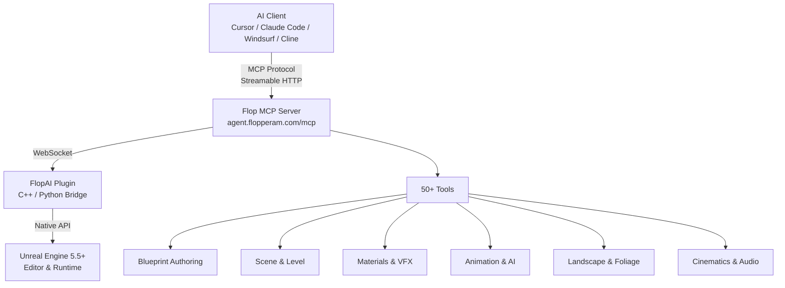
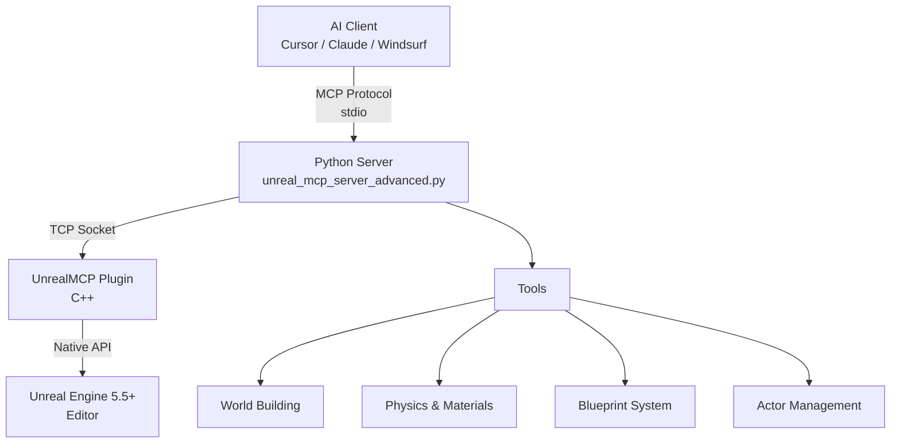

<p align="center">
  
</p>

<h1 align="center">Flopperam — Unreal Engine MCP</h1>

<p align="center">
  <strong>The most advanced MCP server for Unreal Engine.</strong><br/>
  Control a live Unreal Editor through natural language from any MCP client.
</p>

<p align="center">
  <a href="https://www.unrealengine.com/"></a>
  <a href="https://youtube.com/@flopperam"></a>
  <a href="https://discord.gg/3KNkke3rnH"></a>
  <a href="https://twitter.com/Flopperam"></a>
  <a href="https://tiktok.com/@flopperam"></a>
</p>

---

## Two Ways to Use Unreal Engine MCP

This repo contains two separate things:

| | **Hosted Flop MCP** (Recommended) | **Open-Source Local MCP** (This Repo) |
|---|---|---|
| **What** | Production MCP server hosted at `agent.flopperam.com/mcp` | Community MCP server you run locally from the `Python/` folder |
| **Tools** | **50+ tools** across 9 domains — Blueprint authoring, materials, VFX, animation, landscape, AI/BT, cinematics, PCG, and more | Basic toolset — scene manipulation, actor management, world building, and foundational Blueprint operations |
| **Blueprint support** | Full lifecycle — batched narrow tools (`bp_create`, `bp_variable`, `bp_component`, `bp_nodes`, `bp_wire`, `bp_commit`), Graph authoring, contract verification, PIE runtime testing | Foundational — `add_node`, `connect_nodes`, `create_variable`, `create_function` with 23+ node types |
| **Unreal plugin** | **FlopAI plugin** — installed separately via [flopperam.com/unreal-agent](https://www.flopperam.com/unreal-agent) | **UnrealMCP plugin** — bundled in this repo under `UnrealMCP/` |
| **Server instructions** | Rich per-tool LLM guidance, cross-tool relationship mapping, error recovery patterns | Basic tool descriptions |
| **Setup** | One URL + API key, no local dependencies | Clone repo, Python 3.12+, run server locally |
| **Works with** | Cursor, Claude Code, Windsurf, VS Code Copilot, Cline, any MCP client | Same |

> The hosted Flop MCP is a completely different, much more advanced server that shares no code with the local `Python/` server in this repo. It is actively developed with new tools shipping regularly.

---

## Hosted Flop MCP (Recommended)

One URL, one API key. No local server, no Python install. Works with **Cursor, Claude Code, Windsurf, VS Code Copilot, Cline**, and any other MCP client.

### 1. Get an API key at [flopperam.com/account](https://flopperam.com/account)

### 2. Install the FlopAI Unreal plugin — see [flopperam.com/docs](https://flopperam.com/docs) (Installation tab)

### 3. Add the config to your IDE

**Cursor** — `.cursor/mcp.json` (project) or `~/.cursor/mcp.json` (global):
```json
{
  "mcpServers": {
    "flopperam-unreal": {
      "url": "https://agent.flopperam.com/mcp",
      "headers": {
        "Authorization": "Bearer YOUR_API_KEY"
      }
    }
  }
}
```

**Claude Code** — run in your terminal:
```bash
claude mcp add -H "Authorization: Bearer YOUR_API_KEY" --transport http flopperam-unreal https://agent.flopperam.com/mcp
```

**VS Code / Copilot** — `.vscode/mcp.json`:
```json
{
  "servers": {
    "flopperam-unreal": {
      "type": "http",
      "url": "https://agent.flopperam.com/mcp",
      "headers": {
        "Authorization": "Bearer YOUR_API_KEY"
      }
    }
  }
}
```

**Cline / Local LLMs** (Ollama, LM Studio, etc.):
```json
{
  "mcpServers": {
    "flopperam-unreal": {
      "type": "streamableHttp",
      "url": "https://agent.flopperam.com/mcp",
      "headers": {
        "Authorization": "Bearer YOUR_API_KEY"
      }
    }
  }
}
```

Verify the server shows as connected in your IDE and start prompting.

### Hosted Flop MCP — Full Tool List (50+)

| **Category** | **Tools** | **Description** |
|---|---|---|
| **Blueprint Authoring** | `bp_create`, `bp_class`, `bp_variable`, `bp_component`, `bp_graph`, `bp_nodes`, `bp_wire`, `bp_input`, `bp_commit`, `bp_author`, `bp_dry_run`, `bp_skills` | Full Blueprint lifecycle — create Actor/Pawn/Character BPs, add variables/components/events/functions, wire graphs with ~40 node types, compile and verify |
| **Blueprint Inspection** | `bp_brief`, `bp_inspect`, `bp_export` | Read-only orientation — 21 targeted query ops, full GraphSpec JSON export |
| **Scene & Level** | `scene_query`, `scene_brief`, `scene_compose`, `actor_inspect`, `level_inspect`, `search_assets`, `asset_references`, `project_context` | Find actors by class/label/tag with spatial filters, declarative spawn/modify/delete, Content Browser search, dependency graphs |
| **Materials & Shading** | `material_inspect`, `material_edit` | Create materials/instances/functions/Parameter Collections, author expression graphs |
| **VFX** | `niagara_inspect`, `niagara_edit`, `niagara_script_edit`, `chaos_edit` | Niagara particle systems, reusable script modules, Geometry Collection destruction |
| **Animation** | `animation_inspect`, `animation_edit`, `animation_graph_edit`, `ik_rig_edit`, `ik_retarget` | Sequences, montages, BlendSpaces, AnimBP graph authoring, IK rigs + retargeting |
| **UMG / Widgets** | `widget_inspect`, `widget_edit` | Widget tree inspection + editing, styles, animation, MVVM, event binding |
| **AI & Abilities** | `behavior_tree`, `gas_edit`, `tag_registry_edit` | BTs, Blackboards, AI Controllers, EQS, Gameplay Abilities/Effects, Attribute Sets, Gameplay Tags |
| **Landscape & Foliage** | `landscape_inspect`, `landscape_edit`, `foliage_inspect`, `foliage_edit` | Sculpting, semantic terrain features, paint layers, heightmap import/export, foliage scattering |
| **Cinematics & Audio** | `sequencer_edit`, `metasound_edit`, `sound_asset_edit` | Level Sequences with camera cuts, MetaSound procedural audio, SoundCue graphs |
| **Procedural** | `pcg_graph_edit` | PCG graphs with generators, samplers, filters, mesh spawners |
| **Data Assets** | `asset_factory` | Enums, structs, DataTables, DataAssets, Enhanced Input bundles |
| **Editor & Diagnostics** | `editor_actions`, `editor_log`, `performance_audit`, `window_capture`, `cpp_source` | Save/undo/redo, Output Log, perf analysis, viewport screenshots, C++ source + Live Coding |
| **Runtime Verification** | `pie_test_bp`, `pie_test_scene` | PIE test harnesses with 30+ assertion types |
| **Execution** | `python_execution`, `unreal_api`, `skills` | Arbitrary Python in-editor, 15,000+ API lookups, on-demand workflow docs |

---

## Open-Source Local MCP (This Repo)

This repo includes a standalone local MCP server (`Python/`) and a C++ Unreal plugin (`UnrealMCP/`). This is a simpler, community-maintained toolset for basic Unreal Engine control — scene building, actor management, physics, and foundational Blueprint operations.

**If you want the full 50+ tool experience, use the [Hosted Flop MCP](#hosted-flop-mcp-recommended) instead.**

| **Category** | **Tools** | **Description** |
|---|---|---|
| **Blueprint Visual Scripting** | `add_node`, `connect_nodes`, `delete_node`, `set_node_property`, `create_variable`, `set_blueprint_variable_properties`, `create_function`, `add_function_input`, `add_function_output`, `delete_function`, `rename_function` | Blueprint programming with 23+ node types, variables with full property control, custom functions |
| **Blueprint Analysis** | `read_blueprint_content`, `analyze_blueprint_graph`, `get_blueprint_variable_details`, `get_blueprint_function_details` | Inspect Blueprint structure, event graphs, execution flow, variables, and functions |
| **World Building** | `create_town`, `construct_house`, `construct_mansion`, `create_tower`, `create_arch`, `create_staircase` | Build architectural structures and settlements |
| **Epic Structures** | `create_castle_fortress`, `create_suspension_bridge`, `create_aqueduct` | Massive engineering marvels and medieval fortresses |
| **Level Design** | `create_maze`, `create_pyramid`, `create_wall` | Game levels and puzzles |
| **Physics & Materials** | `spawn_physics_blueprint_actor`, `set_physics_properties`, `get_available_materials`, `apply_material_to_actor`, `apply_material_to_blueprint`, `set_mesh_material_color` | Physics simulations and material systems |
| **Blueprint System** | `create_blueprint`, `compile_blueprint`, `add_component_to_blueprint`, `set_static_mesh_properties` | Visual scripting and custom actor creation |
| **Actor Management** | `get_actors_in_level`, `find_actors_by_name`, `delete_actor`, `set_actor_transform`, `get_actor_material_info` | Scene object control and inspection |

**Full setup guide:** [LOCAL_SETUP.md](LOCAL_SETUP.md) (includes macOS compilation steps)

---

## Sproft fork additions

This fork ([github.com/sproft/unreal-engine-mcp](https://github.com/sproft/unreal-engine-mcp))
ports a subset of the hosted Flop tool surface back into the open-source local
MCP server. All additions are clean-room implementations derived from the
documented behaviour and the public UE5 API. None of them link against or
draw from the proprietary FlopAI plugin. MIT-licensed alongside the rest of
the repo.

| **Tool** | **Description** |
|---|---|
| `editor_actions` | Single multiplexed verb tool for save / undo / redo / focus selection / play / stop play. Mirrors the hosted `editor_actions`. |
| `window_capture` | Synchronous PNG screenshot of the active editor viewport. Defaults to `<Project>/Saved/MCPScreenshots/`. |
| `asset_factory` | Asset creation. Supports DataTable (with configurable row struct), Enum (with named entries), Struct (with typed fields), DataAsset (any `UDataAsset` subclass with optional flat property overrides applied through `FProperty::ImportText`), and Enhanced Input bundles. The bundle variant takes a `package_path` package root, a list of `actions` (each `{name, value_type, description?, trigger_when_paused?}` covering Boolean / Axis1D / Axis2D / Axis3D), and a list of `mappings` (each `{action, key, negate?, swizzle?}`) and produces one `UInputMappingContext` plus N `UInputAction` assets in a single declarative call. Existing actions / IMC assets at the target paths are reused unless `overwrite=true`. The optional `negate` row toggle attaches a `UInputModifierNegate`; the optional `swizzle` row token (YXZ / ZYX / XZY / YZX / ZXY) attaches a `UInputModifierSwizzleAxis` so a 1D key can drive a 2D action's Y axis without a second tool call. |
| `widget_edit` | UMG Widget Blueprint authoring. Two operations: `create_widget_blueprint` (path + parent class + optional root panel class) and `add_child_widget` (vertical box, horizontal box, progress bar, text block, button, image, and a few other panel types) under a parent panel by FName. Animations, MVVM, and full slot-property control remain in [BACKLOG.md](BACKLOG.md). |
| `widget_inspect` | Read-only counterpart to `widget_edit`. Walks the `UWidgetTree` and returns the nested hierarchy, a flat widget list, any `UNamedSlot` widgets, and the asset's user-declared Blueprint variables. |
| `bp_input` | Enhanced Input data assets and event-node wiring. Four operations: `create_input_action` (Boolean / Axis1D / Axis2D / Axis3D), `create_input_mapping_context`, `add_mapping` (key-to-action binding on an existing IMC), and `add_action_event_node` (spawn a `UK2Node_EnhancedInputAction` in a target Blueprint's event graph for a given `UInputAction` and optionally MakeLinkTo from the chosen trigger exec pin, default "Triggered", to a named function call on the same Blueprint). |
| `bp_component` | Add a `UActorComponent` subclass to an existing Blueprint's `SimpleConstructionScript`. Accepts short class names (`StaticMeshComponent`, `SpringArm`, `CameraComponent`) or full `/Script/Module.ClassName` paths, an optional `parent_component` to attach under, and an optional flat property dict applied through `FProperty::ImportText`. Compiles and saves the Blueprint on success. |
| `scene_query` | Read-only multiplexed actor query for the editor world. Combines class (substring or exact), `name_pattern`, `label_pattern`, single `tag`, and an optional spherical spatial filter (`center` plus `radius`) with a result `limit`. Returns class / name / label / transform / tags / mobility / hidden flags per actor. |
| `material_edit` | Material authoring. `create_material` produces a `UMaterial` with an optional `Constant3Vector` base-colour input wired into `BaseColor`. `create_material_instance_constant` creates a Material Instance Constant from a parent material. `set_instance_parameter` overrides scalar / vector / texture parameters on a Material Instance Constant. `add_expression` appends a `UMaterialExpression` to a `UMaterial`, resolving the class from a short name (`multiply`, `lerp`, `scalar_parameter`, `texture_sample_parameter_2d`, `time`, `panner`, `constant`, `constant3vector`, `vector_parameter`, `one_minus`, `saturate`, `clamp`, `fresnel`, `power`, `sine`, `cosine`, `component_mask`, `if`, `make_material_attributes`, etc.), a full `/Script/Engine.UMaterialExpressionFoo` path, or a bare class name. Position cascades by default. The optional `properties` dict applies through `FProperty::ImportText` so callers can land `ConstA` / `ConstB`, `ParameterName`, or `DefaultValue` on creation. Optional one-shot connection: `property` (BaseColor, EmissiveColor, etc.) wires the new expression into a material attribute, or `connect_to` + `connect_input` wires it into another named expression. `connect_expressions` connects a source expression's output pin to either a material attribute or another expression's named input pin. `set_expression_property` applies a flat property dict to a named expression. Each expression-graph op recompiles + saves on success unless `recompile=false` or `save=false` is passed. Material Functions and Material Parameter Collections remain on the backlog. |
| `actor_inspect` | Read-only single-actor dump. Resolves the actor by `GetName()` first and Outliner label second, then returns transform / tags / replication snapshot / root component, plus the full attached component list with each component's class, relative transform, attach parent and socket, tags, and (opt-in) a short `FProperty::ExportText` value dump per component or per actor. Mirrors `widget_inspect` for the actor side. |
| `scene_compose` | Declarative single-actor scene mutation. Three operations on one actor per call: `spawn` (class path plus optional transform / preferred name / Outliner label / tags / flat property dict), `modify` (partial transform / label / tags / property patch on an actor resolved by name or label), and `delete`. Property dicts apply through `FProperty::ImportText`; spawn returns the new actor's resolved FName. |
| `scene_brief` | Read-only one-shot orientation summary of the active editor world. Returns persistent level name and asset path, attached streaming sublevels, total actor count and counts per class (sorted by descending count), world bounds union (min / max / centre / extent), GameMode override and default pawn class, a flag for whether the Level Blueprint declares any custom event nodes, the deduplicated set of FName tags in use, and a short list of notable landmark actors (player starts, directional lights, post-process volumes). |
| `level_inspect` | Read-only structured per-actor record list for the editor world plus any loaded sublevels. Sits between `scene_brief` (one designer summary) and `scene_query` (filtered subset). Always returns a uniformly-shaped per-actor block (name, label, class, transform, tags, hidden flags, mobility, owning level) plus a per-level actor-count summary, with optional `class` / `name_pattern` / `label_pattern` / `tag` / `level_filter` filters and an optional `include_components` toggle for a compact per-component list. |
| `python_execution` | Run Python in the editor's interpreter through `PythonScriptPlugin`. Two operations: `execute_string` (a string of Python source, multi-statement by default) and `execute_file` (a `.py` path on disk with optional positional args forwarded as `sys.argv[1:]`). Returns the captured stdout / stderr, the engine `command_result` (repr of the last evaluated expression for evaluate-statement mode), and a structured log array. The plugin's uplugin manifest declares `PythonScriptPlugin` so consumer projects pull it in automatically. |
| `editor_log` | Output Log access. `tail` reads the last N lines of `<Project>/Saved/Logs/<Project>.log` with optional category and minimum-verbosity filters. `write` emits a single line through `LogSproftMCP` at a chosen verbosity (Fatal is demoted to Error). |
| `tag_registry_edit` | Manage the project's Gameplay Tag registry. Three operations: `add_tag` writes a tag (with optional dev comment) into a chosen `Config/Default*Tags.ini` source through `IGameplayTagsEditorModule::AddNewGameplayTagToINI`; `remove_tag` deletes a tag through `IGameplayTagsEditorModule::DeleteTagFromINI`; `list_tags` is a read-only substring search over `UGameplayTagsManager::RequestAllGameplayTags` returning each tag's owning source, source ini path, and dev comment. The editor module handles ini rewrites, tag-tree refresh, and the broadcast that live tag pickers listen on. |
| `bp_create` | Create a UBlueprint asset with a chosen parent class. Resolves the parent class from a short name (Actor, Pawn, Character, ActorComponent, SceneComponent, GameMode, GameModeBase, PlayerController, AIController, UserWidget, DataAsset, BlueprintFunctionLibrary, etc.), a full `/Script/Module.ClassName` path, or a `/Game/...` Blueprint class path. Output package path is configurable under `/Game/`. An optional flat property dict applies through `FProperty::ImportText` on the generated CDO before the first compile so callers can land defaults in one shot. Compiles and saves on success. |
| `bp_brief` | Read-only one-page orientation summary of a Blueprint asset. Returns name, path, parent class (short + full path), blueprint type, variable count, function count, macro count, event-graph node count, named-event list (UK2Node_Event + UK2Node_CustomEvent), SCS component summary (name + class + root flag), implemented Blueprint interfaces, and a data-only flag. Smaller and faster than `read_blueprint_content` plus `analyze_blueprint_graph` for the "what kind of BP is this" question. |
| `bp_inspect` | Read-only targeted query operations on a Blueprint asset, keyed by `op`. `list_variables` returns typed variables with default value, edit flags, category, and friendly name. `list_functions` returns user-authored function and macro graphs with node counts. `list_events` returns event-graph events (`UK2Node_Event` + `UK2Node_CustomEvent`) with the owning ubergraph name. `list_components` returns SCS components with class, scene-vs-actor flag, attach parent and socket, root flag, and child count. `find_node` is a substring search across all graphs against either node short class name or node title (or both via `pattern`), capped by `limit`. |
| `bp_variable` | Declarative Blueprint variable management. One multi-op tool keyed by `op`: `list` (every variable with type, default, category, and flag set), `add` (declare a new variable with `name` + `type` + optional `default` / `category` / flag toggles), `remove` (delete by name), `set_default` (overwrite the default value), `set_flags` (mutate the flag set on an existing variable). `type` accepts scalar tokens (bool / int / float / double / string / name / text / byte), built-in structs (vector / vector2d / rotator / transform / color / linear_color), full `/Script/Module.ClassName` paths for object refs, `/Game/...` Blueprint class paths (auto-suffixed with `_C`), and `struct:/...` for UScriptStruct paths. `container` accepts `single` / `array` / `set` / `map` (with a `value_type` for the map case). Each mutating op compiles + saves on success unless `compile=false` or `save=false` is passed. |
| `bp_class` | Manage class-level settings on an existing UBlueprint. One multi-op tool keyed by `op`: `read` (parent class, blueprint type, BlueprintOptions, implemented interfaces), `set_parent` (re-parent through `Blueprint->ParentClass` + `RefreshAllNodes` + `MarkBlueprintAsStructurallyModified` + recompile, with the same parent resolver as `bp_create`), `set_class_settings` (any subset of `description`, `display_name`, `namespace`, `category`, `hide_categories`), `add_interface` (full `/Script/Module.IName` path, `/Game/...` Blueprint Interface path, or short-name fallback resolved against the loaded class set, going through the `FTopLevelAssetPath` overload of `ImplementNewInterface`), and `remove_interface` (with optional `preserve_functions`). Each mutating op compiles + saves on success unless overridden. |
| `bp_graph` | Read-only graph traversal beyond `bp_inspect`. One multi-op tool keyed by `op`: `list_graphs` (every graph on the Blueprint grouped by kind: ubergraph / function / macro / interface, each with name, kind, graph class, and node count), `list_nodes` (every node in a chosen graph with node FName, short class, full title, position, and pin count, plus optional `class_pattern` / `title_pattern` filters and a 256-node cap), `get_node` (full pin readback for one node: each pin's name, direction, type, default value, default object, exec / data flag, and connected target nodes / pins), and `list_connections` (flat edge list for a chosen graph with `include_exec` / `include_data` filters and a 1024-edge cap). |
| `bp_nodes` | Batched K2 node creation in a chosen Blueprint graph. Defaults to the first event graph; pass `graph` to target a function / macro / interface graph (case-insensitive with substring fallback). Each entry takes a `class` short name (variable_get, variable_set, call_function, branch / if_then_else, dynamic_cast, self, format_text, execution_sequence, knot, make_array, custom_event, event), an optional FName, optional `position`, optional `pin_defaults` dict, and class-specific keys (variable_name, function / function_path resolved as `KismetSystemLibrary:PrintString` or `/Script/Engine.KismetSystemLibrary:PrintString` or a bare name on the same Blueprint, target_class, event_name, event_class). Returns each new node's name, GUID, position, and full pin list so a follow-up `bp_wire` call can address pins by name. Compile is NOT automatic; pass `compile=true` or run `compile_blueprint` after wiring. |
| `bp_wire` | Connect or disconnect named pins between named nodes inside a Blueprint graph. Pin direction is validated (source must be output, dest must be input) and category compatibility runs through the K2 schema's `CanCreateConnection` so incompatible types fail with the engine's own error text. Per-entry `disconnect=true` breaks an existing wire instead of making a new one; `op="disconnect"` is the per-call shortcut. Compile is NOT automatic. |
| `material_inspect` | Read-only counterpart to `material_edit`. For a UMaterial: returns name + path + class, blend mode, two-sided / translucent flags, the full expression list (each with FName, class, position, and parameter name when relevant), parameter list grouped by scalar / vector / texture / static_switch, per-attribute connected output expression for the standard GBuffer attributes (BaseColor / Metallic / Specular / Roughness / Anisotropy / Normal / Tangent / EmissiveColor / Opacity / OpacityMask / WorldPositionOffset / AmbientOcclusion / Refraction / Displacement) with output pin name, and the full used-texture list. For a UMaterialInstance: returns parent material path, the parent material's parameter list, and the instance's own scalar / vector / texture overrides. |
| `search_assets` | Read-only Content-Browser-style asset search backed by `IAssetRegistry`. Filters: `class_filter` (single token or list, accepting short names, full `/Script/Module.ClassName` paths, and `/Game/...` Blueprint asset paths), `class_pattern` (case-insensitive substring on the short class name), `include_subclasses` (sets `bRecursiveClasses`), `path` (single prefix or list of prefixes like `/Game/Crafting`), `recursive_paths` (default true), `name_pattern` (case-insensitive substring on the asset name), and `tag` (single `{name, value}` dict or array of dicts mapped onto `FARFilter::TagsAndValues`). Returns each row's path, name, class, class_path, package, and package_path. With `include_disk_size=true` each row also reports the package's on-disk byte size pulled through `IAssetRegistry::TryGetAssetPackageData`. The result reports `count`, `matched_total`, and a `limit_hit` flag so a caller can paginate by tightening the filter. |
| `asset_references` | Read-only dependency-graph dump for one asset, backed by `IAssetRegistry::GetReferencers` / `GetDependencies`. `direction` selects one of `hard_referencers` (default), `soft_referencers`, `hard_dependencies`, `soft_dependencies`, or the `all_*` variants (any package category, no Hard / Soft restriction). `depth` (default 1, capped at 6) walks the graph transitively and returns the union of every package reached. Each row carries name, path, class, class_path, package, and package_path. Optional `class_filter` accepts a short name or full `/Script/Module.ClassName` path and drops rows whose asset class does not match. The result reports `count`, `matched_total`, `limit_hit`, and `depth_reached` so the caller can answer "what would break if we delete or rename this asset?" without round-tripping through `python_execution`. |

Built and tested against the user's UE 5.7 source build at `D:\UE5`. Should
also work on UE 5.5/5.6 since the API surface used is stable across those
versions.

---

## The Flop Agent — [flopperam.com](https://flopperam.com/)

The MCP gives your IDE tools. **The Flop Agent** is a fully autonomous AI that lives inside Unreal Engine — it plans multi-step workflows, writes and executes code, recovers from errors, and iterates until the job is done.

- **Dynamic workflows** — decomposes complex requests into steps and adapts when something goes wrong
- **Unreal-native reasoning** — tuned prompts, specialized routing, deep knowledge of UE APIs and Blueprints
- **Full Blueprint creation and editing** — create new Blueprints, add variables/components/events/functions, update graph logic, compile and validate
- **World building** — creates materials, places actors, builds structures, and verifies as it goes
- **Code execution** — executes commands directly inside the editor
- **Multiple AI models** — routes to the best model per task (Opus for reasoning, Flash for lookups)
- **Chat inside Unreal** — embedded browser panel, no window switching
- **Text/image to 3D** — three quality tiers (Good, High Quality, Very High Quality)

Supports Unreal Engine 5.5, 5.6, and 5.7. Full docs at [flopperam.com/docs](https://flopperam.com/docs).


---

## See It In Action

Watch our comprehensive tutorial for complete setup and usage:
- **[Complete MCP Tutorial & Installation Guide](https://youtu.be/ct5dNJC-Hx4)** - Full walkthrough of installation, setup, and advanced usage

Check out these examples on our channel:
- **[GPT-5 vs Claude](https://youtube.com/shorts/xgoJ4d3d4-4)** - Claude and GPT-5 go head-to-head building simultaneously
- **[Advanced Metropolis Generation](https://youtube.com/shorts/6WkxCQXbCWk)** - AI generates a full metropolis with 4,000+ objects from a single prompt
- **[Advanced Maze & Mansion Generation](https://youtube.com/shorts/ArExYGpIZwI)** - Claude generates a playable maze and mansion complex

---

## Architecture

### Hosted Flop MCP


### Open-Source Local MCP


---

## Community & Support

- **YouTube**: [youtube.com/@flopperam](https://youtube.com/@flopperam) - Tutorials, showcases, and development updates
- **Discord**: [discord.gg/3KNkke3rnH](https://discord.gg/3KNkke3rnH) - Get help, share creations, and discuss
- **Twitter/X**: [twitter.com/Flopperam](https://twitter.com/Flopperam) - Latest news and quick updates
- **TikTok**: [tiktok.com/@flopperam](https://tiktok.com/@flopperam) - Quick tips and amazing builds
- **Docs**: [flopperam.com/docs](https://flopperam.com/docs) - Full documentation

### Get Help
- **Setup Issues?** Check the [Debugging & Troubleshooting Guide](DEBUGGING.md)
- **Questions?** Ask in our [Discord server](https://discord.gg/3KNkke3rnH) for real-time support
- **Bug reports?** Open an [issue on GitHub](https://github.com/flopperam/unreal-engine-mcp/issues)
- **Feature ideas?** Join the discussion in our community channels

---

## License

MIT License — Build amazing things freely.
