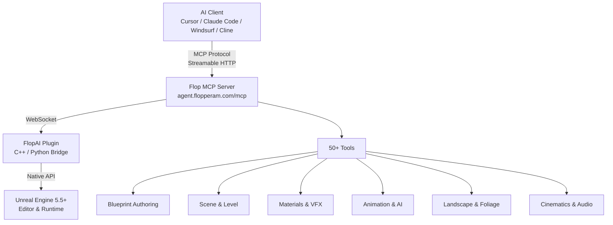
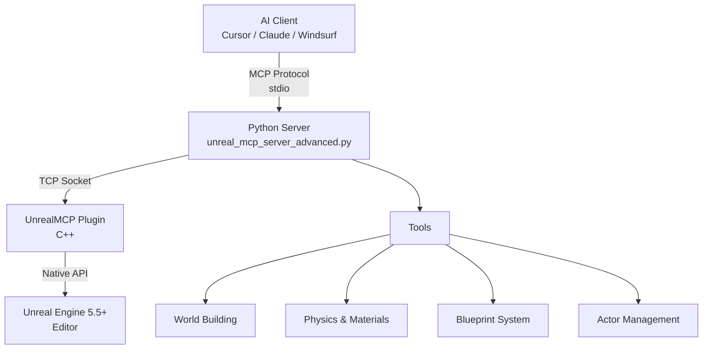

<p align="center">
  
</p>

<h1 align="center">Flopperam — Unreal Engine MCP</h1>

<p align="center">
  <strong>The most advanced MCP server for Unreal Engine.</strong><br/>
  Control a live Unreal Editor through natural language from any MCP client.
</p>

<p align="center">
  <a href="https://www.unrealengine.com/"></a>
  <a href="https://youtube.com/@flopperam"></a>
  <a href="https://discord.gg/3KNkke3rnH"></a>
  <a href="https://twitter.com/Flopperam"></a>
  <a href="https://tiktok.com/@flopperam"></a>
</p>

---

## Two Ways to Use Unreal Engine MCP

This repo contains two separate things:

| | **Hosted Flop MCP** (Recommended) | **Open-Source Local MCP** (This Repo) |
|---|---|---|
| **What** | Production MCP server hosted at `agent.flopperam.com/mcp` | Community MCP server you run locally from the `Python/` folder |
| **Tools** | **50+ tools** across 9 domains — Blueprint authoring, materials, VFX, animation, landscape, AI/BT, cinematics, PCG, and more | Basic toolset — scene manipulation, actor management, world building, and foundational Blueprint operations |
| **Blueprint support** | Full lifecycle — batched narrow tools (`bp_create`, `bp_variable`, `bp_component`, `bp_nodes`, `bp_wire`, `bp_commit`), Graph authoring, contract verification, PIE runtime testing | Foundational — `add_node`, `connect_nodes`, `create_variable`, `create_function` with 23+ node types |
| **Unreal plugin** | **FlopAI plugin** — installed separately via [flopperam.com/unreal-agent](https://www.flopperam.com/unreal-agent) | **UnrealMCP plugin** — bundled in this repo under `UnrealMCP/` |
| **Server instructions** | Rich per-tool LLM guidance, cross-tool relationship mapping, error recovery patterns | Basic tool descriptions |
| **Setup** | One URL + API key, no local dependencies | Clone repo, Python 3.12+, run server locally |
| **Works with** | Cursor, Claude Code, Windsurf, VS Code Copilot, Cline, any MCP client | Same |

> The hosted Flop MCP is a completely different, much more advanced server that shares no code with the local `Python/` server in this repo. It is actively developed with new tools shipping regularly.

---

## Hosted Flop MCP (Recommended)

One URL, one API key. No local server, no Python install. Works with **Cursor, Claude Code, Windsurf, VS Code Copilot, Cline**, and any other MCP client.

### 1. Get an API key at [flopperam.com/account](https://flopperam.com/account)

### 2. Install the FlopAI Unreal plugin — see [flopperam.com/docs](https://flopperam.com/docs) (Installation tab)

### 3. Add the config to your IDE

**Cursor** — `.cursor/mcp.json` (project) or `~/.cursor/mcp.json` (global):
```json
{
  "mcpServers": {
    "flopperam-unreal": {
      "url": "https://agent.flopperam.com/mcp",
      "headers": {
        "Authorization": "Bearer YOUR_API_KEY"
      }
    }
  }
}
```

**Claude Code** — run in your terminal:
```bash
claude mcp add -H "Authorization: Bearer YOUR_API_KEY" --transport http flopperam-unreal https://agent.flopperam.com/mcp
```

**VS Code / Copilot** — `.vscode/mcp.json`:
```json
{
  "servers": {
    "flopperam-unreal": {
      "type": "http",
      "url": "https://agent.flopperam.com/mcp",
      "headers": {
        "Authorization": "Bearer YOUR_API_KEY"
      }
    }
  }
}
```

**Cline / Local LLMs** (Ollama, LM Studio, etc.):
```json
{
  "mcpServers": {
    "flopperam-unreal": {
      "type": "streamableHttp",
      "url": "https://agent.flopperam.com/mcp",
      "headers": {
        "Authorization": "Bearer YOUR_API_KEY"
      }
    }
  }
}
```

Verify the server shows as connected in your IDE and start prompting.

### Hosted Flop MCP — Full Tool List (50+)

| **Category** | **Tools** | **Description** |
|---|---|---|
| **Blueprint Authoring** | `bp_create`, `bp_class`, `bp_variable`, `bp_component`, `bp_graph`, `bp_nodes`, `bp_wire`, `bp_input`, `bp_commit`, `bp_author`, `bp_dry_run`, `bp_skills` | Full Blueprint lifecycle — create Actor/Pawn/Character BPs, add variables/components/events/functions, wire graphs with ~40 node types, compile and verify |
| **Blueprint Inspection** | `bp_brief`, `bp_inspect`, `bp_export` | Read-only orientation — 21 targeted query ops, full GraphSpec JSON export |
| **Scene & Level** | `scene_query`, `scene_brief`, `scene_compose`, `actor_inspect`, `level_inspect`, `search_assets`, `asset_references`, `project_context` | Find actors by class/label/tag with spatial filters, declarative spawn/modify/delete, Content Browser search, dependency graphs |
| **Materials & Shading** | `material_inspect`, `material_edit` | Create materials/instances/functions/Parameter Collections, author expression graphs |
| **VFX** | `niagara_inspect`, `niagara_edit`, `niagara_script_edit`, `chaos_edit` | Niagara particle systems, reusable script modules, Geometry Collection destruction |
| **Animation** | `animation_inspect`, `animation_edit`, `animation_graph_edit`, `ik_rig_edit`, `ik_retarget` | Sequences, montages, BlendSpaces, AnimBP graph authoring, IK rigs + retargeting |
| **UMG / Widgets** | `widget_inspect`, `widget_edit` | Widget tree inspection + editing, styles, animation, MVVM, event binding |
| **AI & Abilities** | `behavior_tree`, `gas_edit`, `tag_registry_edit` | BTs, Blackboards, AI Controllers, EQS, Gameplay Abilities/Effects, Attribute Sets, Gameplay Tags |
| **Landscape & Foliage** | `landscape_inspect`, `landscape_edit`, `foliage_inspect`, `foliage_edit` | Sculpting, semantic terrain features, paint layers, heightmap import/export, foliage scattering |
| **Cinematics & Audio** | `sequencer_edit`, `metasound_edit`, `sound_asset_edit` | Level Sequences with camera cuts, MetaSound procedural audio, SoundCue graphs |
| **Procedural** | `pcg_graph_edit` | PCG graphs with generators, samplers, filters, mesh spawners |
| **Data Assets** | `asset_factory` | Enums, structs, DataTables, DataAssets, Enhanced Input bundles |
| **Editor & Diagnostics** | `editor_actions`, `editor_log`, `performance_audit`, `window_capture`, `cpp_source` | Save/undo/redo, Output Log, perf analysis, viewport screenshots, C++ source + Live Coding |
| **Runtime Verification** | `pie_test_bp`, `pie_test_scene` | PIE test harnesses with 30+ assertion types |
| **Execution** | `python_execution`, `unreal_api`, `skills` | Arbitrary Python in-editor, 15,000+ API lookups, on-demand workflow docs |

---

## Open-Source Local MCP (This Repo)

This repo includes a standalone local MCP server (`Python/`) and a C++ Unreal plugin (`UnrealMCP/`). This is a simpler, community-maintained toolset for basic Unreal Engine control — scene building, actor management, physics, and foundational Blueprint operations.

**If you want the full 50+ tool experience, use the [Hosted Flop MCP](#hosted-flop-mcp-recommended) instead.**

| **Category** | **Tools** | **Description** |
|---|---|---|
| **Blueprint Visual Scripting** | `add_node`, `connect_nodes`, `delete_node`, `set_node_property`, `create_variable`, `set_blueprint_variable_properties`, `create_function`, `add_function_input`, `add_function_output`, `delete_function`, `rename_function` | Blueprint programming with 23+ node types, variables with full property control, custom functions |
| **Blueprint Analysis** | `read_blueprint_content`, `analyze_blueprint_graph`, `get_blueprint_variable_details`, `get_blueprint_function_details` | Inspect Blueprint structure, event graphs, execution flow, variables, and functions |
| **World Building** | `create_town`, `construct_house`, `construct_mansion`, `create_tower`, `create_arch`, `create_staircase` | Build architectural structures and settlements |
| **Epic Structures** | `create_castle_fortress`, `create_suspension_bridge`, `create_aqueduct` | Massive engineering marvels and medieval fortresses |
| **Level Design** | `create_maze`, `create_pyramid`, `create_wall` | Game levels and puzzles |
| **Physics & Materials** | `spawn_physics_blueprint_actor`, `set_physics_properties`, `get_available_materials`, `apply_material_to_actor`, `apply_material_to_blueprint`, `set_mesh_material_color` | Physics simulations and material systems |
| **Blueprint System** | `create_blueprint`, `compile_blueprint`, `add_component_to_blueprint`, `set_static_mesh_properties` | Visual scripting and custom actor creation |
| **Actor Management** | `get_actors_in_level`, `find_actors_by_name`, `delete_actor`, `set_actor_transform`, `get_actor_material_info` | Scene object control and inspection |

**Full setup guide:** [LOCAL_SETUP.md](LOCAL_SETUP.md) (includes macOS compilation steps)

---

## Sproft fork additions

This fork ([github.com/sproft/unreal-engine-mcp](https://github.com/sproft/unreal-engine-mcp))
ports a subset of the hosted Flop tool surface back into the open-source local
MCP server. All additions are clean-room implementations derived from the
documented behaviour and the public UE5 API. None of them link against or
draw from the proprietary FlopAI plugin. MIT-licensed alongside the rest of
the repo.

| **Tool** | **Description** |
|---|---|
| `editor_actions` | Single multiplexed verb tool for save / undo / redo / focus selection / play / stop play. Mirrors the hosted `editor_actions`. |
| `window_capture` | Synchronous PNG screenshot of the active editor viewport. Defaults to `<Project>/Saved/MCPScreenshots/`. |
| `asset_factory` | Asset creation. Supports DataTable (with configurable row struct), Enum (with named entries), Struct (with typed fields), DataAsset (any `UDataAsset` subclass with optional flat property overrides applied through `FProperty::ImportText`), and Enhanced Input bundles. The bundle variant takes a `package_path` package root, a list of `actions` (each `{name, value_type, description?, trigger_when_paused?}` covering Boolean / Axis1D / Axis2D / Axis3D), and a list of `mappings` (each `{action, key, negate?, swizzle?}`) and produces one `UInputMappingContext` plus N `UInputAction` assets in a single declarative call. Existing actions / IMC assets at the target paths are reused unless `overwrite=true`. The optional `negate` row toggle attaches a `UInputModifierNegate`; the optional `swizzle` row token (YXZ / ZYX / XZY / YZX / ZXY) attaches a `UInputModifierSwizzleAxis` so a 1D key can drive a 2D action's Y axis without a second tool call. |
| `widget_edit` | UMG Widget Blueprint authoring. Two operations: `create_widget_blueprint` (path + parent class + optional root panel class) and `add_child_widget` (vertical box, horizontal box, progress bar, text block, button, image, and a few other panel types) under a parent panel by FName. The deepening passes since this cut shipped `set_slot_property` (flat property dict over the widget's UPanelSlot), the animation surface (`add_animation` / `add_animation_track` / `add_keyframe`), the MVVM surface (`set_viewmodel` / `add_property_binding` / `set_binding_conversion`), `add_event_binding` (UMG widget delegate to BP event-graph wiring), the style / brush ops (`set_widget_style` / `set_widget_brush`), `set_widget_navigation` (per-direction nav rule on a child widget's UWidgetNavigation), and `set_canvas_slot` (single-call sugar over `set_slot_property` for the canonical UCanvasPanelSlot surface; takes the widget blueprint plus a target child widget FName plus any of the canvas slot knobs: `anchors_min` / `anchors_max` `[x, y]` (the anchor box; equal min == max collapses the anchor onto a point; also accepts the box-form shorthand `anchors` `[minx, miny, maxx, maxy]` or `{min:[x,y], max:[x,y]}`), `offsets` `[left, top, right, bottom]` (the FAnchorData::Offsets margin; doubles as width / height when anchors collapse onto a point, otherwise stays a margin only; also accepts `position` `[x, y]` + `size` `[x, y]` shorthand for the absolutely-positioned widget case), `alignment` / `pivot` `[x, y]` (the per-axis pivot the offsets resolve against; a scalar broadcasts onto both axes), `z_order` int draw-order under the panel, `auto_size` bool drives `UCanvasPanelSlot::bAutoSize` so the slot sizes to its child's preferred size; refuses children whose parent is not a UCanvasPanel since the slot class on a vertical box / overlay child does not carry these fields; routes through the UCanvasPanelSlot setters (`SetAnchors` / `SetOffsets` / `SetAlignment` / `SetZOrder` / `SetAutoSize`) so the engine's layout-invalidate path fires, then PostEditChange on the slot + the widget so an open UMG editor refresh picks the slot change up), and `set_overlay_slot` (single-call sugar over `set_slot_property` for the UOverlaySlot surface; takes the widget blueprint plus a target child widget FName plus the `horizontal_alignment` token (`Fill` / `Left` / `Center` / `Right`) and / or the `vertical_alignment` token (`Fill` / `Top` / `Center` / `Bottom`) plus an optional `padding` `[left, top, right, bottom]` margin; routes through the canonical `UOverlaySlot::SetHorizontalAlignment` / `SetVerticalAlignment` / `SetPadding` mutators so the parent UOverlay's cached slate widget refreshes; refuses children whose parent is not a UOverlay since the slot class on a canvas / vertical box child does not carry these fields), and `set_box_slot` (single-call sugar over `set_slot_property` for both UHorizontalBoxSlot and UVerticalBoxSlot; the child's slot class decides which orientation the op routes through, so the same op covers both box flavours; takes the widget blueprint plus a target child widget FName plus any of `horizontal_alignment` (`Fill` / `Left` / `Center` / `Right`), `vertical_alignment` (`Fill` / `Top` / `Center` / `Bottom`), `padding` (the `[L, T, R, B]` / `[H, V]` / uniform / object margin shape we already use), and `size` (the FSlateChildSize: `"Auto"` / `"Fill"` / a bare number weight (Fill broadcast) / `["Fill", weight]` / `{rule: "Fill", value: weight}`); routes through the concrete `UHorizontalBoxSlot::SetHorizontalAlignment` / `SetVerticalAlignment` / `SetPadding` / `SetSize` setters (and the matching UVerticalBoxSlot setters) so the parent panel's layout invalidates; refuses children whose parent is not a UHorizontalBox or UVerticalBox since the box-only fields do not live on UCanvasPanelSlot or UOverlaySlot; the response reports the resolved orientation token (`Horizontal` / `Vertical`) so callers know which branch fired). |
| `widget_inspect` | Read-only counterpart to `widget_edit`. Walks the `UWidgetTree` and returns the nested hierarchy, a flat widget list, any `UNamedSlot` widgets, and the asset's user-declared Blueprint variables. |
| `bp_input` | Enhanced Input data assets and event-node wiring. Four operations: `create_input_action` (Boolean / Axis1D / Axis2D / Axis3D), `create_input_mapping_context`, `add_mapping` (key-to-action binding on an existing IMC), and `add_action_event_node` (spawn a `UK2Node_EnhancedInputAction` in a target Blueprint's event graph for a given `UInputAction` and optionally MakeLinkTo from the chosen trigger exec pin, default "Triggered", to a named function call on the same Blueprint). |
| `bp_component` | Add a `UActorComponent` subclass to an existing Blueprint's `SimpleConstructionScript`. Accepts short class names (`StaticMeshComponent`, `SpringArm`, `CameraComponent`) or full `/Script/Module.ClassName` paths, an optional `parent_component` to attach under, and an optional flat property dict applied through `FProperty::ImportText`. Compiles and saves the Blueprint on success. |
| `scene_query` | Read-only multiplexed actor query for the editor world. Combines class (substring or exact), `name_pattern`, `label_pattern`, single `tag`, and an optional spherical spatial filter (`center` plus `radius`) with a result `limit`. Returns class / name / label / transform / tags / mobility / hidden flags per actor. |
| `material_edit` | Material authoring. `create_material` produces a `UMaterial` with an optional `Constant3Vector` base-colour input wired into `BaseColor`. `create_material_instance_constant` creates a Material Instance Constant from a parent material. `set_instance_parameter` overrides scalar / vector / texture parameters on a Material Instance Constant. `add_expression` appends a `UMaterialExpression` to a `UMaterial`, resolving the class from a short name (`multiply`, `lerp`, `scalar_parameter`, `texture_sample_parameter_2d`, `time`, `panner`, `constant`, `constant3vector`, `vector_parameter`, `one_minus`, `saturate`, `clamp`, `fresnel`, `power`, `sine`, `cosine`, `component_mask`, `if`, `make_material_attributes`, etc.), a full `/Script/Engine.UMaterialExpressionFoo` path, or a bare class name. Position cascades by default. The optional `properties` dict applies through `FProperty::ImportText` so callers can land `ConstA` / `ConstB`, `ParameterName`, or `DefaultValue` on creation. Optional one-shot connection: `property` (BaseColor, EmissiveColor, etc.) wires the new expression into a material attribute, or `connect_to` + `connect_input` wires it into another named expression. `connect_expressions` connects a source expression's output pin to either a material attribute or another expression's named input pin. `set_expression_property` applies a flat property dict to a named expression. `add_texture_sample` / `add_texture_sample_cube` / `add_2d_array_sample` spawn the matching `UMaterialExpressionTextureSample` / `UMaterialExpressionTextureSampleParameterCube` / `UMaterialExpressionTextureSampleParameter2DArray` (or plain `UMaterialExpressionTextureSample` when no `parameter_name` is set on the 2D-array variant) and bind a chosen UTexture / UTextureCube / UTexture2DArray asset on the new node, with auto-detect fallback to the 2D variant when the resolved asset is a UTexture2D. The 2D-array variant additionally lands the FName on the parent `UMaterialExpressionTextureSampleParameter::ParameterName` slot when `parameter_name` is supplied so the resulting material exposes a named array slot Material Instances can swap. `add_constant` is a single-call wrapper for the common literal-constant case: pass `material` and `value` (a JSON number for a 1-channel `UMaterialExpressionConstant`, a 2-element array for `UMaterialExpressionConstant2Vector`, a 3-element array for `UMaterialExpressionConstant3Vector`, or a 4-element array for `UMaterialExpressionConstant4Vector`); the op auto-picks the matching expression class and lands the literal on the matching node fields (`R` for the 1- and 2-channel variants, `Constant` (FLinearColor) for the 3- and 4-channel variants), with the same downstream knobs as `add_expression` (`position` / `properties` / `property` / `connect_to` / `connect_input` / `recompile` / `save`). `add_math` is a single-call wrapper that spawns the common math expression nodes by short token so callers do not have to spell out the long `UMaterialExpressionXyz` class names: `op` accepts one of `Add` / `Subtract` / `Multiply` / `Divide` / `Min` / `Max` / `Lerp` / `Power` / `Sin` / `Cos` / `Abs` / `Saturate` / `OneMinus` / `Normalize` / `DotProduct` / `CrossProduct`; optional `A` / `B` / `T` (alpha) / `input` / `Base` / `Exponent` name sibling expressions on the same material whose first output (or the pin named by `<slot>_output`) wires into the matching FExpressionInput slot through `UMaterialEditingLibrary::ConnectMaterialExpressions`; the Const* fallback slots (`constant_a` / `constant_b` / `constant_alpha` / `constant_exponent`) land literal floats and a bare `constant` populates the second slot for the "* scalar" idiom; reuses the same `DeriveDefaultPosition` cascade, `MaterialEdit_ApplyPropertyDict`, `FindExpressionByName`, and `TryParseMaterialProperty` helpers `add_expression` / `add_constant` already use; same downstream knobs. `add_uv_node` is the UV-flow sibling to `add_math`: `op` accepts `TextureCoordinate` / `Panner` / `Rotator` / `WorldPosition` / `ObjectPosition` / `CameraPosition` / `ScreenPosition` (case-insensitive plus aliases `TexCoord` / `UV` / `ObjectPositionWS` / `CameraPositionWS`); routes through the same `CreateMaterialExpression` path; optional flat `properties` dict lands `CoordinateIndex` / `UTiling` on TextureCoordinate, `SpeedX` / `SpeedY` on Panner, `CenterX` / `CenterY` / `Speed` on Rotator, the `WorldPositionShaderOffset` enum on WorldPosition, the `OriginType` enum on ObjectPosition, etc., through the same `MaterialEdit_ApplyPropertyDict` helper; same downstream knobs (`position` / `name` / `property` / `connect_to` / `connect_input` / `recompile` / `save`). `add_dynamic_parameter` spawns a `UMaterialExpressionDynamicParameter` on a target UMaterial graph; dynamic parameter expressions give Niagara renderers (and other runtime systems) four extra material inputs they can drive per particle / per instance without shipping a Material Instance for every variation; `parameter_index` (0..3) picks the per-material slot since each material can host up to four dynamic parameter expressions; `param_names` accepts a 4-entry list of FName strings (mapped to R / G / B / A in order) or an object `{r, g, b, a}` so callers can patch a subset without padding; optional `default_values` lands the editor-side `DefaultValue` FLinearColor preview / fallback used when no Niagara driver is bound (accepts an array, an object, or a scalar number that drives every channel); same downstream knobs as the other `add_*` ops (`position` / `name` / `properties` / `property` / `connect_to` / `connect_input` / `recompile` / `save`). `add_fresnel` spawns a `UMaterialExpressionFresnel` on a target UMaterial graph; the Fresnel expression generates the view-angle falloff most often wired into a material's EmissiveColor (rim light) or Opacity (edge fade) input; the engine surfaces three editor-side knobs: `Exponent` (float; UE default 5.0; the falloff sharpness), `BaseReflectFraction` (float; UE default 0.04; the Schlick F0 floor at view angle 0) and the `Normal` / `CameraVector` input pins (both default to the engine's pixel-shader-side world-space inputs when left empty); the op writes both float knobs directly on the typed pointer and captures the engine-default values on the response so the caller gets a before / after pair on a single round trip; optional `normal` / `camera_vector` wire a named sibling expression's first output into the matching pin through `ConnectMaterialExpressions`, covering the tangent-space-normal and custom-view-vector authoring cases; same downstream knobs. `set_blend_mode` writes the master `UMaterial::BlendMode` UPROPERTY plus the paired `OpacityMaskClipValue` knob; `blend_mode` (alias `mode`) accepts `Opaque` / `Masked` / `Translucent` / `Additive` / `Modulate` / `AlphaComposite` / `AlphaHoldout`, case-insensitive, with or without the `BLEND_` prefix; optional `opacity_mask_clip_value` (alias `opacity_clip` / `clip`) writes the matching float (the engine only consults this on Masked); routes through PreEditChange / PostEditChangeProperty against the BlendMode UPROPERTY so the static permutation recompiles for the new translucency pass; the response carries the previous + new BlendMode tokens and the previous + new opacity-mask clip values so the caller gets a before / after pair on a single round trip; refuses non-UMaterial assets (Material Instances flow through `set_attribute_blendable` instead since the override surface lives on the FMaterialInstanceBasePropertyOverrides struct, not on the MIC's UPROPERTY directly). `set_material_flags` is the reflection-driven bool flag writer for the long tail of shader-permutation toggles on UMaterial; `flags` (alias `bools` / `properties` / `values`) is a flat dict from field name to bool covering `TwoSided` / `DitheredLODTransition` / `bUseMaterialAttributes` / `bCastDynamicShadowAsMasked` / `bOutputTranslucentVelocity` / `bUsedWithStaticLighting` / `bUsedWithSkeletalMesh`, with the casual snake_case shape (`two_sided`, `dithered_lod`, `use_material_attributes`, etc.) mapped back to the canonical UPROPERTY name through a case-insensitive alias table; each entry routes through FindPropertyByName + `FBoolProperty::SetPropertyValue_InContainer` so the op stays compatible with the visibility tightening UE has done across recent versions; each touched flag fires PreEditChange + PostEditChangeProperty so the static permutation invalidates when the engine cares about it; failures (unknown field, non-bool value, missing or non-bool UPROPERTY) land on the response's `skipped` array with a reason rather than aborting; recompiles once after the writes when at least one flag landed (override with `recompile=false`); refuses Material Instances since the override surface lives on FMaterialInstanceBasePropertyOverrides instead. Each expression-graph op recompiles + saves on success unless `recompile=false` or `save=false` is passed. Material Functions and Material Parameter Collections remain on the backlog. |
| `actor_inspect` | Read-only single-actor dump. Resolves the actor by `GetName()` first and Outliner label second, then returns transform / tags / replication snapshot / root component, plus the full attached component list with each component's class, relative transform, attach parent and socket, tags, and (opt-in) a short `FProperty::ExportText` value dump per component or per actor. Mirrors `widget_inspect` for the actor side. |
| `scene_compose` | Declarative single-actor scene mutation. Three operations on one actor per call: `spawn` (class path plus optional transform / preferred name / Outliner label / tags / flat property dict), `modify` (partial transform / label / tags / property patch on an actor resolved by name or label), and `delete`. Property dicts apply through `FProperty::ImportText`; spawn returns the new actor's resolved FName. |
| `scene_brief` | Read-only one-shot orientation summary of the active editor world. Returns persistent level name and asset path, attached streaming sublevels, total actor count and counts per class (sorted by descending count), world bounds union (min / max / centre / extent), GameMode override and default pawn class, a flag for whether the Level Blueprint declares any custom event nodes, the deduplicated set of FName tags in use, and a short list of notable landmark actors (player starts, directional lights, post-process volumes). |
| `level_inspect` | Read-only structured per-actor record list for the editor world plus any loaded sublevels. Sits between `scene_brief` (one designer summary) and `scene_query` (filtered subset). Always returns a uniformly-shaped per-actor block (name, label, class, transform, tags, hidden flags, mobility, owning level) plus a per-level actor-count summary, with optional `class` / `name_pattern` / `label_pattern` / `tag` / `level_filter` filters and an optional `include_components` toggle for a compact per-component list. |
| `python_execution` | Run Python in the editor's interpreter through `PythonScriptPlugin`. Two operations: `execute_string` (a string of Python source, multi-statement by default) and `execute_file` (a `.py` path on disk with optional positional args forwarded as `sys.argv[1:]`). Returns the captured stdout / stderr, the engine `command_result` (repr of the last evaluated expression for evaluate-statement mode), and a structured log array. The plugin's uplugin manifest declares `PythonScriptPlugin` so consumer projects pull it in automatically. |
| `editor_log` | Output Log access. `tail` reads the last N lines of `<Project>/Saved/Logs/<Project>.log` with optional category and minimum-verbosity filters. `write` emits a single line through `LogSproftMCP` at a chosen verbosity (Fatal is demoted to Error). |
| `tag_registry_edit` | Manage the project's Gameplay Tag registry. Three operations: `add_tag` writes a tag (with optional dev comment) into a chosen `Config/Default*Tags.ini` source through `IGameplayTagsEditorModule::AddNewGameplayTagToINI`; `remove_tag` deletes a tag through `IGameplayTagsEditorModule::DeleteTagFromINI`; `list_tags` is a read-only substring search over `UGameplayTagsManager::RequestAllGameplayTags` returning each tag's owning source, source ini path, and dev comment. The editor module handles ini rewrites, tag-tree refresh, and the broadcast that live tag pickers listen on. |
| `bp_create` | Create a UBlueprint asset with a chosen parent class. Resolves the parent class from a short name (Actor, Pawn, Character, ActorComponent, SceneComponent, GameMode, GameModeBase, PlayerController, AIController, UserWidget, DataAsset, BlueprintFunctionLibrary, etc.), a full `/Script/Module.ClassName` path, or a `/Game/...` Blueprint class path. Output package path is configurable under `/Game/`. An optional flat property dict applies through `FProperty::ImportText` on the generated CDO before the first compile so callers can land defaults in one shot. Compiles and saves on success. |
| `bp_brief` | Read-only one-page orientation summary of a Blueprint asset. Returns name, path, parent class (short + full path), blueprint type, variable count, function count, macro count, event-graph node count, named-event list (UK2Node_Event + UK2Node_CustomEvent), SCS component summary (name + class + root flag), implemented Blueprint interfaces, and a data-only flag. Smaller and faster than `read_blueprint_content` plus `analyze_blueprint_graph` for the "what kind of BP is this" question. |
| `bp_inspect` | Read-only targeted query operations on a Blueprint asset, keyed by `op`. `list_variables` returns typed variables with default value, edit flags, category, and friendly name. `list_functions` returns user-authored function and macro graphs with node counts. `list_events` returns event-graph events (`UK2Node_Event` + `UK2Node_CustomEvent`) with the owning ubergraph name. `list_components` returns SCS components with class, scene-vs-actor flag, attach parent and socket, root flag, and child count. `find_node` is a substring search across all graphs against either node short class name or node title (or both via `pattern`), capped by `limit`. |
| `bp_variable` | Declarative Blueprint variable management. One multi-op tool keyed by `op`: `list` (every variable with type, default, category, and flag set), `add` (declare a new variable with `name` + `type` + optional `default` / `category` / flag toggles), `remove` (delete by name), `set_default` (overwrite the default value), `set_flags` (mutate the flag set on an existing variable). `type` accepts scalar tokens (bool / int / float / double / string / name / text / byte), built-in structs (vector / vector2d / rotator / transform / color / linear_color), full `/Script/Module.ClassName` paths for object refs, `/Game/...` Blueprint class paths (auto-suffixed with `_C`), and `struct:/...` for UScriptStruct paths. `container` accepts `single` / `array` / `set` / `map` (with a `value_type` for the map case). Each mutating op compiles + saves on success unless `compile=false` or `save=false` is passed. |
| `bp_class` | Manage class-level settings on an existing UBlueprint. One multi-op tool keyed by `op`: `read` (parent class, blueprint type, BlueprintOptions, implemented interfaces), `set_parent` (re-parent through `Blueprint->ParentClass` + `RefreshAllNodes` + `MarkBlueprintAsStructurallyModified` + recompile, with the same parent resolver as `bp_create`), `set_class_settings` (any subset of `description`, `display_name`, `namespace`, `category`, `hide_categories`), `add_interface` (full `/Script/Module.IName` path, `/Game/...` Blueprint Interface path, or short-name fallback resolved against the loaded class set, going through the `FTopLevelAssetPath` overload of `ImplementNewInterface`), and `remove_interface` (with optional `preserve_functions`). Each mutating op compiles + saves on success unless overridden. |
| `bp_graph` | Read-only graph traversal beyond `bp_inspect`. One multi-op tool keyed by `op`: `list_graphs` (every graph on the Blueprint grouped by kind: ubergraph / function / macro / interface, each with name, kind, graph class, and node count), `list_nodes` (every node in a chosen graph with node FName, short class, full title, position, and pin count, plus optional `class_pattern` / `title_pattern` filters and a 256-node cap), `get_node` (full pin readback for one node: each pin's name, direction, type, default value, default object, exec / data flag, and connected target nodes / pins), and `list_connections` (flat edge list for a chosen graph with `include_exec` / `include_data` filters and a 1024-edge cap). |
| `bp_nodes` | Batched K2 node creation in a chosen Blueprint graph. Defaults to the first event graph; pass `graph` to target a function / macro / interface graph (case-insensitive with substring fallback). Each entry takes a `class` short name (variable_get, variable_set, call_function, branch / if_then_else, dynamic_cast, self, format_text, execution_sequence, knot, make_array, custom_event, event), an optional FName, optional `position`, optional `pin_defaults` dict, and class-specific keys (variable_name, function / function_path resolved as `KismetSystemLibrary:PrintString` or `/Script/Engine.KismetSystemLibrary:PrintString` or a bare name on the same Blueprint, target_class, event_name, event_class). Returns each new node's name, GUID, position, and full pin list so a follow-up `bp_wire` call can address pins by name. Compile is NOT automatic; pass `compile=true` or run `compile_blueprint` after wiring. |
| `bp_wire` | Connect or disconnect named pins between named nodes inside a Blueprint graph. Pin direction is validated (source must be output, dest must be input) and category compatibility runs through the K2 schema's `CanCreateConnection` so incompatible types fail with the engine's own error text. Per-entry `disconnect=true` breaks an existing wire instead of making a new one; `op="disconnect"` is the per-call shortcut. Compile is NOT automatic. |
| `material_inspect` | Read-only counterpart to `material_edit`. For a UMaterial: returns name + path + class, blend mode, two-sided / translucent flags, the full expression list (each with FName, class, position, and parameter name when relevant), parameter list grouped by scalar / vector / texture / static_switch, per-attribute connected output expression for the standard GBuffer attributes (BaseColor / Metallic / Specular / Roughness / Anisotropy / Normal / Tangent / EmissiveColor / Opacity / OpacityMask / WorldPositionOffset / AmbientOcclusion / Refraction / Displacement) with output pin name, and the full used-texture list. For a UMaterialInstance: returns parent material path, the parent material's parameter list, and the instance's own scalar / vector / texture overrides. |
| `search_assets` | Read-only Content-Browser-style asset search backed by `IAssetRegistry`. Filters: `class_filter` (single token or list, accepting short names, full `/Script/Module.ClassName` paths, and `/Game/...` Blueprint asset paths), `class_pattern` (case-insensitive substring on the short class name), `include_subclasses` (sets `bRecursiveClasses`), `path` (single prefix or list of prefixes like `/Game/Crafting`), `recursive_paths` (default true), `name_pattern` (case-insensitive substring on the asset name), and `tag` (single `{name, value}` dict or array of dicts mapped onto `FARFilter::TagsAndValues`). Returns each row's path, name, class, class_path, package, and package_path. With `include_disk_size=true` each row also reports the package's on-disk byte size pulled through `IAssetRegistry::TryGetAssetPackageData`. The result reports `count`, `matched_total`, and a `limit_hit` flag so a caller can paginate by tightening the filter. |
| `asset_references` | Read-only dependency-graph dump for one asset, backed by `IAssetRegistry::GetReferencers` / `GetDependencies`. `direction` selects one of `hard_referencers` (default), `soft_referencers`, `hard_dependencies`, `soft_dependencies`, or the `all_*` variants (any package category, no Hard / Soft restriction). `depth` (default 1, capped at 6) walks the graph transitively and returns the union of every package reached. Each row carries name, path, class, class_path, package, and package_path. Optional `class_filter` accepts a short name or full `/Script/Module.ClassName` path and drops rows whose asset class does not match. The result reports `count`, `matched_total`, `limit_hit`, and `depth_reached` so the caller can answer "what would break if we delete or rename this asset?" without round-tripping through `python_execution`. |
| `bp_commit` | Convenience wrapper that runs the standard end-of-edit Blueprint cycle in one call: `MarkBlueprintAsStructurallyModified` (or the lighter `MarkBlueprintAsModified` when `mark_structurally=false`), `FKismetEditorUtilities::CompileBlueprint` with a captured `FCompilerResultsLog`, and `UEditorAssetLibrary::SaveAsset`. Surfaces compiler errors / warnings / infos as separate string arrays. Skips save when the compile produced errors so a broken Blueprint does not get pinned to disk; `force_save=true` overrides for diagnostic snapshots. Becomes the canonical end-of-edit step for designers chaining `bp_nodes` -> `bp_wire` -> `bp_commit` (with `compile=false` on the intermediate calls). |
| `bp_function_create` | Declarative one-call wrapper for laying a new Blueprint function down with its full typed signature. Wraps `FBlueprintEditorUtils::CreateNewGraph` + `AddFunctionGraph<UClass>` + the FunctionEntry / FunctionResult pin authoring. `inputs` and `outputs` accept `{name, type, is_array?, is_reference?}` entries; `type` resolves through the same wide token set as `bp_variable` (scalar tokens, built-in structs, full `/Script/Module.ClassName` paths, `/Game/...` Blueprint class refs auto-suffixed with `_C`, and `struct:/...` UScriptStruct paths). Optional `pure` / `category` / `keywords` / `tooltip` / `call_in_editor` toggles land on the entry node's `FKismetUserDeclaredFunctionMetadata`. Compiles and saves on success unless overridden. |
| `niagara_inspect` | Read-only structured dump of a `UNiagaraSystem` asset. Returns name + path + class, the system-level spawn / update script paths, an `emitters` array (each with `name`, `enabled`, `sim_target` (cpu / gpu), `local_space`, `determinism`, a `scripts` list grouped by execution stage, plus `event_handlers`, `simulation_stages`, and `renderers` arrays gated by include flags), and a `parameters` array with each user-exposed parameter's name, type token, type path, kind (primitive / data_interface / object), and parameter-store offset. Pairs with `material_inspect` for the VFX side; the edit-side `niagara_edit` / `niagara_script_edit` ops remain on the backlog. |
| `bp_export` | Read-only canonical Blueprint snapshot. Returns a single GraphSpec-style payload: name + path + parent class + blueprint type, the variables array (with type, default value, friendly name, category, edit / replication / instance-editable / expose-on-spawn flags), the SCS components array (with class, scene-vs-actor flag, root flag, attach parent and socket, child count, relative transform, and an optional `FProperty::ExportText` defaults dump), the implemented-interfaces array, and a `graphs` array covering every event graph (UbergraphPages), function graph, macro graph, and interface override graph. Each graph carries name + kind + node count + a per-node block (class, full title, position, GUID, optional event / custom-event signature on `UK2Node_Event` / `UK2Node_CustomEvent`, capped pin list with default value / default object / link count) plus a flat edge list (source / target node + pin name + `is_exec`). Per-node pin output caps at `max_pins_per_node` (default 64) and tags the offending node `pins_truncated` when the cap fires. Sits next to the read-only `bp_brief` / `bp_inspect` / `bp_graph` triad and is the primary diff-able payload for verifying that an MCP-driven authoring session left a Blueprint in the expected state. Where the legacy `read_blueprint_content` returns a shallow event-graph-only summary, `bp_export` walks every graph kind and emits the same pin / edge fields `bp_graph` does. |
| `behavior_tree` | Multi-op tool keyed by `op` (default `inspect`). The `inspect` op returns a read-only structured dump of a `UBehaviorTree` asset: name + path + class, an optional `root_decorators` array (the tree-level decorator chain stored on the BT asset itself), and the `root_node` recursive descriptor. Each composite carries name + class + class_path + kind (composite) + depth + an optional services array + a children array of `{decorators, node}` rows where `node` is either a composite (recursing) or a task. SimpleParallel composites also report their `finish_mode` (immediate / delayed). The recursive walk caps at `max_depth` (default 32) and tags the offending composite with `children_truncated`. The Blackboard side returns `blackboard_path` + `blackboard_name` + an optional `blackboard_parent_path` plus a `blackboard_keys` array (each name + type token (with the `BlackboardKeyType_` prefix stripped, e.g. `Object`, `Class`, `Vector`, `Float`) + inner BaseClass / EnumType / Struct path for typed Object / Class / Enum / Struct keys + instance-sync flag + parent-inherited flag + optional description / category). The earlier edit ops are `create_behavior_tree` (NewObject's a UBehaviorTree at a `/Game/...` path with an optional `/Game/...` UBlackboardData linked through `BlackboardAsset`) and `add_root_composite` (NewObject's a Selector / Sequence / SimpleParallel composite under the tree as outer and assigns it to `RootNode`). The next set of edit ops are `add_child_task` (appends a UBTNode child slot under a target composite via `UBTCompositeNode::Children.AddDefaulted_GetRef()` + `ChildComposite` / `ChildTask` assignment with `InitializeFromAsset` wiring; resolves the parent composite by `GetNodeName()` substring or the `root` sentinel), `add_decorator` (appends a UBTDecorator to a child slot's `Decorators` array; targets the child by `GetNodeName()` substring), `add_blackboard_decorator` (declarative one-call shortcut: spawns a `UBTDecorator_Blackboard` under a target child slot, wires the FBlackboardKeySelector against a named Blackboard key, picks the right operation family (Basic / Arithmetic / Text) from the resolved key's type, and reflection-writes the matching `EBasicKeyOperation` / `EArithmeticKeyOperation` / `ETextKeyOperation` row plus the comparison payload (`IntValue` / `FloatValue` / `StringValue`) so the protected UPROPERTY surface lands without us touching engine private headers; conditions: `IsSet` / `IsNotSet` (Basic family) or `IsEqualTo` / `IsNotEqualTo` (Arithmetic family for int / float / bool / enum keys, Text family for FName / FString keys)), and `add_service` (appends a UBTService to a composite's `Services` array). Each new node accepts an optional flat property dict applied through `FProperty::ImportText_InContainer`. Short-name resolver covers the stock task / decorator / service set (`wait` / `move_to` / `blackboard` / `cooldown` / `loop` / `time_limit` / `default_focus` etc.) plus full `/Script/Module.ClassName` paths and `/Game/...` BP class paths. The newest edit ops cover the Blackboard side of the BT/BB pair: `set_blackboard` rebinds the BT's BlackboardAsset slot (pass `clear=true` to unbind); `add_blackboard_key` appends a typed FBlackboardEntry to a target Blackboard's `Keys` array (short token resolver covers `bool` / `int` / `float` / `string` / `name` / `vector` / `rotator` / `object` / `class` / `enum` / `struct` plus the `/Script/AIModule.UBlackboardKeyType_*` paths and short class names; wires `BaseClass` on Object / Class keys, `EnumType` on Enum keys, and `DefaultValue.InitializeAs(Struct)` on Struct keys when the caller passes the matching inner-type hint; the optional `instance_synced` flag, editor-only `description`, and `category` land on the new entry; `UpdateIfHasSynchronizedKeys` + `UpdateKeyIDs` + `PropagateKeyChangesToDerivedBlackboardAssets` keep the per-asset cache and any derived Blackboards in sync after the write); `remove_blackboard_key` removes an own key by FName with the same post-write fix-up. The Blackboard target resolves either through an explicit `blackboard` arg or, when only `tree` is set, through the tree's BlackboardAsset slot. All edit ops save by default. The deepening passes since this cut shipped `add_blackboard_decorator`, `set_root_decorator` (appends a UBTDecorator to `UBehaviorTree::RootDecorators`, the tree-level chain the BT editor exposes under "Add Decorator" on the root composite; NewObject's the decorator outered to the tree, runs `InitializeFromAsset`, and lands an optional flat property dict through `FProperty::ImportText_InContainer`), and `rename_blackboard_key` (renames an own key on a target UBlackboardData and propagates the new name to every FBlackboardKeySelector across every Hard-referencer asset that implements IBlackboardAssetProvider; refuses duplicate names against own + parent keys, fires PreEditChange + PostEditChangeChainProperty against the `Keys` array's `EntryName` subfield, then walks each Hard-referencer through `IAssetRegistry::GetReferencers` with `EDependencyProperty::Hard`, loads each candidate, iterates every subobject under the package, and rewrites each FStructProperty of FBlackboardKeySelector whose `SelectedKeyName` matches the old name; saves the BB plus every dirty referencer package), and `change_blackboard_key_type` (swaps the UBlackboardKeyType instance on an own key entry for a freshly NewObject'd instance of the requested class, outered to the Blackboard so the new subobject saves with the asset; reuses the same short-token resolver and inner-type hint trio (`base_class` / `enum_path` / `struct_path`) that `add_blackboard_key` uses; refuses parent-inherited keys and missing own keys; fires PreEditChange + PostEditChangeChainProperty on the Keys array's KeyType subfield so the FBlackboardDataChanged broadcast hits editor pickers; UpdateIfHasSynchronizedKeys + UpdateKeyIDs + PropagateKeyChangesToDerivedBlackboardAssets keep derived Blackboards consistent; reuses the same Hard-only IAssetRegistry::GetReferencers walk `rename_blackboard_key` uses to flag every consumer asset whose FBlackboardKeySelector targets this key under `consumer_assets` without silently rewriting consumer pin shapes), and `set_parent_blackboard` (rebinds a target UBlackboardData's `Parent` UPROPERTY to another UBlackboardData, or unbinds when `clear=true` / `parent='none'` is passed; refuses self-parenting and the parent-cycle case through the engine's `UBlackboardData::IsChildOf` ancestor probe; fires PreEditChange + PostEditChangeChainProperty against the Parent UPROPERTY then runs the documented `UpdateParentKeys` + `UpdateIfHasSynchronizedKeys` + `UpdateKeyIDs` + `PropagateKeyChangesToDerivedBlackboardAssets` fix-up so `ParentKeys` is regenerated from the new chain (deduped against own `Keys`), the instance-synced flag propagates from the new parent, FirstKeyID stays consistent, and any derived Blackboard refreshes). The rename / type-change / parent-rebind trio closes the BB management surface end-to-end. |
| `gas_edit` | Multi-op tool over Gameplay Ability System assets, keyed by `op` (default `inspect`). The `inspect` op returns a read-only structured dump for UGameplayAbility (ability tags, cancel / block / activation / source / target tags, cost + cooldown gameplay-effect class paths, AbilityTriggers), UGameplayEffect (DurationPolicy + DurationMagnitude + MaxDurationMagnitude on Has-Duration, modifier list, executions list, GameplayCues, cached asset / granted / blocked-ability tags through the public accessors that the GE component model migrated to in 5.3+), and UAttributeSet (CDO FProperty list filtered on `FGameplayAttribute::IsSupportedProperty`). The edit ops are `create_gameplay_ability` (NewObject's a UBlueprint at a `/Game/...` path with a UGameplayAbility-derived parent class, default `/Script/GameplayAbilities.GameplayAbility`), `create_gameplay_effect` (same shape with a UGameplayEffect parent; optional `duration_policy` (`instant` / `has_duration` / `infinite`) plus an optional literal `duration_magnitude` write through the CDO before the first compile), and `set_gameplay_tags` (tag-container mutation on either asset shape). For UGameplayAbility the writes route through reflected `AbilityTags` / `CancelAbilitiesWithTag` / `BlockAbilitiesWithTag` / `ActivationOwnedTags` / `ActivationRequiredTags` / `ActivationBlockedTags` / `SourceRequiredTags` / `SourceBlockedTags` / `TargetRequiredTags` / `TargetBlockedTags` UPROPERTY fields; the FProperty path side-steps the public / protected member split between AbilityTags and the activation / source / target tag fields. For UGameplayEffect we route through `FindOrAddComponent<UAssetTagsGameplayEffectComponent>` / `UTargetTagsGameplayEffectComponent` / `UBlockAbilityTagsGameplayEffectComponent` and call each component's `SetAndApplyAssetTagChanges` / `SetAndApplyTargetTagChanges` / `SetAndApplyBlockedAbilityTagChanges` mutator so the cached tag-container snapshot on the GE refreshes. The newer modifier ops are `add_modifier` (appends an `FGameplayModifierInfo` with attribute / modifier op / scalable-float magnitude; `attribute` accepts `<set_path>:<attr_name>` colon shape, separate `attribute_set` + `attribute_name` params, or a bare attribute name that sweeps every loaded UAttributeSet subclass for the first matching FProperty filtered through `FGameplayAttribute::IsSupportedProperty`; `modifier_op` covers `Add` / `Multiply` / `Override` / `Division` plus the canonical UE 5.x names case-insensitive; `magnitude` wraps a literal float into `FScalableFloat`), `remove_modifier_at` (bounds-checked `Modifiers.RemoveAt`), and `set_attribute_default` (writes a UAttributeSet's base value plus the matching current value for `FGameplayAttributeData` storage, branching between the legacy float path and the `FGameplayAttributeData` struct path through `CastField<FStructProperty>::Struct->IsChildOf`). The newest pair of ops rebinds the cost / cooldown effect on a UGameplayAbility: `set_ability_cost` writes the ability's `CostGameplayEffectClass` UPROPERTY and `set_ability_cooldown` writes `CooldownGameplayEffectClass`. Both accept an `effect` field that is either a `/Script/Module.ClassName` path, a `/Game/...` Blueprint class path (auto-suffixed with `_C` if missing), or `none` / empty / explicit `clear=true` to clear the binding. The writes route through reflected `FClassProperty` + `ContainerPtrToValuePtr<TSubclassOf<UObject>>` so the op stays compatible with the 5.7 visibility tightening that demoted these fields from public to protected; the cpp stays clean-room (we read / write through the public reflection database, not by friending the class). Each mutating op recompiles + saves on success unless overridden. Heavier ops (GameplayCue authoring) remain on the backlog. The deepening passes since this cut also shipped `create_attribute_set` (NewObject's a UBlueprint subclass of UAttributeSet at a `/Game/...` path with an optional list of named attributes added as typed `FGameplayAttributeData` member variables on the Blueprint through `FBlueprintEditorUtils::AddMemberVariable`; `parent_class` defaults to `/Script/GameplayAbilities.AttributeSet`; the optional `attributes` list accepts string entries or `{name}` object entries; duplicate names against the existing variable set surface under `skipped` so a re-run with the same attribute list stays idempotent; `MarkBlueprintAsStructurallyModified` + compile + save fire after the writes so the new attribute set's CDO carries the typed UPROPERTYs that `FGameplayAttribute::IsSupportedProperty` sweeps for at runtime). |
| `performance_audit` | Read-only frame-time / thread-time snapshot for the active editor viewport. Reads the live `FStatUnitData` ring on the editor's active viewport (the 200-sample circular buffer that `stat unit` already populates) plus the cycle-counter globals `GAverageMS` / `GAverageFPS` / `GGameThreadTime` / `GRenderThreadTime` / `GRHIThreadTime`, and reports a per-metric `avg_ms` / `peak_ms` / `last_ms` triple over the last `frames` samples (default 60, capped at the engine's ring size). Returns blocks for `frame` / `game` / `render` / `rhi` / `gpu`, plus a live `globals` block (cycle-converted thread / GPU times through `RHIGetGPUFrameCycles`) and an optional viewport echo. Optional `metrics` filter list trims the report to a subset; `include_samples=true` opts into the raw per-frame ring dump. Skips the deep-dive captures (`stat startfile` / `stat stopfile`, Insights traces, FPSChart). |
| `pie_test_bp` | Blueprint-side assertion harness. Sits next to `pie_test_scene` (which targets actors in the active editor world) and lets a caller verify properties on a Blueprint asset's CDO without a running PIE session. One assertion kind in this slice: `default_value_equals` (target = a UPROPERTY FName on the Blueprint's generated class; expected = a JSON literal that is canonicalised through the property's `ImportText` -> `ExportText` round-trip and compared against the CDO's `ExportText` output, so vector / rotator / transform / FString / gameplay tag fields all flow through one path). Per-assertion the response carries `index`, `kind`, `target`, `passed` flag, optional `var` / `actual` / `expected` / `expected_raw` / `property_class` / `expected_imported`, plus a human-readable `message`. Aggregate counts (`total` / `passed` / `failed` / `unsupported` / `all_passed`) sit at the top. The kinds that need a running PIE session (`function_returns`, `event_fired`) stay on the backlog. |
| `metasound_edit` | MetaSound asset authoring. Four ops keyed by `op`: `create_metasound_source` (NewObject's a `UMetaSoundSource` at a `/Game/...` path; optional `output_format` token (`mono` / `stereo` / `quad` / `5_1` / `7_1`, default stereo) plus optional `sample_rate` and `block_rate` overrides land on the asset's OutputFormat / SampleRateOverride / BlockRateOverride before InitAsset wires the document) and `create_metasound_patch` (NewObject's a `UMetaSoundPatch` at a `/Game/...` path, the reusable graph asset) route through `UMetaSoundEditorSubsystem::GetChecked()`'s public `InitAsset` + `RegisterGraphWithFrontend`. `add_node` and `connect_nodes` route through the public `UMetaSoundBuilderBase` API obtained per-asset via `UMetaSoundBuilderSubsystem::AttachBuilderToAssetChecked(Asset)`. `add_node` parses a `Namespace.Name[.Variant]` token through `FMetasoundFrontendClassName::Parse` (with a bare-name fallback) and routes through `AddNodeByClassName(ClassName, Result, MajorVersion=1)`; returns the new node's GUID. `connect_nodes` parses two FGuid strings and routes through `ConnectNodes(SourceNode, OutputName, DestinationNode, InputName, Result)`. Member-default writes and a read-only `metasound_inspect` counterpart stay on [BACKLOG.md](BACKLOG.md). |
| `landscape_inspect` | Read-only structured dump of every `ALandscape` actor in the editor world. Returns name + label + transform + level for each landscape plus the GUID, the component-grid configuration (ComponentSizeQuads, SubsectionSizeQuads, NumSubsections, component_count), the proxy material driver and any hole-material override, world-space proxy bounds (min / max / size), the editor-only XY component-space extent rectangle when ULandscapeInfo is registered, the registered layer list (each entry with `layer_name`, `layer_info_object_path`, `phys_material`, `blend_method` enum byte, `is_no_blend`, `is_visibility_layer`), heightmap and weightmap texture deduplication counts, plus optional `heightmap_textures` / `weightmap_textures` package-path arrays and an opt-in per-component records array. Filters: `name_pattern` (substring on actor name + label) and `level_filter` (substring on owning ULevel name). Pairs with `foliage_inspect` for terrain reasoning. |
| `foliage_inspect` | Read-only structured dump of every `AInstancedFoliageActor` in the editor world. Returns per-IFA actor name + label + transform + level plus a `foliage_types` array. Each foliage_type carries the type asset path, source-mesh or actor-class path with a `source_kind` (`static_mesh` / `actor` / `unknown`) discriminator, density + density adjustment factor, radius, per-axis scale interval (ScaleX / ScaleY / ScaleZ min and max), instance counts (placed and total), and the editor-only approximated-bounds box of all its instances. Optional `sample_locations` draws a deterministic seeded sample of N world-space instance locations per type so the agent can probe density without us shipping the full instance dump. Filters: `name_pattern` (substring on actor name + label) and `level_filter`. |
| `sequencer_edit` | Multi-op tool keyed by `op` (default `inspect`). The `inspect` op resolves a target `ULevelSequence` (or any UMovieSceneSequence subclass) and returns asset name + path + class plus the linked UMovieScene's tick / display frame rates (each as `{numerator, denominator, approx_fps}`), the playback range as a start / end / duration triple with `playback_has_start` / `playback_has_end` flags, the master tracks array (each track with name + display_name + class + section_count and an optional sections array reporting `inclusive_start_frame` / `exclusive_end_frame` / `duration_frames`), the optional camera-cut track stub when present, the possessables array (binding GUID + name + possessed-class + parent_guid), and the spawnables array (binding GUID + name + spawn-template class). The earlier edit ops are `create_level_sequence` (NewObject's a ULevelSequence at a `/Game/...` path and runs `ULevelSequence::Initialize` so the new asset has a fresh UMovieScene) and `add_possessable` (resolves a target sequence and a target actor by `GetName()` / Outliner label, then runs `UMovieScene::AddPossessable` + `UMovieSceneSequence::BindPossessableObject`). The track / section edit ops are `add_track` (resolves a UMovieSceneTrack subclass by short token (`transform` / `camera_cut` / `skeletal_animation` / `audio` / `event` / `float` / `subscene` / `bool` / `byte`) plus `/Script/MovieSceneTracks.X` paths and `/Script/Module.Class` shapes; binding-scoped tracks attach via `UMovieScene::AddTrack(TrackClass, BindingGuid)` when a binding GUID or possessable name resolves, master tracks attach via the no-binding `UMovieScene::AddTrack(TrackClass)` overload (5.4+ unified the master / no-binding path), and camera cut tracks land on `UMovieScene::SetCameraCutTrack` after a NewObject of the track class), `add_section` (calls `UMovieSceneTrack::CreateNewSection` so the track decides its native section subclass, wraps the requested `start_frame` + `duration_frames` into a `TRange<FFrameNumber>` with an inclusive start and exclusive end bound, and attaches via `AddSection`; the track lookup matches by FName / display name / class name substring, scoped to a binding when a binding GUID is supplied), and `move_section` (resolves the same track + binding combo, indexes into the track's `GetAllSections()` array via `section_index`, builds a fresh `TRange<FFrameNumber>` from `start_frame` + `duration_frames`, and writes it through `UMovieSceneSection::SetRange`; the base class's `SetRange` already calls `TryModify()`, so we add a `MarkPackageDirty` for save persistence and surface the previous range as `previous_start_frame` / `previous_duration_frames` in the response). All edit ops save by default. Heavier edit ops (spawnable creation, per-row edits) remain on the backlog. The deepening passes since this cut shipped `add_audio_track`, `add_transform_section_keys`, `set_transform_channel_mask`, `add_visibility_track` (declarative one-call wrapper for the show / hide pattern; resolves a binding through `binding` GUID or `actor` / `possessable` name, picks `UMovieSceneVisibilityTrack` for possessables and `UMovieSceneSpawnTrack` for spawnables based on a single `UMovieScene::FindSpawnable(GUID)` cast, finds-or-adds the track on the binding (reusable; `force_new_track=true` overrides), spawns a section through `UMovieSceneTrack::CreateNewSection` + `AddSection`, wraps `[start_frame, end_frame)` into the section's `TRange<FFrameNumber>` with inclusive-start / exclusive-end bounds, and writes the bool channel default through the shared `UMovieSceneBoolSection` base both subclasses inherit so a single `GetChannel().SetDefault(visible)` covers both paths; `visible=false` flips to "hidden / dead"), and `add_audio_fade` (writes a fade-in / fade-out volume ramp on an existing UMovieSceneAudioSection; the engine stores per-section audio volume on the section's `SoundVolume` FMovieSceneFloatChannel at channel index 0 on the channel proxy (both the editor "Volume" identifier and the runtime value-channel registration land at index 0 from `UMovieSceneAudioSection::CacheChannelProxy`); the fade lands as a 4-key linear envelope (`[start, 0.0]` / `[start + fade_in, 1.0]` / `[end - fade_out, 1.0]` / `[end, 0.0]`) with the matching pair dropped when a fade duration is zero; the op clears the channel's existing keys first so a second call replaces the prior envelope rather than stacking; each fade caps at half the section's duration so the two fades cannot cross over; resolves the audio track on master scope by default, pass `binding` GUID or `actor` / `possessable` to target a binding-scoped audio track; `section_index` (default 0) picks the section row). |
| `project_context` | Read-only one-shot summary of the loaded project. Returns project name + uproject path + project dir + content dir, the .uproject metadata (description, category, EngineAssociation, enterprise flag), full engine version strings + per-component major / minor / patch / changelist / branch / licensee flag, the current editor level (name + path) and per-level GameMode + default pawn override, the project-wide GameMapsSettings (`default_game_mode_class_project`, `default_game_map`, `transition_map`, `editor_startup_map`, `game_instance_class`), an `enabled_plugins` array filtered by default to project / external / mod / enterprise (each entry: `name`, `friendly_name`, `type`, `location`, `version`, `version_name`, `category`, `description`, `created_by`, `engine_version`, `can_contain_content`, `is_beta`, `is_experimental`, `base_dir`), a `source_modules` array from the .uproject (`name`, `type`, `loading_phase`), and a `content_roots` array of every immediate `/Game/*` subfolder with a recursive asset count. Designer-readable orientation in one call. |
| `animation_inspect` | Read-only structured dump for animation assets. Resolves the asset by short name or `/Game/...` path and branches by class. USkeletalMesh returns skeleton path + LOD count + bone list (each `{name, parent_index, parent_name}`) + socket list (mesh-level then non-overridden skeleton-level, each with `{name, bone_name, relative_location, relative_rotation, relative_scale, source}`). UAnimSequence returns play length + rate scale + sampling frame rate (`{numerator, denominator, approx_fps}`) + sampled key count + additive anim type token + notifies list (each notify with `{name, time, duration, track_index, trigger_chance, notify_class, notify_class_path, notify_kind}` where `notify_kind` is `instant` / `state` / `event`). UAnimMontage returns play length + rate scale + composite sections (each `{name, time, next_section}`) + slot tracks (each `{slot_name, animation_count}`) + notifies. UBlendSpace (and 1D) returns axis count + sample count + per-axis FBlendParameter (`{display_name, min, max, grid_num, snap_to_grid, wrap_input, axis}`). UAnimBlueprint returns parent class + parent class path + target skeleton path + template flag + variable count + state-machine list (each `{name, state_count, transition_count, initial_state, initial_state_name}`) read off the cached UAnimBlueprintGeneratedClass so the BP must have compiled at least once. |
| `cpp_source` | Read C++ source by class path or by full file path on disk. Provide one of: `class` (a `/Script/Module.ClassName` path, a `/Game/...` Blueprint class path auto-suffixed with `_C`, or a short class name probed against the loaded class set with A / U prefix variants and an `/Script/Engine.<Name>` fallback), `header_path` (absolute path to a .h; sibling .cpp inferred by extension swap), or `source_path` (absolute path to a .cpp; sibling .h inferred). Returns the resolved class metadata (`class`, `class_short`, `module`, `module_dir`) when class-driven, both `header_path` + `source_path` (absolute disk paths), each file's text plus its full byte size, per-file `*_truncated` flags when the per-file `max_bytes` cap (default 256 KiB) fires, and per-file `*_exists` flags so a caller can tell "no .cpp yet, this class is header-only" from "no source code at all, this is a Blueprint-defined class". Backed by `FSourceCodeNavigation::FindClassHeaderPath` / `FindClassSourcePath` / `FindClassModuleName` / `FindModulePath`. |
| `pie_test_scene` | Scene-state assertion harness. Runs against the active editor world without driving Play in Editor and accepts a list of assertion specs each shaped `{kind, target, expected?, tolerance?}`. Eight `kind` values are supported: `actor_exists` (target = actor name; pass = an actor with that `GetName()` or Outliner label is present), `actor_at_location` (target = actor name, expected = `[x, y, z]` world-space location, optional `tolerance` = number, defaults 1.0 cm; pass = the resolved actor's `GetActorLocation` is within `tolerance` of `expected`), `actor_overlapping_tag` (target = actor name, expected = an FName tag string; pass = the resolved actor's `Tags` array contains that FName), `var_equals` (target = actor name, expected = a `{var, value}` dict; pass = the resolved actor's UPROPERTY ImportText-matches the canonicalized representation of `value`, comparing the JSON literal against the property's ExportText representation so vector / rotator / transform / FString / gameplay tag fields all flow through one path), `actor_has_class` (target = actor name, expected = a class path; pass = the resolved actor's class matches or is a subclass), `actor_tag_count` (target = actor name, expected = an integer; pass = the resolved actor's `Tags.Num()` equals the expected count), `level_actor_count` (target = a class path, expected = an integer; pass = the editor world contains exactly that many actors of the resolved class with subclasses included), and `actor_distance` (target = first actor name, `target_b` (or `other`) = second actor name, `max_distance` (or `expected`) = upper-bound distance in cm, optional `tolerance` defaults to 0.0; pass = `FVector::Dist(A.Loc, B.Loc) <= max_distance + tolerance`). Per-assertion the response carries `index`, `kind`, `target`, `passed` flag, optional `actual` / `expected` / `delta` / `tolerance` / `var` / `property_class` for the relevant kinds, and a human-readable `message`. Aggregate counts (`total`, `passed`, `failed`, `unsupported`, `all_passed`) sit at the top of the response. |
| `animation_edit` | Targeted UAnimSequence / UAnimMontage edits (small variant). Multi-op tool keyed by `op`. `set_rate_scale` writes `RateScale` (float) on a UAnimSequenceBase (works on UAnimSequence and UAnimMontage). `set_additive` toggles the additive shape on a UAnimSequence: writes `AdditiveAnimType` (`none` / `local_space` / `rotation_offset_mesh_space`) plus optional `RefPoseType` (`none` / `ref_pose` / `anim_scaled` / `anim_frame`), `RefPoseSeq` (a `/Game/...` UAnimSequence path applied when ref_pose_type is anim_scaled / anim_frame), and `RefFrameIndex` (integer frame index used when ref_pose_type is anim_frame). `add_notify` appends an FAnimNotifyEvent to a notify track on a UAnimSequenceBase: resolves the notify class to either UAnimNotify or UAnimNotifyState (or treats the entry as a custom-event notify when no class is given), auto-creates the notify track when missing through `UAnimationBlueprintLibrary::AddAnimationNotifyTrack`, and routes through `AddAnimationNotifyEvent` / `AddAnimationNotifyStateEvent` for the typed paths. `frame` (integer) wins over `time` (float seconds) when both are present; the frame-to-seconds conversion uses the asset's `GetSamplingFrameRate`. The deepening passes since this cut shipped `add_curve` + `add_sync_marker` + `add_blendspace_sample` + `replace_blendspace_sample` + `delete_blendspace_sample`, `add_metadata_curve` (pairs off the canonical Float / Vector / Transform `add_curve` shapes with the typed metadata curves AnimBPs use as runtime triggers; `metadata_type` accepts `Material` / `Morph` / `Attribute`; the per-asset curve is a Float curve flagged with `AACF_Metadata` (routed through `UAnimationBlueprintLibrary::AddCurve` with `bMetaDataCurve=true`) so the timeline stores a sparse boolean trigger marker; the typing lives on the USkeleton's per-curve `FCurveMetaData` Material / MorphTarget bits via `USkeleton::AddCurveMetaData` + `SetCurveMetaDataMaterial` / `SetCurveMetaDataMorphTarget` (the legacy `AACF_DriveMaterial` / `AACF_DriveMorphTarget` asset flags moved to the skeleton in 5.x); the Attribute case clears both bits so the curve flows through the engine's "no typed driver" path; non-editor builds fall back to the public `AccumulateCurveMetaData` hot path; optional `keyframes` accepts a flat `[time, value]` float pair list; saves both the sequence and the skeleton on success), and `set_root_motion` (writes the four canonical root-motion UPROPERTYs on a UAnimSequence in one call: `bEnableRootMotion` (`enable` required) plus the optional `RootMotionRootLock` token (`RefPose` / `AnimFirstFrame` / `Zero`), `bForceRootLock`, and `bUseNormalizedRootMotionScale`; the four fields are public UPROPERTYs on UAnimSequence under `Category=RootMotion`; PostEditChange + MarkPackageDirty fire after the writes so any open editor refreshes; refuses non-UAnimSequence assets since the four fields are not on the base class; the response carries every field's previous + new value plus per-field `provided` flags so callers can see which fields were left untouched), and `set_compression_scheme` (writes the per-sequence compression slot on a UAnimSequence; UE5 routes compression through `UAnimSequence::BoneCompressionSettings`, a `UAnimBoneCompressionSettings` DataAsset whose `Codecs` array holds the `UAnimBoneCompressionCodec` subclass instances the engine runs in turn; two input shapes share the op: `compression_settings` for a `/Game/...` DataAsset path written into the slot directly, or `compression_codec` (alias `compression_scheme` / `scheme`) for a codec class path or short class name (the legacy `UAnimCompress_BitwiseCompressOnly` / `UAnimCompress_RemoveLinearKeys` / `UAnimCompress_RemoveTrivialKeys` codecs all survived the 5.x refactor as `UAnimBoneCompressionCodec` subclasses); the codec-class shape NewObject's a per-sequence `UAnimBoneCompressionSettings` outered to the sequence so the codec choice does not bleed into any other sequence on the project; optional `request_compile` (alias `recompile`) triggers `UAnimSequence::RequestAnimCompression` with the default synchronous `FRequestAnimCompressionParams` so the DDC bake reruns with the new codec before save), and `set_curve_compression` (complement to `set_compression_scheme` covering the curve side of compression; UE5 routes float-curve compression through `UAnimSequence::CurveCompressionSettings`, a UAnimCurveCompressionSettings DataAsset whose single `Codec` slot holds the UAnimCurveCompressionCodec subclass instance; two input shapes share the op: `compression_settings` (alias `curve_compression_settings`) for a `/Game/...` UAnimCurveCompressionSettings DataAsset path written into the slot directly, or `compression_codec` (alias `curve_compression_codec` / `curve_compression_scheme` / `scheme`) for a codec class path or short class name (e.g. `UAnimCurveCompressionCodec_CompressedRichCurve` / `UAnimCurveCompressionCodec_UniformIndexable` / `UAnimCurveCompressionCodec_UniformlySampled`); the codec-class shape NewObject's a per-sequence UAnimCurveCompressionSettings outered to the sequence so the choice does not bleed into any other sequence; assigns one codec subobject of the requested class into the settings's single `Codec` slot (the curve side stores one codec, unlike the bone side's `Codecs` array); optional `request_compile` (alias `recompile`) triggers `UAnimSequence::RequestAnimCompression` so the DDC bake reruns with the new curve codec before save), and `set_loop_flags` (writes the loop knobs on a UAnimSequence; the required `loop` (alias `b_loop` / `bLoop`) toggles `bLoop` (the per-asset loop flag the engine consults when the AnimGraph does not override the play mode); optional `looping_interpolation` (alias `b_looping_interpolation`) writes `bLoopingInterpolation` which controls the additive interpolation when the sequence loops; optional `enable_root_motion_on_allowed` (alias `b_enable_root_motion_on_allowed`) writes `bEnableRootMotionOnAllowed`, the gate that lets the AnimGraph decide whether root motion fires when the sequence loops; all three writes go through reflection (FindPropertyByName + FBoolProperty::SetPropertyValue_InContainer) so the op stays compatible with the visibility tightening UE has done across recent versions; distinct from `set_root_motion` which writes the root-motion knobs proper; refuses non-UAnimSequence assets since the three loop knobs are not on the UAnimSequenceBase shared with UAnimMontage), and `set_blend_times` (tunes the seconds-long crossfade duration the AnimGraph reads when a montage blends in or out, plus the optional `bEnableRootMotionTranslation` toggle on a UAnimSequence; `blend_in_time` / `blend_out_time` (alias `blend_in` / `blend_out` / `BlendInTime` / `BlendOutTime`) write the inner `BlendTime` float on a UAnimMontage's `BlendIn` / `BlendOut` slot; the engine has shipped FAlphaBlend (legacy) and FAlphaBlendArgs (modern wrapper) as the struct type for those slots so the op resolves through reflection on the outer FStructProperty's Struct -> ContainerPtrToValuePtr -> inner BlendTime FloatProperty rather than hard-coding either shape; the two blend-time fields require a UAnimMontage and refuse non-Montage assets up front; `enable_root_motion_translation` (alias `b_enable_root_motion_translation` / `root_motion_translation`) requires a UAnimSequence since the engine reads it on UAnimSequence directly (Montages inherit from UAnimSequenceBase not UAnimSequence); at least one of the three knobs must be provided; PostEditChange + MarkPackageDirty close the edit; the response carries the previous + new value for each knob plus per-field `provided` / `written` flags). Each op saves the asset by default. |
| `foliage_edit` | Foliage authoring (small variant). Three ops on AInstancedFoliageActor / UFoliageType keyed by `op`. `add_foliage_type` registers a UFoliageType asset on the AInstancedFoliageActor for a chosen level: resolves (or spawns) the IFA through `AInstancedFoliageActor::GetInstancedFoliageActorForLevel(Level, /*bCreateIfNone=*/true)` and binds the type through `AInstancedFoliageActor::AddFoliageType`, reusing an existing FFoliageInfo when the type is already registered (`type_already_bound` flag in the response). The optional `level` is a substring on the owning ULevel name; defaults to the persistent level. `set_foliage_density` writes `Density`, `DensityAdjustmentFactor`, `Radius`, and the per-axis `ScaleX` / `ScaleY` / `ScaleZ` FFloatInterval pairs on a UFoliageType asset; only the fields present in the call are written, and each axis interval requires both `_min` and `_max` together. `place_foliage_instances` places N foliage instances on the IFA for the chosen level: required `locations` list of `[x, y, z]` world-space triples drives one `FFoliageInstance` per row, written through `FFoliageInfo::AddInstance(InSettings, NewInstance)` (FOLIAGE_API). Optional parallel `rotations` (`[pitch, yaw, roll]` triples) and `scales` (`[x, y, z]` triples) override the per-instance rotation / scale; missing rotations land at zero rotation, missing scales fall back to the foliage type's per-axis ScaleX / Y / Z interval midpoint so the placement matches the painting density tool's defaults. The IFA's owning level is dirtied + saved on success unless `save=false`. The per-stroke painting brush surface stays in [BACKLOG.md](BACKLOG.md). |
| `ik_retarget` | Inspect or mutate a `UIKRetargeter` asset (read + edit slice). The 5.6 retargeter refactor moved chain mapping / root settings / global settings into a polymorphic op stack (`FInstancedStruct` of `FIKRetargetOpBase`-derived structs); the read-only inspect slice walks the asset's public surface plus the op stack and reports asset path + class, source / target IK Rig paths + has_*_ik_rig flags, current source / target retarget pose names with their bone-rotation-offset counts and root-offset flags, the retarget op stack (per-op `index` / `name` / `parent_name` / `struct_type` / `struct_path` / `enabled` / `initialized` plus an optional `chain_mapping` array of `{target_chain, source_chain}` pairs reaching through `FIKRetargetOpBase::GetChainMapping()`), and aggregate counts (`op_count` / `op_count_total` / `ops_truncated` / `chain_pair_count`). Filters: `include_op_chain_mappings` (default true) and `max_ops` (default 64). Edit ops route through the editor-only `UIKRetargeterController::GetController(Retargeter)` accessor: `set_source_ik_rig` and `set_target_ik_rig` rebind the retargeter's source / target IK Rig through `UIKRetargeterController::SetIKRig(Source / Target, Rig)` (pass `clear=true` to unbind the side); `set_retarget_pose` switches the active retarget pose for either source / target through `SetCurrentRetargetPose(PoseName, Side)` and surfaces the controller's missing-pose guard as a clear error. Each mutating op runs `MarkPackageDirty` and saves to disk by default unless `save=false`. The IKRigEditor private dependency was already in the build.cs from `ik_rig_edit`. The follow-on edit ops (append op / remove op, set chain mapping pair on a chosen op, per-pose bone-rotation-offset override, profile management) stay in [BACKLOG.md](BACKLOG.md). |
| `sound_asset_edit` | Sound Cue authoring (small variant). Three ops on USoundCue assets keyed by `op`: `create_sound_cue` (NewObject's a USoundCue at a `/Game/...` path; optional `sound_wave` parameter resolves the named USoundWave and wires a single USoundNodeWavePlayer into the cue's `FirstNode` slot, mirroring the editor's "right-click sound wave -> Create Cue" shortcut), `add_sound_node_wave_player` (resolves an existing USoundCue + USoundWave, calls `USoundCue::ConstructSoundNode<USoundNodeWavePlayer>`, binds the wave through `USoundNodeWavePlayer::SetSoundWave`, and (when `connect_to_root=true`, the default) writes the new node into `FirstNode`. `LinkGraphNodesFromSoundNodes` refreshes the editor graph so the SoundCue editor opens cleanly), and `set_attenuation` (writes `AttenuationSettings` on the USoundBase shape; `attenuation` accepts a `/Game/...` USoundAttenuation path or null / empty string to clear the override). Cue + wave + attenuation lookups accept `/Game/...` paths or short names (short-name resolution falls back to the asset registry's per-class index). The full SoundCue node-graph authoring surface (random / sequence / mixer / modulator / delay / loop / branch composites, attenuation-node insertion with FAttenuationSettings overrides, distance-crossfade authoring) stays in [BACKLOG.md](BACKLOG.md). |
| `unreal_api` | Reflection-driven query of the live UE5 type database (small variant). Where the hosted Flop tool is documented as a "15 K+ API lookup", this clean-room variant trades the offline reference table for live `UClass` / `FProperty` / `UFunction` walks against whichever modules have already loaded into the editor. Six ops keyed by `op`: `describe` (default; full surface for one class: parent class + direct child class list with recursive count + implemented interfaces + every UPROPERTY field with cpp_type / container / inner_type / key_type / value_type / flags / tooltip / category / inherited flag + every UFUNCTION method with full parameter list / return value / flags / tooltip / category / `is_pure` / `is_blueprint_callable` / `is_blueprint_event` / `is_static` / `is_net` / `is_const` / inherited flag, plus the queried class's own flag set decoded into FName tokens), `find_property` (case-insensitive substring search across one class's property list, same record shape as describe's properties array), `find_function` (case-insensitive substring search across one class's function list, same record shape as describe's functions array), `list_classes` (substring filter across every loaded UClass, plus optional `include_subclasses_of` / `include_native` / `include_blueprint` / `include_interfaces` / `include_abstract` filters; backed by `TObjectIterator<UClass>` plus `GetDerivedClasses(Parent, Out, /*bRecursive=*/true)` when a parent is given), `find_in_subclasses` (parent class plus `property` / `function` / `member` substring; walks each descendant's own declarations through `EFieldIteratorFlags::ExcludeSuper` so the result tells the caller which descendant ADDS a member rather than which inherits it; `include_parent=true` opts the parent class itself in), `class_diff` (two class paths; returns `properties.added` / `properties.removed` / `properties.changed` plus the parallel function trio with the canonical signature including parameter list / return type / the relevant flag set covering BlueprintPure / BlueprintCallable / BlueprintEvent / Static / NetMulticast / NetServer / NetClient / Const). The class identifier accepts `/Script/Module.ClassName`, a `/Game/...` Blueprint class path (auto-suffixed with `_C`), or a short class name (probed against the loaded class set with A / U prefix variants and a `/Script/Engine.<Name>` fallback). Walks inherited members by default; `include_inherited=false` restricts to the class's own declarations. Per-list caps (`max_properties` / `max_functions` / `max_children` / `max_results`) with truncated flags and aggregate totals. Backed by `TFieldIterator<FProperty>` / `TFieldIterator<UFunction>` plus `GetDerivedClasses` from `UObjectHash.h`. Pairs with `cpp_source` for the "what does this UClass actually look like" question without leaving the reflection database. |
| `ik_rig_edit` | Inspect or mutate a `UIKRigDefinition` asset (read + edit slice). Pairs with `ik_retarget` for the rig side of the retargeting pipeline. Default op `inspect` walks the asset's public surface plus the solver stack and reports asset path + class, preview skeletal mesh path, retarget root bone (`Pelvis`), retarget chain list (each chain `chain_name` / `start_bone` / `end_bone` / `ik_goal_name`), IK goal list (each goal `goal_name` / `bone_name` / position alpha / rotation alpha / current + initial transforms), the solver stack (per-solver `index` / `struct_type` / `struct_path` / `enabled` plus optional `start_bone` / `end_bone` for solvers that use them, plus a reflection-driven `settings` dict reflected off `GetSolverSettings()` and a `bone_settings` array for solvers that use custom bone settings), and aggregate counts. Filters: `include_solver_settings` (default true), `include_bone_settings` (default true), `max_chains` / `max_goals` / `max_solvers`. Edit ops route through the editor-only `UIKRigController::GetController(Rig)` accessor: `set_retarget_root` (`UIKRigController::SetRetargetRoot(BoneName)`), `add_retarget_chain` (`UIKRigController::AddRetargetChain(ChainName, StartBone, EndBone, OptionalGoalName)`; the duplicate-name guard returns `NAME_None` and surfaces as a clear error), `add_ik_goal` (`UIKRigController::AddNewGoal(GoalName, BoneName)`; same guard), `add_solver` (resolves a `UIKRigSolverBase`-derived `UScriptStruct` from a short token (`full_body` / `fbik` / `limb` / `pole` / `body_mover` / `set_transform`), a bare struct name, or a `/Script/Module.FStructName` path, then routes through the typed `UIKRigController::AddSolver(UScriptStruct*)` overload; the BlueprintCallable string overload sits next to it), `remove_solver_at` (`UIKRigController::RemoveSolver(Index)` plus a stack-bounds guard surfacing as a clear error), and `set_solver_settings` (resolves the solver at the given stack `index`, walks a flat `properties` dict, and applies each entry through `FProperty::ImportText_InContainer` against the reflected `GetSolverSettingsType()` struct rooted at `GetSolverSettings()`; failed entries surface under the response's `skipped` array; on success the solver's official `SetSolverSettings` mutator runs so per-derived-type logic fires). Each mutating op runs `MarkPackageDirty` and saves the asset by default unless `save=false`. Adds `IKRigEditor` to the editor-only `PrivateDependencyModuleNames`. The remove-side ops on chains / goals plus the bone-settings writes stay in [BACKLOG.md](BACKLOG.md). |
| `chaos_edit` | Inspect or mutate a `UGeometryCollection` asset (read + edit slice). Default op `inspect` walks the asset's public surface plus the underlying `FGeometryCollection` managed-array data and reports asset path + class, `is_empty` / `has_visible_geometry` / `root_index` flags, the `geometry_sources` array (each `{source_path, local_transform, source_materials, split_components, set_internal_from_material_index, add_internal_materials}`), aggregate transform counts (`vertex_count` / `face_count` / `geometry_count` / `transform_count` / `cluster_count` / `rigid_count` / `none_sim_count`), the `max_level` (deepest fracture level present) plus `bone_hierarchy_depth` and the per-fracture-level histogram (`count_per_level` and parallel `cluster_count_per_level`). The `simulation` block reports clustering toggle + cluster group index + max cluster level + `cluster_connection_type` token + `damage_model` token + damage threshold list + per-cluster-only damage threshold flag + minimum mass clamp + total mass + mass-as-density flag + density toggles + the removal surface (scale-on-removal, remove-on-max-sleep, sleep / removal duration intervals, slow-moving-as-sleeping toggle). Plus a `materials` array, a `nanite` block (enable + fallback + minimum residency), and `embedded_geometry_count` / `auto_instance_mesh_count` / `size_specific_data_count` aggregates. Filters: `include_geometry_sources` (default true), `include_per_level_histogram` (default true), `max_sources` / `max_materials`. Edit ops: `set_simulation_settings` (writes a flat `properties` dict against the asset's reflected simulation surface (`Mass`, `MinimumMassClamp`, `bMassAsDensity`, `EnableClustering`, `MaxClusterLevel`, `DamageModel`, etc.) through `FProperty::ImportText_InContainer`; failed entries surface under `skipped` with a reason; `InvalidateCollection` runs after the writes so the cached simulation data rebuilds), `import_static_mesh` (appends a UStaticMesh into the collection through the editor-only `FGeometryCollectionConversion::AppendStaticMesh(StaticMesh, Materials, Transform, Collection, ReindexMaterials)`; optional `transform` lays the mesh down at a chosen world-space transform; the source mesh's static materials inherit by default). Each mutating op runs `MarkPackageDirty` and saves the asset by default unless `save=false`. Adds `GeometryCollectionEngine` and `Chaos` to PublicDependencyModuleNames; adds `GeometryCollectionEditor` to the editor-only `PrivateDependencyModuleNames` for the conversion API. The fracture / authoring write side beyond mesh append, dataflow driver, per-instance damage threshold override, and the re-cluster ops stay in [BACKLOG.md](BACKLOG.md). |
| `niagara_edit` | Niagara system + emitter authoring. Three ops keyed by `op`. Default op `create_niagara_system` NewObject's a `UNiagaraSystem` at a `/Game/...` path through `UNiagaraSystemFactoryNew::InitializeSystem(System, /*bCreateDefaultNodes=*/false)`. A system with no emitters opens cleanly in the Niagara editor but surfaces a "no emitter" warning in the asset's status banner. The edit op `add_emitter_from_asset` resolves an existing system and an existing `UNiagaraEmitter` and routes through `UNiagaraSystem::AddEmitterHandle(SourceEmitter, HandleName, VersionGuid)`. The emitter handle's display name defaults to the source emitter's `GetName()`; the version GUID defaults to the source emitter's currently exposed version (`UNiagaraEmitter::GetExposedVersion().VersionGuid`). The edit op `set_emitter_local_parameter` resolves an existing system, walks `UNiagaraSystem::GetEmitterHandles()` for the matching emitter handle by name, reaches through `FNiagaraEmitterHandle::GetEmitterData()` to the spawn / update script (`FVersionedNiagaraEmitterData::SpawnScriptProps.Script` / `UpdateScriptProps.Script`), and writes the parameter into the script's `RapidIterationParameters` store via the documented `FNiagaraParameterStore::SetParameterData(Buffer, Param, bAdd=true)` byte-buffer overload (the parameter is added if missing). Type tokens (`float` / `int` / `bool` / `vec2` / `vec3` / `vec4` / `color` / `quat`) resolve through `FNiagaraTypeDefinition::Get*Def()`; `value` is a JSON literal for scalar shapes or a JSON array for vector / color / quat shapes (length 2 / 3 / 4). Saves the system to disk by default unless `save=false`. The broader authoring surface (parameter store extensions beyond emitter rapid-iteration writes, modules, simulation stages, sim-target / determinism flag writes) stays in [BACKLOG.md](BACKLOG.md). Adds `NiagaraEditor` to the editor-only `PrivateDependencyModuleNames` for the `InitializeSystem` linkage. The deepening passes since this cut shipped `add_module_to_stage`, `request_compile`, `set_emitter_flag`, `add_sim_stage`, `set_emitter_sim_target`, `set_system_exposed_parameter`, `set_system_warmup` (writes the system-level warmup trio `WarmupTime` / `WarmupTickCount` / `WarmupTickDelta` on a UNiagaraSystem; the public NIAGARA_API `SetWarmupTime` / `SetWarmupTickDelta` mutators route through `ResolveWarmupTickCount` so the derived tick count stays consistent with the time / delta pair, and a direct caller-supplied `warmup_tick_count` reflection-writes the UPROPERTY plus harmonises `WarmupTime` so the editor's `WarmupTime > 0` EditCondition holds), `set_emitter_loop` (writes the per-version emitter data's `EmitterState` loop fields on a UNiagaraSystem; the runtime path stores loop configuration on FVersionedNiagaraEmitterData's `EmitterState` UPROPERTY which holds an ENiagaraLoopBehavior enum (`Once` / `Infinite` / `Multiple`) plus an int32 `LoopCount` used when Multiple is selected; the op resolves the emitter handle through the same name / source-name match every other per-emitter op uses, then walks the FVersionedNiagaraEmitterData UScriptStruct's reflected EmitterState property to reach the nested FNiagaraEmitterStateData; LoopBehavior is read / written through either FByteProperty (TEnumAsByte form) or FEnumProperty (modern UENUM form) so the writer tolerates either header layout; LoopCount goes through FIntProperty; the response carries the resolved mode + count, the previous mode + count for diff, and a `saved` flag), and `set_emitter_property` (generic catch-all that lands a flat `properties` dict on the matched emitter's `FVersionedNiagaraEmitterData` through reflection; resolves the system + emitter handle the same way every other per-emitter op does; each entry that resolves to a UPROPERTY on the struct routes through `FProperty::ImportText_InContainer` with the JSON value marshaled into the ImportText shape per-type (bool / number / string / arrays + objects re-serialised through `FJsonSerializer::Serialize` so struct / array UPROPERTYs land too); each entry that fails to resolve lands on the response's `skipped` array with a reason and the attempted ImportText input rather than aborting; covers the long tail of per-emitter tunables we have not shipped named ops for (`bRequiresPersistentIDs`, `bUseExternalParameterStore`, `ParticleSpawnMode`, `InterpolatedSpawnMode`, etc.); single-field convenience shape (`name` + `value` instead of `properties`) for one-liner writes), and `add_user_parameter` (declares a brand-new user-tunable parameter on `UNiagaraSystem::GetExposedParameters()`, the `User.` namespace `FNiagaraUserRedirectionParameterStore`; routes through the documented `FNiagaraParameterStore::AddParameter` NIAGARA_API overload so a caller can declare a new system-tunable through MCP even when no initial value is supplied; sister op to `set_system_exposed_parameter` which writes an existing parameter's bytes; the shared `ResolveNiagaraTypeToken` helper extends with `position` (LWC vec3 backed by `FNiagaraTypeDefinition::GetPositionDef`) and `transform` (FTransform UScriptStruct wrapped through the explicit `FNiagaraTypeDefinition` ctor) on top of the existing scalar / vec / color / quat tokens; optional `value` or `default` lands an initial value through `SetParameterData(bAdd=false)` after the add; the Transform shape accepts an object form `{location, rotation, scale}` or a 10-channel flat array; the `User.` namespace prefix lands automatically per the redirection store's contract), and `set_renderer_property` (tweaks an existing renderer on an emitter's render stack rather than adding / replacing it (the sister `set_emitter_renderer` op covers that case); resolves a system + emitter handle (same name resolver every other per-emitter op uses), walks the matched emitter's `FVersionedNiagaraEmitterData::GetRenderers()` array by `renderer_index` (default 0), then lands each entry of a flat `properties` dict through `FProperty::ImportText_InContainer` against the resolved `UNiagaraRendererProperties` subobject; failures collect on `skipped` rather than aborting so a typo in one field does not lose the rest; convenience `name` + `value` shape covers the single-field one-liner; PostEditChange fires on the renderer after the writes so the cached system binding state regenerates and the editor's stack viewmodel refreshes; saves the system on success unless `save=false`), and `remove_emitter` (cleanup helper that strips an existing emitter handle off a UNiagaraSystem; pairs with `add_emitter_from_asset`; `system` resolves the target system; `emitter` (alias `emitter_handle` / `handle_name` / `name`) matches the handle by display name (case-insensitive) or by the source emitter's `GetName()` so handles that have not been renamed still resolve; routes the remove through the public NIAGARA_API `UNiagaraSystem::RemoveEmitterHandlesById` against a single-element TArray<FGuid> so the system's internal bookkeeping (cached compiled emitters, simulation cache, exposed parameter wiring) runs the same teardown the editor's Selected -> Remove command runs; the response carries the previous emitter count, the handle's name and GUID, the source emitter path when present, and the new count; surfaces a structured failure when the remove did not shrink the handle list since the engine silently no-ops in a handful of read-only / parent-override cases). |
| `skills` | Fetch on-demand workflow docs (small variant). Reads from a curated index of short markdown files (`Python/skills/*.md`) baked into this fork. Each doc follows a four-section shape (when to use, the canonical UE5 path, our wrappers in this fork, gotchas) sized at 200 to 400 words. Three ops keyed by `op`: `get` (default; returns the markdown body of one skill, with topic-name normalisation handling `replication` / `enhanced_input` / `Enhanced Input` / `replication.md` interchangeably), `list` (returns every available topic with its first H1 heading), and `search` (case-insensitive substring search across topic slug + first H1). Pre-baked entries: `replication` (multiplayer state sync, RPCs, lifetime props), `enhanced-input` (Enhanced Input action / context / mapping), `gameplay-tags` (Gameplay Tag registry and runtime queries), and `crafting-data-tables` (DataTable + row struct patterns). Adding a new entry is a file-add under `Python/skills/`, not a code change. |
| `landscape_edit` | Landscape authoring (small variant retry). Three ops on an `ALandscape` actor in the active editor world keyed by `op`: `set_landscape_material` (writes the proxy's master `LandscapeMaterial` UPROPERTY to a chosen UMaterialInterface and runs the same `PostEditChangeProperty` rebroadcast that the editor's BlueprintSetter uses, so component MICs rebuild on the next tick), `import_heightmap_png` (decodes a 16-bit grayscale PNG file off disk through `IImageWrapperModule::CreateImageWrapper(EImageFormat::PNG)` plus `IImageWrapper::SetCompressed` / `GetRaw`, walks the resolved `ULandscapeInfo` extent, and writes the height samples through `FLandscapeEditDataInterface::SetHeightData` so every component, heightmap texture, and collision mip lands in one pass; PNG dimensions must match the landscape's extent exactly (the standard "components * (CompSize) + 1" inclusive grid); 8-bit PNGs are widened by * 257 so a flat 0xFF source lands at 0xFFFF), and `set_height_box` (writes a uniform height value across an axis-aligned bounded region of the landscape's component grid; the rect is described by `min` / `max` `[x, y]` integer pairs in landscape quad coordinates and is bounds-checked against `ULandscapeInfo::GetLandscapeExtent`; the height value is either a normalised float in `[0, 1]` (mapped to the uint16 `[0, 65535]` heightmap range) or a raw uint16 sample (`height_uint16`); the op walks the components touched through `FLandscapeEditDataInterface::GetComponentsInRegion` and writes through `SetHeightData` with a single-value tightly-packed buffer sized to the rect; `components_touched` returns in the response). Adds `ImageWrapper` to PublicDependencyModuleNames. The per-stroke brush surface and per-layer paint slice stay in [BACKLOG.md](BACKLOG.md). |
| `pcg_graph_edit` | Inspect or mutate a `UPCGGraph` asset (read + edit slice). Default op `inspect` walks the public node list, per-node input / output pins, the graph's exposed input / output pin surface, and a flat edge list. Each node carries name + title (`UPCGNode::GetNodeTitle(EPCGNodeTitleType::ListView)`) + settings class + 2D editor position + per-pin descriptors (label, allowed-types token through `FPCGDataTypeIdentifier::ToString()`, `pin_status` (normal / required / advanced / override_or_user_param), `pin_usage` (normal / loop / feedback / dependency_only), multiple-data / multiple-connections / invisible flags, edge count). Edges are surfaced as `from` (upstream) / `to` (downstream) so callers do not have to remember PCG's reversed pin label convention (UPCGEdge::InputPin is the upstream side, UPCGEdge::OutputPin is the downstream side). Filters: `include_pins` (default true), `include_edges` (default true), `max_nodes` (default 1024), `max_edges` (default 4096). Edit ops: `add_node` (resolves a `UPCGSettings` subclass by short name or `/Script/Module.ClassName` path through `UPCGGraph::AddNodeOfType<T>` with optional `node_name` rename and 2D `position`), `connect_pins` (creates an edge between two named nodes / pin labels through `UPCGGraph::AddEdge`; `from_node` / `to_node` accept a node FName, a node title substring, or the sentinel tokens `input` / `output` for the graph IO nodes; `from_pin` / `to_pin` default to the first matching output / input pin), `remove_node` (`UPCGGraph::RemoveNode` plus cascading edge cleanup), and `set_node_settings` (resolves the target node by FName / title / substring, pulls the node's `UPCGSettings` subobject through `UPCGNode::GetSettings()`, walks a flat `properties` dict, and applies each entry through `FProperty::ImportText_InContainer`; failed entries surface under the response's `skipped` array; after the writes, `Settings->PostEditChangeProperty` runs and `Node->OnNodeChangedDelegate.Broadcast(Node, EPCGChangeType::Settings)` fires so any open PCG editor refreshes the node's pin layout / cached settings). Each mutating op runs `MarkPackageDirty` and saves the asset by default unless `save=false`. Adds `PCG` to PublicDependencyModuleNames and the PCG plugin to the uplugin manifest. The pin-rename op stays in [BACKLOG.md](BACKLOG.md). |
| `niagara_script_edit` | Inspect or mutate a `UNiagaraScript` asset (read + edit slice). Pairs with `niagara_inspect` (system / emitter side). The default `inspect` op walks the asset's public API plus the cached VM compile data and reports asset name + path + class, `usage` token (function / module / dynamic_input / particle_spawn / particle_update / particle_event / particle_simulation_stage / particle_gpu_compute / emitter_spawn / emitter_update / system_spawn / system_update), `usage_id` GUID, an `inputs` array (`{name, type, type_path, kind}` rows from the cached VM `Parameters` set), an `outputs` array (same shape from the script's `AttributesWritten`), an `attributes` array (runtime particle attribute layout), a `data_interfaces` array (per-DI name + type + user_ptr_idx + registered-function count + RegisteredParameterMapRead / Write fields), and a `compile_data` block (last-compile status (unknown / dirty / error / up_to_date / being_created / up_to_date_with_warnings / compute_up_to_date_with_warnings), byte-code length, num temp registers, num user pointers, parameter / internal-parameter / baked-rapid-iteration / compile-tag / sim-stage-meta / script-literal byte / read-data-set / write-data-set counts plus the GPU shader parameter / loose-metadata / external-constant counts). Filters: `include_inputs` / `include_outputs` / `include_attributes` / `include_data_interfaces` / `include_compile_data` (default true) plus per-list caps (`max_inputs` / `max_outputs` / `max_attributes` / `max_data_interfaces`, default 512 each). The edit op `set_module_usage` writes the script's `ENiagaraScriptUsage` (`module` / `function` / `dynamic_input` / `emitter_spawn` / `emitter_update` / `particle_spawn` / `particle_update` / `system_spawn` / `system_update`); the underlying `Usage` member is public on `UNiagaraScript`, so we drop the new value in directly, mark the source graph as not-synchronised through `UNiagaraScriptSourceBase::MarkNotSynchronized` so the next compile request reruns, and call `PostEditChangeProperty` so any in-process compile-id machinery refreshes. The edit op `add_input_parameter` writes a typed parameter into the script's `RapidIterationParameters` store through the public `FNiagaraParameterStore::AddParameter` (NIAGARA_API). Type tokens are the same set niagara_edit accepts (`float` / `int` / `bool` / `vec2` / `vec3` / `vec4` / `color` / `quat`); an optional `value` JSON literal (number for scalars, array for vectors / color / quat) lands as the parameter's default through `SetParameterData` and missing values default to type-zero. After the write we run `MarkNotSynchronized` + `PostEditChangeProperty` on the source graph so the next compile-id machinery refreshes. The canonical authoring entry point (`UNiagaraGraph::AddParameter`) is still not exported by `NIAGARAEDITOR_API` in 5.7 (the three overloads at NiagaraGraph.h lines 354 to 356 lack the macro), so a graph-driven recompile that re-derives the parameter set from the source graph alone will not see the new entry; designers who want graph-side persistence should re-author through the editor's Module Inputs panel, but the parameter is otherwise visible in the script's input panel and respected by emitter / system overrides on the same script. |
| `animation_graph_edit` | Inspect or mutate a `UAnimBlueprint`'s state machines (read + edit slice). Pairs with `animation_inspect`'s AnimBP path, which already returns a state-machine summary keyed off `UAnimBlueprintGeneratedClass::BakedStateMachines`. The read-only `inspect` slice goes one level deeper: per state machine returns name + initial state + the per-state details (FName + state-root-node index + start / end / fully-blended notify indices + entry-rule node index + always_reset_on_entry / is_a_conduit flags + per-state exit-transition table with `transition_index` + automatic-rule trigger time + sync-group required-markers FName) and the per-machine `transitions` array (each row with `previous_state` / `next_state` / `previous_state_name` / `next_state_name` / `crossfade_duration` / `min_time_before_reentry` / `blend_mode` token (linear / cubic_in / hermite_cubic / sinusoidal / quadratic_in_out / cubic_in_out / quartic_in_out / quintic_in_out / circular_in / circular_out / circular_in_out / exp_in / exp_out / exp_in_out / custom) / `logic_type` token (standard_blend / inertialization / custom) / start / end / interrupt notify indices / optional custom curve and blend profile paths). The flat AnimGraph node-property list off `UAnimBlueprintGeneratedClass::AnimNodeProperties` carries `{index, struct_type, struct_path}` rows per node so a downstream consumer can answer "what AnimGraph nodes does this AnimBP have" without needing the editor-only AnimGraph module. Filters: `include_state_machines` / `include_states` / `include_transitions` / `include_anim_nodes` (default true) plus per-list caps (`max_state_machines` (64) / `max_states_per_machine` (256) / `max_transitions_per_machine` (1024) / `max_anim_nodes` (2048)). Uncompiled AnimBPs report `compiled=false` with empty arrays. The `add_state` edit op resolves the target state machine on the AnimBP by name (walks every UEdGraph reachable through FunctionGraphs / UbergraphPages / MacroGraphs plus per-node GetSubGraphs / per-graph SubGraphs for any `UAnimGraphNode_StateMachineBase` whose `GetStateMachineName()` matches case-insensitive), reaches through `EditorStateMachineGraph` to the `UAnimationStateMachineGraph`, and spawns a new `UAnimStateNode` through the public schema-action template `FEdGraphSchemaAction_NewStateNode::SpawnNodeFromTemplate<UAnimStateNode>(Graph, NewObject<UAnimStateNode>(), Location)`. PerformAction wires the per-state `BoundGraph` (the per-state AnimGraph that holds the pose subtree) via `PostPlacedNewNode` plus `AllocateDefaultPins`. The duplicate-name guard surfaces a clear error rather than silently spawning. The `add_transition` edit op spawns a `UAnimStateTransitionNode` between two existing states on the same state machine through the same schema-action template and runs `CreateConnections(From, To)` so the arrow points the right direction; the rule `BoundGraph` (the Boolean condition graph) is wired by `PostPlacedNewNode`; an optional `priority` lands on the new node's `PriorityOrder`. The duplicate-edge guard returns an error rather than spawning a parallel transition. The `set_state_animation` edit op writes the per-state animation asset reference into the state's `BoundGraph`: it resolves the right player class for the asset shape (`UAnimSequence` -> `UAnimGraphNode_SequencePlayer`, `UBlendSpace` -> `UAnimGraphNode_BlendSpacePlayer`, etc.) through the engine's `GetNodeClassForAsset(AssetClass)` helper. If a matching player already lives in the BoundGraph the op swaps its asset; otherwise it spawns a fresh player on the BoundGraph, calls `SetAnimationAsset` + `CopySettingsFromAnimationAsset`, and wires the player's `Pose` output into the state's `Result` input pin. `compile=true` (default) recompiles after the edit, and `save=true` (default) writes to disk. Adds `AnimGraph` to the editor-only `PrivateDependencyModuleNames`. Heavier edit ops (per-state property writes, AnimGraph node add / connect inside a state's `BoundGraph` beyond the player, link a Linked Anim Graph by tag) stay in [BACKLOG.md](BACKLOG.md). |

The `material_edit` tool also gains a bulk `add_expressions` operation that takes a list of expression specs (each with `class`, optional `name` alias, optional `position`, optional `properties` dict) plus an optional list of edge specs (each `{source, source_output?, dest, dest_input?}` between expressions or `{source, property}` to a material attribute), and lays the small graph down in one call. Recompile + save run once after the whole batch unless `recompile=false` / `save=false` is passed.

The `widget_edit` tool also gains a third op `set_slot_property` that takes a target widget FName plus a flat property dict and applies the dict to the widget's UPanelSlot through `FProperty::ImportText_InContainer`. Covers `UCanvasPanelSlot` anchors / offsets / size / ZOrder, `UVerticalBoxSlot` / `UHorizontalBoxSlot` padding / fill / alignment, and any other UPanelSlot-derived class without us spelling out each property by name. Each entry that fails to resolve as a UPROPERTY or refuses ImportText is reported under the response's `skipped` array with a reason and the attempted ImportText input.

The `widget_edit` tool also gains the animation surface ops `add_animation` and `add_animation_track`. `add_animation` appends a new `UWidgetAnimation` onto the WBP's `Animations` array, spawns a fresh `UMovieScene` outered to the animation, sets the display rate to 20 fps to match the AnimationTabSummoner default, and writes the playback range to `[FFrameNumber(0), end + 1]` ticks where end is `duration * MovieScene->GetTickResolution()` rounded to the next tick boundary. The asset's `DisplayLabel` picks up the supplied `animation_name` so the Animations panel shows the designer-readable label. `add_animation_track` resolves a `UMovieSceneTrack` subclass by short token (`float` / `color` / `vector` / `transform` / `visibility` / `event` / `material` / `audio` / `bool` / `byte`) plus `/Script/MovieSceneTracks.X` paths and `/Script/Module.Class` shapes, walks the animation's `AnimationBindings` array for an existing binding to the named target widget, and either reuses that binding's GUID or spawns a fresh possessable through `UMovieScene::AddPossessable` plus a manual `FWidgetAnimationBinding` row before calling `UMovieScene::AddTrack(TrackClass, BindingGuid)`. We write the binding row directly because `UWidgetAnimation::BindPossessableObject` expects a UUserWidget context that does not exist at asset-author time; the runtime resolution path goes through `FWidgetAnimationBinding::FindRuntimeObject` which the binding row alone can satisfy. An optional `property_path` lands on either the resolved track's `PropertyPath` or `PropertyName` field through reflection so designers calling against `MovieSceneFloatTrack` / `MovieSceneColorTrack` get a friendly entry without us spelling out every track subclass. Per-keyframe authoring (section creation, Sequencer key-frame writes, transform sub-track binding) stays in [BACKLOG.md](BACKLOG.md).

The `material_edit` tool also gains the parameter-collection surface ops `create_parameter_collection` and `add_collection_parameter`. The first NewObject's a `UMaterialParameterCollection` at a `/Game/...` path through `UMaterialParameterCollectionFactoryNew::FactoryCreateNew`. The second resolves the target MPC by path, refuses duplicate names across both `ScalarParameters` / `VectorParameters` arrays, and appends a typed entry. The `parameter_type` token is `scalar` / `float` for scalar, or `vector` / `color` / `linear_color` for vector; default values come in as a JSON number (scalars) or `[r, g, b, a]` array / `{r,g,b,a}` object / CSV string (vectors; flows through the same `TryParseLinearColor` helper `set_instance_parameter` already uses). Each entry receives a fresh `FGuid::NewGuid()` so the asset's per-entry ID stays stable across renames. After the array write the op runs `PreEditChange` against the resolved array UPROPERTY and a synthesised `FPropertyChangedEvent(EPropertyChangeType::ArrayAdd)` through `PostEditChangeProperty`, which is the asset's canonical "I just changed an MPC" path: regenerates `StateId`, rebuilds the uniform buffer layout through `CreateBufferStruct`, and walks `TObjectIterator<UMaterial>` requeueing every material that references this collection through `FMaterialUpdateContext`.

The `material_edit` tool also gains `create_material_function`: NewObject's a `UMaterialFunction` at a `/Game/...` path through `UMaterialFunctionFactoryNew::FactoryCreateNew` and runs an optional initial `expressions` list (same shape as `add_expressions`, each spec carrying `class` plus optional `name` alias / `position` / `properties` dict) through `UMaterialEditingLibrary::CreateMaterialExpressionInFunction`. After the batch `UMaterialEditingLibrary::UpdateMaterialFunction` recompiles every UMaterial that already references the new function in one pass. The expression-class resolver picks up `function_input` / `function_output` short tokens for the canonical seed pair, so the typical workflow is one declarative call seeding a `function_input` + `function_output` plus a small chain. The op closes the longstanding "Material Functions remain on the backlog" gap on the small `material_edit` surface.

The `animation_edit` tool also gains `add_curve` and `add_sync_marker`. `add_curve` registers a typed animation curve (`Float` / `Vector` / `Transform`) on a UAnimSequenceBase through `UAnimationBlueprintLibrary::AddCurve`, then optionally seeds the new curve with `[time, value]` keyframes through `AddFloatCurveKeys` / `AddVectorCurveKeys` / `AddTransformationCurveKeys`. Float keyframes accept a number, Vector keyframes take an `[x, y, z]` array, Transform keyframes take `[time, location, rotation, scale]` (each component a 3-vector; rotation interpreted as Euler degrees, matching the editor's "Curve" panel). `add_sync_marker` writes an `FAnimSyncMarker` onto a UAnimSequence's notify track through `UAnimationBlueprintLibrary::AddAnimationSyncMarker`; the notify track auto-creates through `AddAnimationNotifyTrack` when missing and `frame` (int) wins over `time` (float seconds), mirroring `add_notify`'s precedence.

The `widget_edit` tool also gains `add_keyframe`: writes a key into a track's first section. Resolves the target track by global index across the animation's master + binding tracks. When the track has no section yet we spawn one through `UMovieSceneTrack::CreateNewSection` + `AddSection` and stretch the range to cover the key time; when it does we extend the first section's range through `UMovieSceneSection::ExpandToFrame`. Walks `Section->GetChannelProxy()` and writes the key through `FMovieSceneFloatChannel::AddCubicKey` / `AddLinearKey` / `AddConstantKey`, falling through to `FMovieSceneDoubleChannel` for the 5.4+ vector + transform track shape that switched away from float channels. `value` accepts a number (scalar tracks), an `[x, y, z, w?]` array, or an `{x,y,z,w}` / `{r,g,b,a}` object; channels write 0..N-1 starting at `channel_offset`. Optional `interpolation` is `cubic` (default) / `linear` / `constant`. `frame` (int, on the MovieScene's tick resolution) wins over `time` (float seconds).

The `niagara_edit` tool also gains `add_module_to_stage`: resolves an existing system + emitter handle (same shape `set_emitter_local_parameter` uses) and an existing `UNiagaraScript` configured as a Module (`Usage = Module`), then walks the spawn / update script's source graph for the `UNiagaraNodeOutput` whose `GetUsage()` matches the chosen stage and routes through the public `FNiagaraStackGraphUtilities::AddScriptModuleToStack(ModuleScript, OutputNode, TargetIndex, SuggestedName)` overload (NIAGARAEDITOR_API exported on line 288 of `NiagaraStackGraphUtilities.h`). The output-node walk is hand-rolled because `UNiagaraGraph::FindOutputNode` is not exported as `NIAGARAEDITOR_API`; we walk `Source->NodeGraph->Nodes` directly through the public `UNiagaraScript::GetLatestSource` -> `UNiagaraScriptSource::NodeGraph` chain. After the add the op runs `MarkNotSynchronized` on the source so the next compile re-runs.

The `gas_edit` tool also gains `create_cue_notify` (aliases `create_gameplay_cue` / `create_cue`). NewObject's a UBlueprint at a `/Game/...` path with a `UGameplayCueNotify_Static` (default) or `AGameplayCueNotify_Actor` parent; the `parent_class` arg accepts short tokens (`static` / `actor` / `notify_static` / `notify_actor`) plus `UGameplayCueNotify_*` subclass paths. An optional `cue_tag` writes the asset's `GameplayCueTag` UPROPERTY through reflection: we resolve the FGameplayTag through `UGameplayTagsManager::Get().RequestGameplayTag` with `bErrorIfNotFound=false` so unknown tags surface a clean `cue_tag_warning` rather than crash, and the mirror FName `GameplayCueName` field also picks up the typed tag string to match the engine's PostEditChangeProperty fix-up flow. The `set_ability_cue_tag` op stays in [BACKLOG.md](BACKLOG.md): `UGameplayAbility` exposes cue invocation through the BlueprintCallable `K2_AddGameplayCue` / `K2_ExecuteGameplayCue` pair, but there is no canonical UPROPERTY storing a per-ability cue association, so the surface needs a graph-side authoring slice on the ability's event graph rather than a CDO write.

The `bp_input` tool also gains `add_action_modifier` (aliases `add_modifier` / `add_mapping_modifier`). Writes a `UInputModifier` subobject onto an existing `FEnhancedActionKeyMapping` row's `Modifiers` array. The row is located by walking `IMC->GetMappings()` for an `(action, key)` match: `input_action` accepts a `/Game/...` UInputAction path or a short name (matched against the row's `Action->GetName`); the FKey check short-circuits invalid input early. `modifier_class` resolves through short tokens (`negate` / `scalar` / `dead_zone` / `swizzle_axis` plus the no-underscore variants) or a UInputModifier subclass path with `/Script/EnhancedInput.X` and bare class name fallbacks. The new modifier outers under the IMC asset (matching the editor's `Instanced` subobject convention). An optional flat `properties` dict applies through `FProperty::ImportText_InContainer` so callers can land `Order` on a swizzle, `Scalar` on a scalar, `LowerThreshold` / `UpperThreshold` / `Type` on a dead zone, `bX` / `bY` / `bZ` on a negate, etc., in the same call. Failed property entries surface under the response's `skipped` array.

The `niagara_edit` tool also gains `request_compile` and `set_emitter_flag`. `request_compile` resolves an existing `UNiagaraSystem` and routes through the public `UNiagaraSystem::RequestCompile(bForce)` (NIAGARA_API exported on NiagaraSystem.h line 438). The optional `force` flag picks the bForce argument; the bool return surfaces as `compile_requested` so the caller knows whether a build was queued. `set_emitter_flag` resolves an existing system + emitter handle (same shape `set_emitter_local_parameter` uses) and writes a boolean flag onto `FVersionedNiagaraEmitterData` through the engine's reflection database. Supported flags: `bLocalSpace`, `bDeterminism`, `bInterpolatedSpawning`, `bRequiresPersistentIDs`. The reflected route handles the FBoolProperty / bitfield split (bLocalSpace and bDeterminism are plain bool fields; bRequiresPersistentIDs is a uint32:1 bitfield) without us spelling out two paths. The deprecated `bInterpolatedSpawning` token routes through the modern `InterpolatedSpawnMode` enum slot so modern emitters stay consistent; the op accepts the enum tokens (`no_interpolation` / `run_update_script` / `run_update_script_with_interpolation`) when `value` is a string.

The `bp_input` tool also gains `add_action_trigger` (aliases `add_trigger` / `add_mapping_trigger`). Parallels the existing `add_action_modifier` op but writes to the mapping row's `Triggers` array on `FEnhancedActionKeyMapping`. The row is found by `(input_action, key)` the same way; `trigger_class` resolves through short tokens (`pressed` / `released` / `hold` / `hold_and_release` / `tap` / `pulse` / `chord_action` / `down` / `repeated_tap` / `combo`) or a UInputTrigger subclass path with `/Script/EnhancedInput.X` and bare class name fallbacks. The new trigger outers under the IMC asset (matching the editor's `Instanced` subobject convention). An optional flat `properties` dict applies through `FProperty::ImportText_InContainer` so callers can land `HoldTimeThreshold` on a hold trigger, `TapReleaseTimeThreshold` on a tap trigger, `ChordAction` on a chord trigger, `Interval` on a pulse trigger, etc., in the same call. Failed property entries surface under the response's `skipped` array.

The `widget_edit` tool also gains `set_viewmodel` (MVVM minimum cut). Resolves an existing UWidgetBlueprint and a UClass implementing `INotifyFieldValueChanged` (UMVVMViewModelBase subclasses are the canonical case) and routes through the editor-only `UWidgetBlueprintExtension::RequestExtension<UMVVMWidgetBlueprintExtension_View>(WBP)` to get-or-create the MVVM extension on the WBP. If the extension has no `UMVVMBlueprintView` instance yet we call `CreateBlueprintViewInstance()`, then route a fresh `FMVVMBlueprintViewModelContext(Class, Name)` through `UMVVMBlueprintView::AddViewModel`. The viewmodel class resolver accepts `/Script/Module.ClassName` paths, `/Game/...` Blueprint class paths (auto-suffixed with `_C`), and short class names (with a `U` prefix fallback); the resolved class must implement `INotifyFieldValueChanged` and must not derive from UWidget (the MVVM `AllowedClasses` schema rules out widget viewmodels). An optional `binding_name` also runs `UMVVMBlueprintView::AddDefaultBinding` so the asset surfaces one seeded binding row ready for downstream property-path edits. The full MVVM surface (conversion functions, two-way bindings, bindings to widget properties beyond root) stays in [BACKLOG.md](BACKLOG.md). Adds `ModelViewViewModel` (runtime) and `FieldNotification` (runtime) to PublicDependencyModuleNames plus `ModelViewViewModelBlueprint` to the editor-only PrivateDependencyModuleNames. The .uplugin manifest gains the `ModelViewViewModel` plugin so consumer projects pull it in automatically.

The `gas_edit` tool also gains `set_ability_cue_tag` (aliases `set_cue_tag` / `add_cue_tag` / `bind_cue_tag`). The previous pass dropped the op because UGameplayAbility has no canonical UPROPERTY storing a per-ability cue association; the runtime BlueprintCallable `K2_ExecuteGameplayCue` lives on the ability class itself, so this slice ships through graph authoring. Resolves a UGameplayAbility-derived UBlueprint, resolves the cue tag through `UGameplayTagsManager::RequestGameplayTag` with `bErrorIfNotFound=false` (unknown tags surface a clean `cue_tag_warning` rather than crash), finds or creates the Blueprint's event graph, and spawns a `UK2Node_CallFunction` wired to `UGameplayAbility::K2_ExecuteGameplayCue` through `SetFromFunction`. The new node's `GameplayCueTag` literal pin is pre-filled with the canonical struct ExportText form `(TagName="Foo.Bar")` so the pin matches what the editor's literal makes when the user types the tag in the pin picker. Reuses an existing matching call node when one is already wired for the same tag so the op is idempotent. The cue invocation exec pin stays unwired by default; a downstream `bp_wire` call can chain it from an event node (e.g. ActivateAbility) when the caller is ready. `MarkBlueprintAsStructurallyModified` runs after the edit; optional `compile` + `save` are on by default.

The `niagara_edit` tool also gains `add_sim_stage` and `set_emitter_sim_target`. `add_sim_stage` resolves an existing system + emitter handle (same shape `set_emitter_local_parameter` uses), NewObject's a `UNiagaraSimulationStageBase` subobject outered to the UNiagaraEmitter, and routes through the public `UNiagaraEmitter::AddSimulationStage(stage, EmitterVersion)` overload (NIAGARA_API exported on `NiagaraEmitter.h` line 946). The default stage subclass is `UNiagaraSimulationStageGeneric`; the `generic` short token plus full `/Script/Niagara.X` paths and bare class names resolve, and abstract subclasses fail closed rather than NewObject into a vtable hole. An optional `stage_name` lands on `SimulationStageName` before the add so the editor's stack viewmodel surfaces a designer-readable label. The emitter version GUID for AddSimulationStage flows through `FNiagaraEmitterHandle::GetInstance().Version` so callers do not have to plumb it. `set_emitter_sim_target` resolves an existing system + emitter handle and writes `FVersionedNiagaraEmitterData::SimTarget` against the documented tokens (`cpu` / `gpu` / `CPUSim` / `GPUComputeSim`). Both ops mark the system package dirty and save by default unless `save=false`.

The `gas_edit` tool also gains `set_modifier_magnitude` covering all four documented `FGameplayEffectModifierMagnitude` variants. The previous `add_modifier` op only emitted the scalable-float variant; this op extends the surface to `AttributeBased` (reuses the `add_modifier` attribute resolver plus an `FAttributeBasedFloat` payload with backing-attribute capture source / snapshot flag / coefficient / pre + post multiply / calculation type token), `SetByCaller` (`data_name` FName and / or `data_tag` FGameplayTag; unknown tags surface a clean `data_tag_warning` and the runtime falls back to DataName), and `CustomCalculationClass` (`UGameplayModMagnitudeCalculation` subclass path; refuses non-subclasses; coefficient / pre + post multiply). The op assigns the fresh `FGameplayEffectModifierMagnitude` through the typed public constructor of each variant so the protected member fields stay sealed behind the engine's friend-class contract. The previous magnitude's calculation type surfaces on the response as `previous_magnitude_type` so the caller sees the rewrite outcome.

The `material_edit` tool also gains `add_function_call`: adds a `UMaterialExpressionMaterialFunctionCall` to a target UMaterial through `UMaterialEditingLibrary::CreateMaterialExpression` (the same path `add_expression` uses for every other expression subclass), then casts the new expression and calls the BlueprintCallable `SetMaterialFunction(NewFunction)` (ENGINE_API on `MaterialExpressionMaterialFunctionCall.h` line 157) so the call expression's `FunctionInputs` / `FunctionOutputs` arrays regenerate from the bound function's declared input / output pins. Without that step the call node renders without pins and a downstream `connect_expressions` call has no input names to target. Position cascades through the same `DeriveDefaultPosition` helper `add_expression` uses; optional `name` renames the spawned expression through `UObject::Rename(..., REN_DontCreateRedirectors)` so follow-up wiring calls can address the node by FName. Recompiles + saves on success unless `recompile=false` / `save=false`. With this op landing the `material_edit` BACKLOG row narrows to a `set_attribute_blendable` op on instance overrides.

The `widget_edit` tool also gains `add_property_binding`: full MVVM property-binding row authoring beyond the seeded-empty row that `set_viewmodel` leaves behind. The op resolves a UWidgetBlueprint plus a viewmodel slot on its `UMVVMBlueprintView` (by FName label or by FGuid context id), resolves the source field on the viewmodel's class (FProperty or UFunction; the field-variant path stores the right kind), resolves the destination widget by FName on the WBP's WidgetTree, and resolves the destination field on the widget's class. The new `FMVVMBlueprintViewBinding` spawns through `UMVVMBlueprintView::AddDefaultBinding` and the returned mutable reference's `SourcePath` / `DestinationPath` / `BindingType` / `bEnabled` / `bCompile` land in place. Path setup goes through the public `FMVVMBlueprintPropertyPath::SetViewModelId` + `SetPropertyPath(WBP, FieldVariant)` and `SetWidgetName` + `SetPropertyPath(WBP, FieldVariant)` setters. `binding_mode` tokens map `one_way` (default) / `two_way` / `one_time` onto `EMVVMBindingMode::OneWayToDestination` / `TwoWay` / `OneTimeToDestination`. The hidden one-way-to-source / one-time-to-source variants stay out of the surface so the op matches the designer-facing MVVM editor tokens. Conversion functions stay in [BACKLOG.md](BACKLOG.md).

The `material_edit` tool also gains `set_attribute_blendable`: flips a per-attribute override toggle on a `UMaterialInstanceConstant`'s `FMaterialInstanceBasePropertyOverrides` struct. The `attribute` token resolves to a matching `bOverride_X` slot (`blend_mode` / `shading_model` / `opacity_mask_clip_value` / `dithered_lod_transition` / `cast_dynamic_shadow_as_masked` / `two_sided` / `is_thin_surface` / `output_translucent_velocity` / `has_pixel_animation` / `enable_tessellation` / `displacement_scaling` / `enable_displacement_fade` / `displacement_fade_range` / `max_world_position_offset_displacement` / `compatible_with_lumen_card_sharing`). The `enabled` boolean lands on the `bOverride_X` flag through `FBoolProperty::SetPropertyValue_InContainer` so the override's bit-packed uint8 stays correct, and the optional `value` lands on the matching payload field through `FProperty::ImportText_Direct` so callers can set `BlendMode = "BLEND_Masked"`, `ShadingModel = "MSM_Unlit"`, `OpacityMaskClipValue = 0.333`, `TwoSided = true`, etc. in the same call. After the writes the op fires `PostEditChangeProperty` on the MIC (which is what the editor UI calls on the override-checkbox toggle path; the engine code routes that through `UpdateStaticPermutation`, which recompiles the static permutation shaders for the new flag set) and follows up with `UpdateOverridableBaseProperties` so the renderer-side cached fields stay in sync. Saves on success unless `save=false`. With this op landing the `material_edit` BACKLOG row that read "narrows to a set_attribute_blendable op on instance overrides" closes.

The `niagara_edit` tool also gains `set_system_exposed_parameter`: resolves an existing UNiagaraSystem and writes a parameter into the system's `ExposedParameters` store (`FNiagaraUserRedirectionParameterStore`). Reuses the same type-token resolver and tightly-packed byte-buffer marshaling the per-emitter `set_emitter_local_parameter` variant uses (`float` / `int` / `bool` / `vec2` / `vec3` / `vec4` / `color` / `quat`), and routes through the documented NIAGARA_API `FNiagaraParameterStore::SetParameterData(buffer, var, bAdd=true)` overload. When the parameter is missing the base store's `SetParameterData` calls the virtual `AddParameter`, and the user-redirect store's override normalises the bare token into the `User.X` namespace and updates the redirection map automatically; callers may therefore pass either the bare form (`MyFloat`) or the fully-qualified `User.MyFloat` form and see the canonical entry on the next FindParameter lookup. Saves the system on success unless `save=false`.

The `gas_edit` tool also gains `add_execution`: appends an `FGameplayEffectExecutionDefinition` to a UGameplayEffect's `Executions` array on the GE CDO. The `calculation_class` token (alias `execution_class`) resolves to a `UGameplayEffectExecutionCalculation` subclass through a `/Script/Module.ClassName` reflection path, a `/Game/.../BP` class path (the resolver follows through to the BP's generated class), or a bare class name fallback that walks `TObjectIterator<UClass>`. Abstract subclasses fail closed. Optional `passed_in_tags` lands on the entry's `PassedInTags` `FGameplayTagContainer`; each tag flows through `UGameplayTagsManager::RequestGameplayTag` with `bErrorIfNotFound=false` so unknown tags surface in the response's `unknown_tags` array rather than abort the op. `MarkBlueprintAsModified` + `CompileBlueprint` follow the same compile-on-write pattern `add_modifier` uses; recompiles + saves on success unless `compile=false` / `save=false`.

The `widget_edit` tool also gains `set_binding_conversion`: rewrites the per-direction conversion-function slot on an existing `FMVVMBlueprintViewBinding`. Resolves the target binding by `binding_id` FGuid string (the return shape of `add_property_binding`) or by `binding_index` int into the BlueprintView's Bindings array. The `direction` token picks the source-to-destination or destination-to-source side; either clears the slot (`conversion_function` empty / `none` / explicit `clear=true`) or NewObject's a fresh `UMVVMBlueprintViewConversionFunction` outered to the WBP and runs `Initialize(WBP, CreateWrapperName(Binding, bSourceToDestination), FMVVMBlueprintFunctionReference(WBP, UFunction*))` against the resolved conversion UFunction. The `conversion_function` token resolves through `/Script/Module.Class:Function` or `/Game/.../BP_C:Function` (the dot-separated `/Script/Module.Class.Function` form is also accepted). Replacing an existing conversion calls `RemoveWrapperGraph` first so the prior wrapper graph garbage collects. Mirrors the canonical `UMVVMEditorSubsystem::SetSourceToDestinationConversionFunction` / `SetDestinationToSourceConversionFunction` hot path; the K2Node-class branch (async conversion nodes) stays out of scope for this slice.

The `gas_edit` tool also gains `add_calculation_modifier`: appends an `FGameplayEffectExecutionScopedModifierInfo` to the chosen execution's `CalculationModifiers` array on a UGameplayEffect. `execution_index` picks the row into the GE's `Executions` list (run `add_execution` first). The captured attribute resolves through the same `attribute` colon-form / `attribute_set` + `attribute_name` pair resolver `add_modifier` uses; `source` (`Source` / `Target`, default Source) + `snapshot` (default false) build the `FGameplayEffectAttributeCaptureDefinition` through its public attribute-backed constructor so `AggregatorType` lands on `CapturedAttributeBacked`. Optional `modifier_op` (default Additive) lands on `ModifierOp`; optional `magnitude` literal float wraps into the scalable-float variant of `FGameplayEffectModifierMagnitude` so the scoped modifier carries a baseline magnitude. Recompiles + saves on success unless `compile=false` / `save=false`.

The `gas_edit` tool also gains `add_conditional_effect`: appends an `FConditionalGameplayEffect` to a parent UGameplayEffect's `ConditionalGameplayEffects` array. The child effect resolves through `effect_class` (UGameplayEffect-derived class path, `/Script/Module.ClassName` or `/Game/.../BP` auto-suffixed with `_C`) via the existing `ResolveClassByToken` helper; optional `required_source_tags` lands on `RequiredSourceTags` through `UGameplayTagsManager::RequestGameplayTag` with `bErrorIfNotFound=false` so unknown tags surface a warning and skip. Recompiles + saves on success.

The `widget_edit` tool also gains `add_event_binding`: spawns (or focuses) a `UK2Node_ComponentBoundEvent` in the WBP's event graph for a named child widget's multicast delegate property (`OnClicked` / `OnHovered` / `OnTextCommitted` / `OnValueChanged`, etc.). Resolves the FObjectProperty for the child widget on the WBP's `SkeletonGeneratedClass` and the FMulticastDelegateProperty on that widget's UClass, then routes through the canonical `FKismetEditorUtilities::CreateNewBoundEventForClass` (UNREALED_API) so the runtime wiring matches the UMG editor's "+ event" picker. Auto-flips `bIsVariable` + recompiles when the child widget is not yet exposed as a Blueprint variable, since CreateNewBoundEventForClass needs the FObjectProperty on the generated class. `FindBoundEventForComponent` runs first so a second call returns the existing node rather than doubling up. Optional `handler_function` lands on the spawned K2Node's `CustomFunctionName` so the resulting BP entry point picks up the caller's chosen label; the rename skips when the name collides with another event node.

The `widget_edit` tool also gains `set_widget_style`: writes a flat property dict against a child widget's style struct field through reflection. Defaults to the `WidgetStyle` UPROPERTY (covers UButton / UProgressBar / UScrollBar / UScrollBox / USlider / UCheckBox / UEditableText / UEditableTextBox / UComboBox etc.); an optional `style_field` knob targets secondary slots (`WidgetBarStyle` on a UScrollBox, etc.). Each entry in `style` writes through `FProperty::ImportText_Direct` against the field on the resolved FXyzStyle struct so designers can rebrand a button's `Normal` brush, a progress bar's `FillImage`, or a scrollbar's `Thumb`, without spelling out the struct surface by hand. Failed entries surface under the response's `skipped` array with reason + attempted ImportText input. After the writes `PostEditChangeProperty` fires on the widget so the UMG editor's preview refreshes and the variable's compiled default propagates. Saves on success unless `save=false`.

The `chaos_edit` tool also gains `fracture_box`: axis-aligned box fracture against a UGeometryCollection through the `PlanarCut` plugin's `CutWithPlanarCells` entry point (PLANARCUT_API on `PlanarCut.h` line 210). Required `min` / `max` 3-element arrays describe the cutting region in the collection's local space; optional `divisions` (`[X, Y, Z]` int triple, default `[2, 2, 2]`) drives the cell grid through the documented `FPlanarCells(FBox, FIntVector)` constructor; optional `transform_index` picks the target transform (defaults to the collection's `root_index`, the unfractured root for a fresh asset). Optional `grout` / `random_seed` / `collision_sample_spacing` / `include_outside_cell` / `split_islands` knobs surface through the matching params on the documented call signature. After the cut runs `InitializeMaterials` + `UpdateGeometryDependentProperties` + `InvalidateCollection` so the cached simulation data and renderer-side fields rebuild on the next access. Enables the `PlanarCut` plugin in `UnrealMCP.uplugin` (`EnabledByDefault: false` upstream) and adds `PlanarCut` + `GeometryCore` + `DynamicMesh` + `GeometryAlgorithms` to the editor-only `PrivateDependencyModuleNames`.

The `widget_edit` tool also gains `set_widget_brush`: writes an FSlateBrush field on a target child widget. `brush_field` picks the FSlateBrush UPROPERTY (`Brush` on UImage, `Background` on UBorder, `NormalThumbnail` on USlider, `FillImage` on UProgressBar etc.); defaults to the canonical brush field for the widget's class through a short-name probe (`Brush` first, then `Background`, then `WidgetStyle`). Supports both designer-sugar shorthands (`texture` / `material` / `resource_object` resolves an asset by path or short name and lands on `FSlateBrush::SetResourceObject`; `tint` / `tint_color` accepts `[r,g,b,a]` arrays / `{R,G,B,A}` objects / `(R=,G=,B=,A=)` ImportText strings; `size` / `image_size` accepts `[x,y]` or `{X,Y}`; `margin` accepts `[L,T,R,B]` / `[H,V]` / a uniform float / `{Left,Top,Right,Bottom}`; `tiling` / `draw_as` / `mirroring` route through ImportText so the engine's TEnumAsByte enum-token machinery picks them up) and a raw `brush` dict that lands any other FSlateBrush UPROPERTY through `FProperty::ImportText_Direct` against the struct. Top-level sugar keys honour the same shorthands without the wrapping dict. After the writes `PostEditChangeProperty` fires on the widget so the UMG editor preview refreshes; `MarkBlueprintAsModified` + optional `compile=true` + `save=true` close the edit.

The `chaos_edit` tool also gains `set_damage_threshold`: writes the asset's `DamageThreshold` `TArray<float>` (per-fracture-level damage thresholds for the UserDefined_Damage_Threshold damage model). Either pass `thresholds` (an array of per-level floats; the array is copied verbatim into `UGeometryCollection::DamageThreshold`) or `threshold` / `value` (a single uniform float; the asset's current `DamageThreshold` array length is preserved and every entry is overwritten with that value, defaulting to a single-entry array when the asset has none). Optional `set_damage_model=true` flips `DamageModel` over to `Chaos_Damage_Model_UserDefined_Damage_Threshold` so the per-level threshold actually drives the runtime strain; optional `clear_size_specific=true` clears `bUseSizeSpecificDamageThreshold` so the per-level table applies (the asset's EditCondition on `DamageThreshold` gates on the negation of that flag). After the writes runs `InvalidateCollection` + `MarkPackageDirty` so the cached simulation data rebuilds, then saves to disk unless `save=false`. The Dataflow-driver path (writes against the active Dataflow node's `DamageThresholds` field) stays in [BACKLOG.md](BACKLOG.md): the inner FDataflowNode is not a UPROPERTY on the UDataflowEdNode wrapper, so the reflective write needs the editor-only DATAFLOWENGINE dependency in this module which the small variant stays clear of.

The `bp_input` tool also gains `add_action_chord`: declarative one-call wrapper that lays a `UInputTriggerChordAction` on a mapping row and binds its `ChordAction` slot to a sibling `UInputAction` in one step. Resolves the host row by `(input_action, key)` pair the same way `add_action_trigger` does, NewObject's a `UInputTriggerChordAction` outered to the IMC (matching the editor's `Instanced` UPROPERTY convention on `FEnhancedActionKeyMapping::Triggers`), writes the resolved sibling UInputAction to the trigger's public `ChordAction TObjectPtr<const UInputAction>` member, and appends the trigger to the row's `Triggers` array. The chord-action sibling resolves through a `/Game/...` path or a unique short name probed against the asset registry's UInputAction index; the chord-action IA must exist before the call so topology stays explicit. Refuses self-chord (the runtime never resolves a row chorded against its own action). Optional flat `properties` lands on the trigger through `FProperty::ImportText_InContainer` for any additional UPROPERTY a future UE version drops on the UInputTriggerChordAction surface beyond `ChordAction`. Saves on success unless `save=false`.

The `material_edit` tool also gains `add_texture_sample`: adds a `UMaterialExpressionTextureSample` to a target UMaterial and binds the new node's `Texture` property to a chosen UTexture asset in one call. Spawns the expression through `UMaterialEditingLibrary::CreateMaterialExpression` (the same path `add_expression` uses for every other expression subclass), writes `TextureSample->Texture` directly, and runs `UMaterialExpressionTextureBase::AutoSetSampleType` (`ENGINE_API` on `MaterialExpressionTextureBase.h` line 63) so the engine derives the sampler type from the texture the same way the editor's right-click "Refresh Sampler Type" entry does. The texture resolves through a `/Game/...` path or a unique short name probed against the asset registry's UTexture index (any UTexture subclass passes). Optional `coordinates` knob names an existing expression on the same material whose first output (or the pin named by `coordinates_output`) wires into the texture sample's `Coordinates` input through `UMaterialEditingLibrary::ConnectMaterialExpressions`. Optional `property` / `connect_to` / `connect_input` knobs mirror `add_expression` so a single call can both spawn the sample and drop its RGB output into BaseColor (or another material attribute / expression). Position cascades through the same `DeriveDefaultPosition` helper `add_expression` uses; optional `name` renames the spawned expression. Recompiles + saves on success unless `recompile=false` / `save=false`.

The `sequencer_edit` tool also gains `add_transform_section_keys`: declarative one-call writer for per-channel transform keys on a binding's `UMovieScene3DTransformTrack`. Resolves the target binding through `binding` GUID or `actor` / `possessable` name, finds or creates the transform track through `UMovieScene::FindTrack` + `AddTrack`, finds or creates a `UMovieScene3DTransformSection` through the track's `CreateNewSection` + `AddSection`, then walks the supplied `keyframes` list and writes each `{time_frames, location?, rotation?, scale?}` row through the section's channel proxy. Channel slots follow `UMovieScene3DTransformSection::CacheChannelProxy`: 0..2 Translation X/Y/Z, 3..5 Rotation X/Y/Z (Roll / Pitch / Yaw on FRotator), 6..8 Scale X/Y/Z. The op writes through `FMovieSceneDoubleChannel::AddCubicKey` / `AddLinearKey` / `AddConstantKey` (the 5.4+ double-channel storage shape) with a `FMovieSceneFloatChannel` fallback for older section variants. The section's range expands through `ExpandToFrame` to cover the min and max key times, so a camera fly-through is one call. Optional `interpolation` is `cubic` (default) / `linear` / `constant`. Saves on success unless `save=false`.

The `animation_edit` tool also gains `add_blendspace_sample`: appends a sample to a `UBlendSpace` or `UBlendSpace1D` through the canonical editor authoring entry point `UBlendSpace::AddSample(UAnimSequence*, FVector)` (`ENGINE_API` gated under `WITH_EDITOR`). `blendspace` (aliases `blend_space` / `asset`) is the target asset path; `animation` (aliases `anim_sequence` / `sequence`) is a `UAnimSequence` path; `sample_value` (aliases `value` / `position`) is a `[x]` 1-element array for `UBlendSpace1D` or a `[x, y]` 2-element array for `UBlendSpace` (the engine's `FBlendParameter[3]` storage carries an unused third axis on both shapes, so we accept up to three values and pad with zero). Before AddSample runs the op refuses the operation when the animation's skeleton fails `UBlendSpace::IsAnimationCompatibleWithSkeleton`, when the additive type fails `IsAnimationCompatible`, or when the sample value fails `ValidateSampleValue` (range check plus too-close-to-existing-sample probe), so callers see a specific error rather than a silent `INDEX_NONE` return. Marks the package dirty and saves on success unless `save=false`.

The `animation_edit` tool also gains `replace_blendspace_sample` and `delete_blendspace_sample`. `replace_blendspace_sample` swaps the `UAnimSequence` on the sample at `sample_index` through the canonical editor surface `UBlendSpace::ReplaceSampleAnimation(SampleIndex, AnimSequence)` (`ENGINE_API` gated under `WITH_EDITOR`); bounds-checked through `IsValidBlendSampleIndex`; an empty / `none` animation string or explicit `clear=true` unbinds the sample's sequence to mirror the editor's "Clear" picker. The replacement sequence's skeleton goes through the same `IsAnimationCompatibleWithSkeleton` + `IsAnimationCompatible` chain `add_blendspace_sample` runs so the asset never lands in a state the engine refuses to play. `delete_blendspace_sample` removes the sample at `sample_index` through `UBlendSpace::DeleteSample(SampleIndex)`; the response carries the removed sample's animation path + value so the caller can reapply through `add_blendspace_sample` when they only meant to nudge the axis position. Both ops mark the package dirty and save on success unless `save=false`.

The `sequencer_edit` tool also gains `set_transform_channel_mask`: writes the `FMovieSceneTransformMask` on a binding's `UMovieScene3DTransformSection` through the documented `UMovieScene3DTransformSection::SetMask` (MOVIESCENETRACKS_API). Resolves the target binding through `binding` GUID or `actor` / `possessable` name, indexes into the transform track's `GetAllSections()` at an optional `section_index` (default 0). The mask is supplied either as a flat `channels` list of `EMovieSceneTransformChannel` token names (`translation_x` / `rotation_y` / `scale_z` / `translation` / `rotation` / `scale` / `all_transform` / `weight` / `all` / `none`, case-insensitive with snake / camel and `_` / `.` normalisation) or as a raw integer `mask` matching the EMovieSceneTransformChannel bit layout (TranslationX = 0x001 through ScaleZ = 0x100 plus Weight = 0x200). `SetMask` clears the cached `ChannelProxy` so the editor's channel list regenerates on the next inspect. Useful for layered camera animations where a child section drives only Translation while a parent track drives Rotation. The response carries the previous + new mask both as a raw bitfield (`previous_mask` / `mask`) and as a tokenised channel list (`previous_channels` / `channels`) so the caller can audit the diff.

The `material_edit` tool also gains `add_texture_sample_cube`: cube-texture sibling of `add_texture_sample`. Spawns a `UMaterialExpressionTextureSampleParameterCube` and binds the new node's `Texture` property to a chosen `UTextureCube` asset in one call. When the resolved asset is a `UTexture2D` (or anything other than a UTextureCube) the op falls back to spawning a `UMaterialExpressionTextureSample` so a generic "wire this texture up" call still lands; the response surfaces `is_cube_texture` and `fell_back_to_2d` flags. The shared base class `UMaterialExpressionTextureBase` carries the `Texture` UPROPERTY and the documented `AutoSetSampleType()` (ENGINE_API on `MaterialExpressionTextureBase.h` line 63) the editor's right-click "Refresh Sampler Type" entry uses, so the same writer path applies to both branches without spelling out the per-class case. The downstream knobs `add_texture_sample` exposes apply (`coordinates` / `coordinates_output` wires the 3-vector UV input from a named expression; `connect_to` / `connect_input` / `property` lands the RGB output on another expression or a material attribute; `name` renames the spawned expression; `properties` lands `ParameterName` / `Group` / `SortPriority` UPROPERTYs through `FProperty::ImportText_InContainer`). Position cascades through the same `DeriveDefaultPosition` helper. Recompiles + saves on success unless `recompile=false` / `save=false`.

The `pie_test_scene` tool also gains three editor-world assertion kinds: `actor_has_class`, `actor_tag_count`, and `level_actor_count`. `actor_has_class` takes a target actor name plus an expected class path (`/Script/Module.ClassName`, a `/Game/...` Blueprint class path auto-suffixed with `_C`, or a bare short class name) and passes when the actor's class matches the expected class or is a subclass. `actor_tag_count` takes a target actor name plus an expected integer and passes when the actor's `Tags.Num()` equals the count. `level_actor_count` takes a class path as the target plus an expected integer and passes when the editor world contains exactly that many actors of the resolved class (subclasses included; mirrors `UGameplayStatics::GetAllActorsOfClass`'s subclass-inclusive walk through `TActorIterator<AActor>(World, TargetClass)`). All three answer statically against the editor world; no PIE drive needed.

The `sequencer_edit` tool also gains `add_audio_track`: declarative one-call wrapper that lays a `UMovieSceneAudioTrack` plus a `UMovieSceneAudioSection` down in a single pass. Resolves a USoundBase asset (USoundWave / USoundCue subclass; accepts a `/Game/...` path or a unique short asset name through the asset registry), finds or creates the track (binding-scoped when `binding` GUID or `actor` / `possessable` name is set; master track otherwise; an existing matching track on the resolved scope wins so the op is idempotent for follow-up adds, unless `force_new_track=true`), and routes the section through `UMovieSceneAudioTrack::AddNewSound(USoundBase*, FFrameNumber)` so the engine picks the canonical AudioSection subclass and seeds the per-section ranges. The section's range is overridden from an inclusive `start_frame` plus an exclusive `start_frame + duration_frames`; `start_frame` defaults to the MovieScene's playback range start when omitted, and `duration_frames` defaults to the sound's intrinsic length pulled through `USoundBase::GetDuration` converted via the MovieScene's tick resolution (looping cues report 1e6f from GetDuration, so the op clamps that to a single second on the section side and surfaces a `sound_duration_finite` flag in the response).

The `gas_edit` tool also gains `create_attribute_set`: NewObject's a UBlueprint subclass of `UAttributeSet` at a `/Game/...` path with an optional list of named attributes added as typed `FGameplayAttributeData` member variables. `parent_class` defaults to `/Script/GameplayAbilities.AttributeSet`; subclasses (`/Game/...` Blueprint class paths or `/Script/Module.ClassName` paths) resolve through the same `ResolveCreateParentClass` helper `create_gameplay_ability` / `create_gameplay_effect` already use. The optional `attributes` list accepts string entries or `{name}` object entries (the object form lets a future surface hang follow-on metadata off each row), and each name lands as a struct UPROPERTY whose `PinSubCategoryObject` is the canonical `FGameplayAttributeData::StaticStruct()`. The variable add routes through `FBlueprintEditorUtils::AddMemberVariable`, which is the same path `bp_variable add` uses for the `struct:/Script/GameplayAbilities.GameplayAttributeData` token shape. Duplicate names against the existing variable set surface under the response's `skipped` array (with a reason) so a re-run with the same attribute list stays idempotent. After the writes `MarkBlueprintAsStructurallyModified` fires, then the BP compiles + saves so the new attribute set's CDO carries the typed UPROPERTYs that `FGameplayAttribute::IsSupportedProperty` sweeps for at runtime.

The `niagara_edit` tool also gains `set_emitter_renderer`: adds a `UNiagaraRendererProperties` subobject to the matching emitter handle's render stack through the public NIAGARA_API `UNiagaraEmitter::AddRenderer(Renderer, EmitterVersion)` overload (signature stable from 5.5 through 5.7 at `Plugins/FX/Niagara/Source/Niagara/Classes/NiagaraEmitter.h` line 941). The emitter version comes through `FNiagaraEmitterHandle::GetInstance().Version` so callers do not have to plumb it. `renderer_class` accepts a short token (`UNiagaraSpriteRendererProperties` / `UNiagaraMeshRendererProperties` / `UNiagaraRibbonRendererProperties` / `UNiagaraLightRendererProperties`), a `/Script/Niagara.X` path, or a short class name probed against the loaded class set with a `U` prefix variant and a `/Script/Niagara.<Name>` fallback; refuses abstract subclasses. The new renderer NewObject's with the UNiagaraEmitter as outer so the subobject saves with the emitter asset, matching the editor's render-stack panel. An optional flat `properties` dict lands on the new renderer through `FProperty::ImportText_InContainer`; failures collect on the response's `skipped` array (with reason + attempted ImportText input + property class) rather than aborting the whole call. JSON values marshal into ImportText shape per-type (bool, number, string passthrough; array / object re-serialised through `FJsonSerializer::Serialize` so struct / array UPROPERTYs land too). When `replace=true` the op walks the emitter's `FVersionedNiagaraEmitterData::GetRenderers()` and runs `Emitter->RemoveRenderer(Existing, Version)` against every renderer whose class matches before the add, so a single call swaps "this is the sprite renderer of the emitter" without us shipping a separate remove op. `replace=false` (the default) adds the new renderer alongside any existing renderers so emitters can carry multiple renderers of the same class. Saves on success unless `save=false`.

The `widget_edit` tool also gains `set_widget_navigation`: writes a per-direction navigation rule onto a child widget's `UWidgetNavigation` instance. Resolves a target child widget by FName on the WBP's `WidgetTree`, picks a direction field (`Up` / `Down` / `Left` / `Right` / `Next` / `Previous`; case-insensitive) on the navigation object, sets the matched `FWidgetNavigationData::Rule` to one of `Escape` / `Stop` / `Wrap` / `Explicit` / `Custom` / `CustomBoundary`, and optionally lands a `target` FName on `FWidgetNavigationData::WidgetToFocus` (required for the `Explicit` rule; doubles as the delegate / function name for the `Custom` / `CustomBoundary` rules per the comment on the field). The `UWidget::Navigation` slot is an Instanced UPROPERTY that the editor NewObject's on demand the moment any direction gets a non-default rule; the op mirrors that flow by spawning the instance with the target widget as outer on first use (`spawned_navigation_instance` flag in the response) and reusing the existing instance on follow-up calls so successive per-direction writes accumulate on the same `UWidgetNavigation`. The `Explicit` rule's target widget gets bounds-checked against the WBP's WidgetTree so a typo at author time lands as a clear error rather than a runtime resolve-failure. PostEditChangeProperty fires on the widget so the UMG editor's navigation panel refreshes. Useful for keyboard / gamepad UI authoring.

The `sequencer_edit` tool also gains `add_event_track`: declarative one-call wrapper that lays a `UMovieSceneEventTrack` plus a default `UMovieSceneEventTriggerSection` (the modern section subclass the engine's `UMovieSceneEventTrack::CreateNewSection` returns since the 5.1 refactor that moved the legacy `UMovieSceneEventSection` aside) down in a single pass. Master tracks (the common case for sequence-wide hooks) ride the no-binding `UMovieScene::AddTrack` overload; pass `binding` GUID or `actor` / `possessable` name to scope the track under a possessable / spawnable instead. The track is reused on the matching scope by default (idempotent re-runs), unless `force_new_track=true` is passed. `start_frame` defaults to the MovieScene's playback range start when omitted; `duration_frames` defaults to the playback range length, with a single-tick fallback for sequences whose playback range is still open. The section attaches through the canonical `CreateNewSection` + `AddSection` pair so the track's modern subclass landing logic stays the engine's own. Optional `event_callback_function` lands on the track's `UMovieSceneNameableTrack::SetDisplayName` slot so designers can navigate to the new section by name in Sequencer before authoring the per-key event endpoints (those still flow through the sequence director Blueprint's K2 graph; this op stops at the track + section pair so the cpp stays clean of editor-only K2 surface). Saves on success unless `save=false`.

The `animation_edit` tool also gains `add_notify_state`: pairs with the existing `add_notify` op which only handles point-notify shapes (UAnimNotify). The new op accepts a UAnimNotifyState subclass plus `start_frame` (int) + `duration_frames` (int); frame counts win over their seconds counterparts (`start_time` / `duration`) for symmetry with `add_notify`'s frame-vs-time precedence, and the seconds conversion routes through the asset's `GetSamplingFrameRate` when present (30 fps fallback for UAnimMontage / UAnimComposite branches that do not expose the per-asset rate). Resolves the class against `UAnimNotifyState` and refuses anything that fails the IsChildOf check, so a UAnimNotify (the point-notify shape) lands as a clear error rather than silently misrouting to the AddAnimationNotifyEvent path. Refuses abstract subclasses and non-positive durations. Auto-creates the named notify track through `AddAnimationNotifyTrack` when missing, matching `add_notify`. Routes through the public `UAnimationBlueprintLibrary::AddAnimationNotifyStateEvent` entry point (signature: `UAnimNotifyState* (UAnimSequenceBase*, FName, float StartTime, float Duration, TSubclassOf<UAnimNotifyState>)`, exported through `AnimationBlueprintLibrary.h` line 264). The response carries the resolved start time + duration in seconds plus the original frame counts when supplied, the resolved sampling frame rate as `{numerator, denominator}`, the spawned notify's class + name, and the asset's running notify count. Saves on success unless `save=false`.

The `animation_edit` tool also gains `set_root_motion`: writes the four canonical root-motion UPROPERTYs on a UAnimSequence in one call. `enable` (required) lands on `bEnableRootMotion`; optional `root_motion_root_lock` token (`RefPose` / `AnimFirstFrame` / `Zero`) lands on `RootMotionRootLock` (case-insensitive with underscore / space normalisation); optional `force_root_lock` lands on `bForceRootLock`; optional `use_normalized_root_motion_scale` lands on `bUseNormalizedRootMotionScale`. The four fields are public UPROPERTYs on UAnimSequence under `Category=RootMotion`. Boolean inputs accept JSON true / false, numeric 0 / 1, or string tokens (true / false / on / off / yes / no / enable). After the writes `PostEditChange` + `MarkPackageDirty` fire so any open editor refreshes, then the asset saves by default. Refuses non-UAnimSequence assets (the four fields are not on the base class). The response carries every field's previous + new value (with the lock token resolved back through the enum) plus per-field `provided` flags so callers can see which fields were left untouched.

The `niagara_edit` tool also gains `set_emitter_property`: generic catch-all that lands a flat `properties` dict on an emitter's `FVersionedNiagaraEmitterData` through the engine's reflection database. Resolves the system + emitter handle the same way every other per-emitter op does, walks the `FVersionedNiagaraEmitterData` UScriptStruct's UPROPERTY database, and routes each entry through `FProperty::ImportText_InContainer` with the JSON value marshaled into the ImportText shape per-type (bool, number, string passthrough; arrays / objects re-serialised back through `FJsonSerializer::Serialize` so struct / array UPROPERTYs land too). Properties that fail to resolve (missing UPROPERTY or ImportText refusal) land on the response's `skipped` array with a reason and the attempted ImportText input rather than aborting the write. Covers the long tail of per-emitter tunables we have not shipped named ops for (`bRequiresPersistentIDs`, `bUseExternalParameterStore`, `ParticleSpawnMode`, `InterpolatedSpawnMode`, `SimTarget`, `bAttachToParentSystem`, etc.). The single-field convenience shape (`name` + `value` instead of `properties`) lets a one-liner set just one field.

The `material_edit` tool also gains `add_uv_node`: single-call wrapper that spawns one of the common UV-flow expression nodes by short `op` token so callers do not have to spell out the long `UMaterialExpressionXyz` class names. `op` accepts `TextureCoordinate` / `Panner` / `Rotator` / `WorldPosition` / `ObjectPosition` / `CameraPosition` / `ScreenPosition` (case-insensitive; underscores and spaces are normalised out before the lookup; aliases `TexCoord` / `UV` / `ObjectPositionWS` / `CameraPositionWS` route through the same table). Routes through `UMaterialEditingLibrary::CreateMaterialExpression` for the spawn so the editor's right-click "Add Material Expression" path is the same path the op takes. Optional flat `properties` dict applies through `MaterialEdit_ApplyPropertyDict` (the same ImportText_InContainer helper `add_expression` / `add_constant` / `add_math` already use) so callers can land `CoordinateIndex` / `UTiling` / `VTiling` on TextureCoordinate, `SpeedX` / `SpeedY` / `ConstCoordinate` on Panner, `CenterX` / `CenterY` / `Speed` on Rotator, the `WorldPositionShaderOffset` enum on WorldPosition, and the `OriginType` enum on ObjectPosition, all in the same call. Same downstream knobs as `add_math` (`position`, `name`, `property` / `connect_to` / `connect_input` for one-shot downstream wiring, `recompile`, `save`). Wraps the common UV-flow shortcuts without leaving `material_edit`.

This fork also ships the Blueprint authoring trio that the hosted Flop README names but does not document beyond a one-line phrase. `bp_author` is a Python-side compositor that walks a declarative JSON spec (`{name, parent_class, variables, components, graphs: {events, functions}}`) and runs `bp_create` → `bp_variable add` → `bp_component` → `bp_function_create` → `bp_nodes` → `bp_wire` → `bp_commit` in order. Each step's response surfaces on the ordered `steps` array. `stop_on_error` (default true) returns at the first failing step; pass false to continue past failures and collect every per-step result. `bp_dry_run` accepts the same spec, probes the parent class through live `unreal_api describe`, runs the variable-type-token / class-token / node-class shape checkers offline, and returns a `would_do` step plan plus `unresolved` rows for unknown tokens and `warnings` for soft red flags. Calls no write op. `bp_skills` is the `skills` tool scoped to topic IDs starting with `blueprint-`. Seed entries: `blueprint-events` (event graph authoring: override events / custom events / UMG bound events) and `blueprint-variables` (typed variables, default values, flag toggles). Adding a new entry is a file-add under `Python/skills/`, not a code change. All three are pure Python over the existing tools; no new C++ surface.

Built and tested against the user's UE 5.7 source build at `D:\UE5`. Should
also work on UE 5.5/5.6 since the API surface used is stable across those
versions.

---

## The Flop Agent — [flopperam.com](https://flopperam.com/)

The MCP gives your IDE tools. **The Flop Agent** is a fully autonomous AI that lives inside Unreal Engine — it plans multi-step workflows, writes and executes code, recovers from errors, and iterates until the job is done.

- **Dynamic workflows** — decomposes complex requests into steps and adapts when something goes wrong
- **Unreal-native reasoning** — tuned prompts, specialized routing, deep knowledge of UE APIs and Blueprints
- **Full Blueprint creation and editing** — create new Blueprints, add variables/components/events/functions, update graph logic, compile and validate
- **World building** — creates materials, places actors, builds structures, and verifies as it goes
- **Code execution** — executes commands directly inside the editor
- **Multiple AI models** — routes to the best model per task (Opus for reasoning, Flash for lookups)
- **Chat inside Unreal** — embedded browser panel, no window switching
- **Text/image to 3D** — three quality tiers (Good, High Quality, Very High Quality)

Supports Unreal Engine 5.5, 5.6, and 5.7. Full docs at [flopperam.com/docs](https://flopperam.com/docs).


---

## See It In Action

Watch our comprehensive tutorial for complete setup and usage:
- **[Complete MCP Tutorial & Installation Guide](https://youtu.be/ct5dNJC-Hx4)** - Full walkthrough of installation, setup, and advanced usage

Check out these examples on our channel:
- **[GPT-5 vs Claude](https://youtube.com/shorts/xgoJ4d3d4-4)** - Claude and GPT-5 go head-to-head building simultaneously
- **[Advanced Metropolis Generation](https://youtube.com/shorts/6WkxCQXbCWk)** - AI generates a full metropolis with 4,000+ objects from a single prompt
- **[Advanced Maze & Mansion Generation](https://youtube.com/shorts/ArExYGpIZwI)** - Claude generates a playable maze and mansion complex

---

## Architecture

### Hosted Flop MCP


### Open-Source Local MCP


---

## Community & Support

- **YouTube**: [youtube.com/@flopperam](https://youtube.com/@flopperam) - Tutorials, showcases, and development updates
- **Discord**: [discord.gg/3KNkke3rnH](https://discord.gg/3KNkke3rnH) - Get help, share creations, and discuss
- **Twitter/X**: [twitter.com/Flopperam](https://twitter.com/Flopperam) - Latest news and quick updates
- **TikTok**: [tiktok.com/@flopperam](https://tiktok.com/@flopperam) - Quick tips and amazing builds
- **Docs**: [flopperam.com/docs](https://flopperam.com/docs) - Full documentation

### Get Help
- **Setup Issues?** Check the [Debugging & Troubleshooting Guide](DEBUGGING.md)
- **Questions?** Ask in our [Discord server](https://discord.gg/3KNkke3rnH) for real-time support
- **Bug reports?** Open an [issue on GitHub](https://github.com/flopperam/unreal-engine-mcp/issues)
- **Feature ideas?** Join the discussion in our community channels

---

## License

MIT License — Build amazing things freely.
