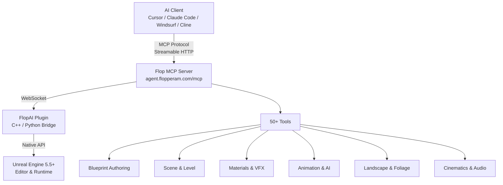
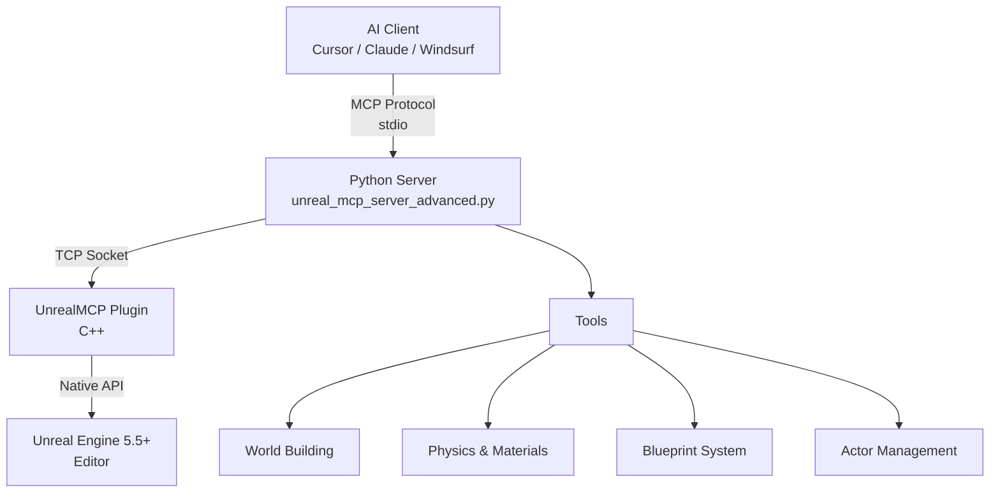

<p align="center">
  
</p>

<h1 align="center">Flopperam — Unreal Engine MCP</h1>

<p align="center">
  <strong>The most advanced MCP server for Unreal Engine.</strong><br/>
  Control a live Unreal Editor through natural language from any MCP client.
</p>

<p align="center">
  <a href="https://www.unrealengine.com/"></a>
  <a href="https://youtube.com/@flopperam"></a>
  <a href="https://discord.gg/3KNkke3rnH"></a>
  <a href="https://twitter.com/Flopperam"></a>
  <a href="https://tiktok.com/@flopperam"></a>
</p>

---

## Two Ways to Use Unreal Engine MCP

This repo contains two separate things:

| | **Hosted Flop MCP** (Recommended) | **Open-Source Local MCP** (This Repo) |
|---|---|---|
| **What** | Production MCP server hosted at `agent.flopperam.com/mcp` | Community MCP server you run locally from the `Python/` folder |
| **Tools** | **50+ tools** across 9 domains — Blueprint authoring, materials, VFX, animation, landscape, AI/BT, cinematics, PCG, and more | Basic toolset — scene manipulation, actor management, world building, and foundational Blueprint operations |
| **Blueprint support** | Full lifecycle — batched narrow tools (`bp_create`, `bp_variable`, `bp_component`, `bp_nodes`, `bp_wire`, `bp_commit`), Graph authoring, contract verification, PIE runtime testing | Foundational — `add_node`, `connect_nodes`, `create_variable`, `create_function` with 23+ node types |
| **Unreal plugin** | **FlopAI plugin** — installed separately via [flopperam.com/unreal-agent](https://www.flopperam.com/unreal-agent) | **UnrealMCP plugin** — bundled in this repo under `UnrealMCP/` |
| **Server instructions** | Rich per-tool LLM guidance, cross-tool relationship mapping, error recovery patterns | Basic tool descriptions |
| **Setup** | One URL + API key, no local dependencies | Clone repo, Python 3.12+, run server locally |
| **Works with** | Cursor, Claude Code, Windsurf, VS Code Copilot, Cline, any MCP client | Same |

> The hosted Flop MCP is a completely different, much more advanced server that shares no code with the local `Python/` server in this repo. It is actively developed with new tools shipping regularly.

---

## Hosted Flop MCP (Recommended)

One URL, one API key. No local server, no Python install. Works with **Cursor, Claude Code, Windsurf, VS Code Copilot, Cline**, and any other MCP client.

### 1. Get an API key at [flopperam.com/account](https://flopperam.com/account)

### 2. Install the FlopAI Unreal plugin — see [flopperam.com/docs](https://flopperam.com/docs) (Installation tab)

### 3. Add the config to your IDE

**Cursor** — `.cursor/mcp.json` (project) or `~/.cursor/mcp.json` (global):
```json
{
  "mcpServers": {
    "flopperam-unreal": {
      "url": "https://agent.flopperam.com/mcp",
      "headers": {
        "Authorization": "Bearer YOUR_API_KEY"
      }
    }
  }
}
```

**Claude Code** — run in your terminal:
```bash
claude mcp add -H "Authorization: Bearer YOUR_API_KEY" --transport http flopperam-unreal https://agent.flopperam.com/mcp
```

**VS Code / Copilot** — `.vscode/mcp.json`:
```json
{
  "servers": {
    "flopperam-unreal": {
      "type": "http",
      "url": "https://agent.flopperam.com/mcp",
      "headers": {
        "Authorization": "Bearer YOUR_API_KEY"
      }
    }
  }
}
```

**Cline / Local LLMs** (Ollama, LM Studio, etc.):
```json
{
  "mcpServers": {
    "flopperam-unreal": {
      "type": "streamableHttp",
      "url": "https://agent.flopperam.com/mcp",
      "headers": {
        "Authorization": "Bearer YOUR_API_KEY"
      }
    }
  }
}
```

Verify the server shows as connected in your IDE and start prompting.

### Hosted Flop MCP — Full Tool List (50+)

| **Category** | **Tools** | **Description** |
|---|---|---|
| **Blueprint Authoring** | `bp_create`, `bp_class`, `bp_variable`, `bp_component`, `bp_graph`, `bp_nodes`, `bp_wire`, `bp_input`, `bp_commit`, `bp_author`, `bp_dry_run`, `bp_skills` | Full Blueprint lifecycle — create Actor/Pawn/Character BPs, add variables/components/events/functions, wire graphs with ~40 node types, compile and verify |
| **Blueprint Inspection** | `bp_brief`, `bp_inspect`, `bp_export` | Read-only orientation — 21 targeted query ops, full GraphSpec JSON export |
| **Scene & Level** | `scene_query`, `scene_brief`, `scene_compose`, `actor_inspect`, `level_inspect`, `search_assets`, `asset_references`, `project_context` | Find actors by class/label/tag with spatial filters, declarative spawn/modify/delete, Content Browser search, dependency graphs |
| **Materials & Shading** | `material_inspect`, `material_edit` | Create materials/instances/functions/Parameter Collections, author expression graphs |
| **VFX** | `niagara_inspect`, `niagara_edit`, `niagara_script_edit`, `chaos_edit` | Niagara particle systems, reusable script modules, Geometry Collection destruction |
| **Animation** | `animation_inspect`, `animation_edit`, `animation_graph_edit`, `ik_rig_edit`, `ik_retarget` | Sequences, montages, BlendSpaces, AnimBP graph authoring, IK rigs + retargeting |
| **UMG / Widgets** | `widget_inspect`, `widget_edit` | Widget tree inspection + editing, styles, animation, MVVM, event binding |
| **AI & Abilities** | `behavior_tree`, `gas_edit`, `tag_registry_edit` | BTs, Blackboards, AI Controllers, EQS, Gameplay Abilities/Effects, Attribute Sets, Gameplay Tags |
| **Landscape & Foliage** | `landscape_inspect`, `landscape_edit`, `foliage_inspect`, `foliage_edit` | Sculpting, semantic terrain features, paint layers, heightmap import/export, foliage scattering |
| **Cinematics & Audio** | `sequencer_edit`, `metasound_edit`, `sound_asset_edit` | Level Sequences with camera cuts, MetaSound procedural audio, SoundCue graphs |
| **Procedural** | `pcg_graph_edit` | PCG graphs with generators, samplers, filters, mesh spawners |
| **Data Assets** | `asset_factory` | Enums, structs, DataTables, DataAssets, Enhanced Input bundles |
| **Editor & Diagnostics** | `editor_actions`, `editor_log`, `performance_audit`, `window_capture`, `cpp_source` | Save/undo/redo, Output Log, perf analysis, viewport screenshots, C++ source + Live Coding |
| **Runtime Verification** | `pie_test_bp`, `pie_test_scene` | PIE test harnesses with 30+ assertion types |
| **Execution** | `python_execution`, `unreal_api`, `skills` | Arbitrary Python in-editor, 15,000+ API lookups, on-demand workflow docs |

---

## Open-Source Local MCP (This Repo)

This repo includes a standalone local MCP server (`Python/`) and a C++ Unreal plugin (`UnrealMCP/`). This is a simpler, community-maintained toolset for basic Unreal Engine control — scene building, actor management, physics, and foundational Blueprint operations.

**If you want the full 50+ tool experience, use the [Hosted Flop MCP](#hosted-flop-mcp-recommended) instead.**

| **Category** | **Tools** | **Description** |
|---|---|---|
| **Blueprint Visual Scripting** | `add_node`, `connect_nodes`, `delete_node`, `set_node_property`, `create_variable`, `set_blueprint_variable_properties`, `create_function`, `add_function_input`, `add_function_output`, `delete_function`, `rename_function` | Blueprint programming with 23+ node types, variables with full property control, custom functions |
| **Blueprint Analysis** | `read_blueprint_content`, `analyze_blueprint_graph`, `get_blueprint_variable_details`, `get_blueprint_function_details` | Inspect Blueprint structure, event graphs, execution flow, variables, and functions |
| **World Building** | `create_town`, `construct_house`, `construct_mansion`, `create_tower`, `create_arch`, `create_staircase` | Build architectural structures and settlements |
| **Epic Structures** | `create_castle_fortress`, `create_suspension_bridge`, `create_aqueduct` | Massive engineering marvels and medieval fortresses |
| **Level Design** | `create_maze`, `create_pyramid`, `create_wall` | Game levels and puzzles |
| **Physics & Materials** | `spawn_physics_blueprint_actor`, `set_physics_properties`, `get_available_materials`, `apply_material_to_actor`, `apply_material_to_blueprint`, `set_mesh_material_color` | Physics simulations and material systems |
| **Blueprint System** | `create_blueprint`, `compile_blueprint`, `add_component_to_blueprint`, `set_static_mesh_properties` | Visual scripting and custom actor creation |
| **Actor Management** | `get_actors_in_level`, `find_actors_by_name`, `delete_actor`, `set_actor_transform`, `get_actor_material_info` | Scene object control and inspection |

**Full setup guide:** [LOCAL_SETUP.md](LOCAL_SETUP.md) (includes macOS compilation steps)

---

## Sproft fork additions

This fork ([github.com/sproft/unreal-engine-mcp](https://github.com/sproft/unreal-engine-mcp))
ports a subset of the hosted Flop tool surface back into the open-source local
MCP server. All additions are clean-room implementations derived from the
documented behaviour and the public UE5 API. None of them link against or
draw from the proprietary FlopAI plugin. MIT-licensed alongside the rest of
the repo.

| **Tool** | **Description** |
|---|---|
| `editor_actions` | Single multiplexed verb tool for save / undo / redo / focus selection / play / stop play. Mirrors the hosted `editor_actions`. |
| `window_capture` | Synchronous PNG screenshot of the active editor viewport. Defaults to `<Project>/Saved/MCPScreenshots/`. |
| `asset_factory` | Asset creation. Supports DataTable (with configurable row struct), Enum (with named entries), Struct (with typed fields), DataAsset (any `UDataAsset` subclass with optional flat property overrides applied through `FProperty::ImportText`), and Enhanced Input bundles. The bundle variant takes a `package_path` package root, a list of `actions` (each `{name, value_type, description?, trigger_when_paused?}` covering Boolean / Axis1D / Axis2D / Axis3D), and a list of `mappings` (each `{action, key, negate?, swizzle?}`) and produces one `UInputMappingContext` plus N `UInputAction` assets in a single declarative call. Existing actions / IMC assets at the target paths are reused unless `overwrite=true`. The optional `negate` row toggle attaches a `UInputModifierNegate`; the optional `swizzle` row token (YXZ / ZYX / XZY / YZX / ZXY) attaches a `UInputModifierSwizzleAxis` so a 1D key can drive a 2D action's Y axis without a second tool call. |
| `widget_edit` | UMG Widget Blueprint authoring. Two operations: `create_widget_blueprint` (path + parent class + optional root panel class) and `add_child_widget` (vertical box, horizontal box, progress bar, text block, button, image, and a few other panel types) under a parent panel by FName. Animations, MVVM, and full slot-property control remain in [BACKLOG.md](BACKLOG.md). |
| `widget_inspect` | Read-only counterpart to `widget_edit`. Walks the `UWidgetTree` and returns the nested hierarchy, a flat widget list, any `UNamedSlot` widgets, and the asset's user-declared Blueprint variables. |
| `bp_input` | Enhanced Input data assets and event-node wiring. Four operations: `create_input_action` (Boolean / Axis1D / Axis2D / Axis3D), `create_input_mapping_context`, `add_mapping` (key-to-action binding on an existing IMC), and `add_action_event_node` (spawn a `UK2Node_EnhancedInputAction` in a target Blueprint's event graph for a given `UInputAction` and optionally MakeLinkTo from the chosen trigger exec pin, default "Triggered", to a named function call on the same Blueprint). |
| `bp_component` | Add a `UActorComponent` subclass to an existing Blueprint's `SimpleConstructionScript`. Accepts short class names (`StaticMeshComponent`, `SpringArm`, `CameraComponent`) or full `/Script/Module.ClassName` paths, an optional `parent_component` to attach under, and an optional flat property dict applied through `FProperty::ImportText`. Compiles and saves the Blueprint on success. |
| `scene_query` | Read-only multiplexed actor query for the editor world. Combines class (substring or exact), `name_pattern`, `label_pattern`, single `tag`, and an optional spherical spatial filter (`center` plus `radius`) with a result `limit`. Returns class / name / label / transform / tags / mobility / hidden flags per actor. |
| `material_edit` | Material authoring. `create_material` produces a `UMaterial` with an optional `Constant3Vector` base-colour input wired into `BaseColor`. `create_material_instance_constant` creates a Material Instance Constant from a parent material. `set_instance_parameter` overrides scalar / vector / texture parameters on a Material Instance Constant. `add_expression` appends a `UMaterialExpression` to a `UMaterial`, resolving the class from a short name (`multiply`, `lerp`, `scalar_parameter`, `texture_sample_parameter_2d`, `time`, `panner`, `constant`, `constant3vector`, `vector_parameter`, `one_minus`, `saturate`, `clamp`, `fresnel`, `power`, `sine`, `cosine`, `component_mask`, `if`, `make_material_attributes`, etc.), a full `/Script/Engine.UMaterialExpressionFoo` path, or a bare class name. Position cascades by default. The optional `properties` dict applies through `FProperty::ImportText` so callers can land `ConstA` / `ConstB`, `ParameterName`, or `DefaultValue` on creation. Optional one-shot connection: `property` (BaseColor, EmissiveColor, etc.) wires the new expression into a material attribute, or `connect_to` + `connect_input` wires it into another named expression. `connect_expressions` connects a source expression's output pin to either a material attribute or another expression's named input pin. `set_expression_property` applies a flat property dict to a named expression. Each expression-graph op recompiles + saves on success unless `recompile=false` or `save=false` is passed. Material Functions and Material Parameter Collections remain on the backlog. |
| `actor_inspect` | Read-only single-actor dump. Resolves the actor by `GetName()` first and Outliner label second, then returns transform / tags / replication snapshot / root component, plus the full attached component list with each component's class, relative transform, attach parent and socket, tags, and (opt-in) a short `FProperty::ExportText` value dump per component or per actor. Mirrors `widget_inspect` for the actor side. |
| `scene_compose` | Declarative single-actor scene mutation. Three operations on one actor per call: `spawn` (class path plus optional transform / preferred name / Outliner label / tags / flat property dict), `modify` (partial transform / label / tags / property patch on an actor resolved by name or label), and `delete`. Property dicts apply through `FProperty::ImportText`; spawn returns the new actor's resolved FName. |
| `scene_brief` | Read-only one-shot orientation summary of the active editor world. Returns persistent level name and asset path, attached streaming sublevels, total actor count and counts per class (sorted by descending count), world bounds union (min / max / centre / extent), GameMode override and default pawn class, a flag for whether the Level Blueprint declares any custom event nodes, the deduplicated set of FName tags in use, and a short list of notable landmark actors (player starts, directional lights, post-process volumes). |
| `level_inspect` | Read-only structured per-actor record list for the editor world plus any loaded sublevels. Sits between `scene_brief` (one designer summary) and `scene_query` (filtered subset). Always returns a uniformly-shaped per-actor block (name, label, class, transform, tags, hidden flags, mobility, owning level) plus a per-level actor-count summary, with optional `class` / `name_pattern` / `label_pattern` / `tag` / `level_filter` filters and an optional `include_components` toggle for a compact per-component list. |
| `python_execution` | Run Python in the editor's interpreter through `PythonScriptPlugin`. Two operations: `execute_string` (a string of Python source, multi-statement by default) and `execute_file` (a `.py` path on disk with optional positional args forwarded as `sys.argv[1:]`). Returns the captured stdout / stderr, the engine `command_result` (repr of the last evaluated expression for evaluate-statement mode), and a structured log array. The plugin's uplugin manifest declares `PythonScriptPlugin` so consumer projects pull it in automatically. |
| `editor_log` | Output Log access. `tail` reads the last N lines of `<Project>/Saved/Logs/<Project>.log` with optional category and minimum-verbosity filters. `write` emits a single line through `LogSproftMCP` at a chosen verbosity (Fatal is demoted to Error). |
| `tag_registry_edit` | Manage the project's Gameplay Tag registry. Three operations: `add_tag` writes a tag (with optional dev comment) into a chosen `Config/Default*Tags.ini` source through `IGameplayTagsEditorModule::AddNewGameplayTagToINI`; `remove_tag` deletes a tag through `IGameplayTagsEditorModule::DeleteTagFromINI`; `list_tags` is a read-only substring search over `UGameplayTagsManager::RequestAllGameplayTags` returning each tag's owning source, source ini path, and dev comment. The editor module handles ini rewrites, tag-tree refresh, and the broadcast that live tag pickers listen on. |
| `bp_create` | Create a UBlueprint asset with a chosen parent class. Resolves the parent class from a short name (Actor, Pawn, Character, ActorComponent, SceneComponent, GameMode, GameModeBase, PlayerController, AIController, UserWidget, DataAsset, BlueprintFunctionLibrary, etc.), a full `/Script/Module.ClassName` path, or a `/Game/...` Blueprint class path. Output package path is configurable under `/Game/`. An optional flat property dict applies through `FProperty::ImportText` on the generated CDO before the first compile so callers can land defaults in one shot. Compiles and saves on success. |
| `bp_brief` | Read-only one-page orientation summary of a Blueprint asset. Returns name, path, parent class (short + full path), blueprint type, variable count, function count, macro count, event-graph node count, named-event list (UK2Node_Event + UK2Node_CustomEvent), SCS component summary (name + class + root flag), implemented Blueprint interfaces, and a data-only flag. Smaller and faster than `read_blueprint_content` plus `analyze_blueprint_graph` for the "what kind of BP is this" question. |
| `bp_inspect` | Read-only targeted query operations on a Blueprint asset, keyed by `op`. `list_variables` returns typed variables with default value, edit flags, category, and friendly name. `list_functions` returns user-authored function and macro graphs with node counts. `list_events` returns event-graph events (`UK2Node_Event` + `UK2Node_CustomEvent`) with the owning ubergraph name. `list_components` returns SCS components with class, scene-vs-actor flag, attach parent and socket, root flag, and child count. `find_node` is a substring search across all graphs against either node short class name or node title (or both via `pattern`), capped by `limit`. |
| `bp_variable` | Declarative Blueprint variable management. One multi-op tool keyed by `op`: `list` (every variable with type, default, category, and flag set), `add` (declare a new variable with `name` + `type` + optional `default` / `category` / flag toggles), `remove` (delete by name), `set_default` (overwrite the default value), `set_flags` (mutate the flag set on an existing variable). `type` accepts scalar tokens (bool / int / float / double / string / name / text / byte), built-in structs (vector / vector2d / rotator / transform / color / linear_color), full `/Script/Module.ClassName` paths for object refs, `/Game/...` Blueprint class paths (auto-suffixed with `_C`), and `struct:/...` for UScriptStruct paths. `container` accepts `single` / `array` / `set` / `map` (with a `value_type` for the map case). Each mutating op compiles + saves on success unless `compile=false` or `save=false` is passed. |
| `bp_class` | Manage class-level settings on an existing UBlueprint. One multi-op tool keyed by `op`: `read` (parent class, blueprint type, BlueprintOptions, implemented interfaces), `set_parent` (re-parent through `Blueprint->ParentClass` + `RefreshAllNodes` + `MarkBlueprintAsStructurallyModified` + recompile, with the same parent resolver as `bp_create`), `set_class_settings` (any subset of `description`, `display_name`, `namespace`, `category`, `hide_categories`), `add_interface` (full `/Script/Module.IName` path, `/Game/...` Blueprint Interface path, or short-name fallback resolved against the loaded class set, going through the `FTopLevelAssetPath` overload of `ImplementNewInterface`), and `remove_interface` (with optional `preserve_functions`). Each mutating op compiles + saves on success unless overridden. |
| `bp_graph` | Read-only graph traversal beyond `bp_inspect`. One multi-op tool keyed by `op`: `list_graphs` (every graph on the Blueprint grouped by kind: ubergraph / function / macro / interface, each with name, kind, graph class, and node count), `list_nodes` (every node in a chosen graph with node FName, short class, full title, position, and pin count, plus optional `class_pattern` / `title_pattern` filters and a 256-node cap), `get_node` (full pin readback for one node: each pin's name, direction, type, default value, default object, exec / data flag, and connected target nodes / pins), and `list_connections` (flat edge list for a chosen graph with `include_exec` / `include_data` filters and a 1024-edge cap). |
| `bp_nodes` | Batched K2 node creation in a chosen Blueprint graph. Defaults to the first event graph; pass `graph` to target a function / macro / interface graph (case-insensitive with substring fallback). Each entry takes a `class` short name (variable_get, variable_set, call_function, branch / if_then_else, dynamic_cast, self, format_text, execution_sequence, knot, make_array, custom_event, event), an optional FName, optional `position`, optional `pin_defaults` dict, and class-specific keys (variable_name, function / function_path resolved as `KismetSystemLibrary:PrintString` or `/Script/Engine.KismetSystemLibrary:PrintString` or a bare name on the same Blueprint, target_class, event_name, event_class). Returns each new node's name, GUID, position, and full pin list so a follow-up `bp_wire` call can address pins by name. Compile is NOT automatic; pass `compile=true` or run `compile_blueprint` after wiring. |
| `bp_wire` | Connect or disconnect named pins between named nodes inside a Blueprint graph. Pin direction is validated (source must be output, dest must be input) and category compatibility runs through the K2 schema's `CanCreateConnection` so incompatible types fail with the engine's own error text. Per-entry `disconnect=true` breaks an existing wire instead of making a new one; `op="disconnect"` is the per-call shortcut. Compile is NOT automatic. |
| `material_inspect` | Read-only counterpart to `material_edit`. For a UMaterial: returns name + path + class, blend mode, two-sided / translucent flags, the full expression list (each with FName, class, position, and parameter name when relevant), parameter list grouped by scalar / vector / texture / static_switch, per-attribute connected output expression for the standard GBuffer attributes (BaseColor / Metallic / Specular / Roughness / Anisotropy / Normal / Tangent / EmissiveColor / Opacity / OpacityMask / WorldPositionOffset / AmbientOcclusion / Refraction / Displacement) with output pin name, and the full used-texture list. For a UMaterialInstance: returns parent material path, the parent material's parameter list, and the instance's own scalar / vector / texture overrides. |
| `search_assets` | Read-only Content-Browser-style asset search backed by `IAssetRegistry`. Filters: `class_filter` (single token or list, accepting short names, full `/Script/Module.ClassName` paths, and `/Game/...` Blueprint asset paths), `class_pattern` (case-insensitive substring on the short class name), `include_subclasses` (sets `bRecursiveClasses`), `path` (single prefix or list of prefixes like `/Game/Crafting`), `recursive_paths` (default true), `name_pattern` (case-insensitive substring on the asset name), and `tag` (single `{name, value}` dict or array of dicts mapped onto `FARFilter::TagsAndValues`). Returns each row's path, name, class, class_path, package, and package_path. With `include_disk_size=true` each row also reports the package's on-disk byte size pulled through `IAssetRegistry::TryGetAssetPackageData`. The result reports `count`, `matched_total`, and a `limit_hit` flag so a caller can paginate by tightening the filter. |
| `asset_references` | Read-only dependency-graph dump for one asset, backed by `IAssetRegistry::GetReferencers` / `GetDependencies`. `direction` selects one of `hard_referencers` (default), `soft_referencers`, `hard_dependencies`, `soft_dependencies`, or the `all_*` variants (any package category, no Hard / Soft restriction). `depth` (default 1, capped at 6) walks the graph transitively and returns the union of every package reached. Each row carries name, path, class, class_path, package, and package_path. Optional `class_filter` accepts a short name or full `/Script/Module.ClassName` path and drops rows whose asset class does not match. The result reports `count`, `matched_total`, `limit_hit`, and `depth_reached` so the caller can answer "what would break if we delete or rename this asset?" without round-tripping through `python_execution`. |
| `bp_commit` | Convenience wrapper that runs the standard end-of-edit Blueprint cycle in one call: `MarkBlueprintAsStructurallyModified` (or the lighter `MarkBlueprintAsModified` when `mark_structurally=false`), `FKismetEditorUtilities::CompileBlueprint` with a captured `FCompilerResultsLog`, and `UEditorAssetLibrary::SaveAsset`. Surfaces compiler errors / warnings / infos as separate string arrays. Skips save when the compile produced errors so a broken Blueprint does not get pinned to disk; `force_save=true` overrides for diagnostic snapshots. Becomes the canonical end-of-edit step for designers chaining `bp_nodes` -> `bp_wire` -> `bp_commit` (with `compile=false` on the intermediate calls). |
| `bp_function_create` | Declarative one-call wrapper for laying a new Blueprint function down with its full typed signature. Wraps `FBlueprintEditorUtils::CreateNewGraph` + `AddFunctionGraph<UClass>` + the FunctionEntry / FunctionResult pin authoring. `inputs` and `outputs` accept `{name, type, is_array?, is_reference?}` entries; `type` resolves through the same wide token set as `bp_variable` (scalar tokens, built-in structs, full `/Script/Module.ClassName` paths, `/Game/...` Blueprint class refs auto-suffixed with `_C`, and `struct:/...` UScriptStruct paths). Optional `pure` / `category` / `keywords` / `tooltip` / `call_in_editor` toggles land on the entry node's `FKismetUserDeclaredFunctionMetadata`. Compiles and saves on success unless overridden. |
| `niagara_inspect` | Read-only structured dump of a `UNiagaraSystem` asset. Returns name + path + class, the system-level spawn / update script paths, an `emitters` array (each with `name`, `enabled`, `sim_target` (cpu / gpu), `local_space`, `determinism`, a `scripts` list grouped by execution stage, plus `event_handlers`, `simulation_stages`, and `renderers` arrays gated by include flags), and a `parameters` array with each user-exposed parameter's name, type token, type path, kind (primitive / data_interface / object), and parameter-store offset. Pairs with `material_inspect` for the VFX side; the edit-side `niagara_edit` / `niagara_script_edit` ops remain on the backlog. |
| `bp_export` | Read-only canonical Blueprint snapshot. Returns a single GraphSpec-style payload: name + path + parent class + blueprint type, the variables array (with type, default value, friendly name, category, edit / replication / instance-editable / expose-on-spawn flags), the SCS components array (with class, scene-vs-actor flag, root flag, attach parent and socket, child count, relative transform, and an optional `FProperty::ExportText` defaults dump), the implemented-interfaces array, and a `graphs` array covering every event graph (UbergraphPages), function graph, macro graph, and interface override graph. Each graph carries name + kind + node count + a per-node block (class, full title, position, GUID, optional event / custom-event signature on `UK2Node_Event` / `UK2Node_CustomEvent`, capped pin list with default value / default object / link count) plus a flat edge list (source / target node + pin name + `is_exec`). Per-node pin output caps at `max_pins_per_node` (default 64) and tags the offending node `pins_truncated` when the cap fires. Sits next to the read-only `bp_brief` / `bp_inspect` / `bp_graph` triad and is the primary diff-able payload for verifying that an MCP-driven authoring session left a Blueprint in the expected state. Where the legacy `read_blueprint_content` returns a shallow event-graph-only summary, `bp_export` walks every graph kind and emits the same pin / edge fields `bp_graph` does. |
| `behavior_tree` | Multi-op tool keyed by `op` (default `inspect`). The `inspect` op returns a read-only structured dump of a `UBehaviorTree` asset: name + path + class, an optional `root_decorators` array (the tree-level decorator chain stored on the BT asset itself), and the `root_node` recursive descriptor. Each composite carries name + class + class_path + kind (composite) + depth + an optional services array + a children array of `{decorators, node}` rows where `node` is either a composite (recursing) or a task. SimpleParallel composites also report their `finish_mode` (immediate / delayed). The recursive walk caps at `max_depth` (default 32) and tags the offending composite with `children_truncated`. The Blackboard side returns `blackboard_path` + `blackboard_name` + an optional `blackboard_parent_path` plus a `blackboard_keys` array (each name + type token (with the `BlackboardKeyType_` prefix stripped, e.g. `Object`, `Class`, `Vector`, `Float`) + inner BaseClass / EnumType / Struct path for typed Object / Class / Enum / Struct keys + instance-sync flag + parent-inherited flag + optional description / category). The edit ops are `create_behavior_tree` (NewObject's a UBehaviorTree at a `/Game/...` path with an optional `/Game/...` UBlackboardData linked through `BlackboardAsset`; `overwrite=true` is the standard escape hatch for an existing asset) and `add_root_composite` (NewObject's a Selector / Sequence / SimpleParallel composite under the tree as outer and assigns it to `RootNode`; `replace=true` overrides the existing-RootNode guard). Both edit ops save by default. Pairs with `niagara_inspect` for AI assets. Heavier edit ops (append child task / composite, insert decorator, append service, blackboard key edits) remain on the backlog. |
| `gas_edit` | Multi-op tool over Gameplay Ability System assets, keyed by `op` (default `inspect`). The `inspect` op returns a read-only structured dump for UGameplayAbility (ability tags, cancel / block / activation / source / target tags, cost + cooldown gameplay-effect class paths, AbilityTriggers), UGameplayEffect (DurationPolicy + DurationMagnitude + MaxDurationMagnitude on Has-Duration, modifier list, executions list, GameplayCues, cached asset / granted / blocked-ability tags through the public accessors that the GE component model migrated to in 5.3+), and UAttributeSet (CDO FProperty list filtered on `FGameplayAttribute::IsSupportedProperty`). The edit ops are `create_gameplay_ability` (NewObject's a UBlueprint at a `/Game/...` path with a UGameplayAbility-derived parent class, default `/Script/GameplayAbilities.GameplayAbility`), `create_gameplay_effect` (same shape with a UGameplayEffect parent; optional `duration_policy` (`instant` / `has_duration` / `infinite`) plus an optional literal `duration_magnitude` write through the CDO before the first compile), and `set_gameplay_tags` (tag-container mutation on either asset shape). For UGameplayAbility the writes route through reflected `AbilityTags` / `CancelAbilitiesWithTag` / `BlockAbilitiesWithTag` / `ActivationOwnedTags` / `ActivationRequiredTags` / `ActivationBlockedTags` / `SourceRequiredTags` / `SourceBlockedTags` / `TargetRequiredTags` / `TargetBlockedTags` UPROPERTY fields; the FProperty path side-steps the public / protected member split between AbilityTags and the activation / source / target tag fields. For UGameplayEffect we route through `FindOrAddComponent<UAssetTagsGameplayEffectComponent>` / `UTargetTagsGameplayEffectComponent` / `UBlockAbilityTagsGameplayEffectComponent` and call each component's `SetAndApplyAssetTagChanges` / `SetAndApplyTargetTagChanges` / `SetAndApplyBlockedAbilityTagChanges` mutator so the cached tag-container snapshot on the GE refreshes. Heavier ops (modifier add / remove, cost / cooldown rebind, attribute default override, GameplayCue authoring) remain on the backlog. |
| `performance_audit` | Read-only frame-time / thread-time snapshot for the active editor viewport. Reads the live `FStatUnitData` ring on the editor's active viewport (the 200-sample circular buffer that `stat unit` already populates) plus the cycle-counter globals `GAverageMS` / `GAverageFPS` / `GGameThreadTime` / `GRenderThreadTime` / `GRHIThreadTime`, and reports a per-metric `avg_ms` / `peak_ms` / `last_ms` triple over the last `frames` samples (default 60, capped at the engine's ring size). Returns blocks for `frame` / `game` / `render` / `rhi` / `gpu`, plus a live `globals` block (cycle-converted thread / GPU times through `RHIGetGPUFrameCycles`) and an optional viewport echo. Optional `metrics` filter list trims the report to a subset; `include_samples=true` opts into the raw per-frame ring dump. Skips the deep-dive captures (`stat startfile` / `stat stopfile`, Insights traces, FPSChart). |
| `pie_test_bp` | Blueprint-side assertion harness. Sits next to `pie_test_scene` (which targets actors in the active editor world) and lets a caller verify properties on a Blueprint asset's CDO without a running PIE session. One assertion kind in this slice: `default_value_equals` (target = a UPROPERTY FName on the Blueprint's generated class; expected = a JSON literal that is canonicalised through the property's `ImportText` -> `ExportText` round-trip and compared against the CDO's `ExportText` output, so vector / rotator / transform / FString / gameplay tag fields all flow through one path). Per-assertion the response carries `index`, `kind`, `target`, `passed` flag, optional `var` / `actual` / `expected` / `expected_raw` / `property_class` / `expected_imported`, plus a human-readable `message`. Aggregate counts (`total` / `passed` / `failed` / `unsupported` / `all_passed`) sit at the top. The kinds that need a running PIE session (`function_returns`, `event_fired`) stay on the backlog. |
| `metasound_edit` | MetaSound asset authoring (small variant). Two ops keyed by `op`: `create_metasound_source` (NewObject's a `UMetaSoundSource` at a `/Game/...` path; optional `output_format` token (`mono` / `stereo` / `quad` / `5_1` / `7_1`, default stereo) plus optional `sample_rate` and `block_rate` overrides land on the asset's OutputFormat / SampleRateOverride / BlockRateOverride before InitAsset wires the document) and `create_metasound_patch` (NewObject's a `UMetaSoundPatch` at a `/Game/...` path, the reusable graph asset). Both ops route through `UMetaSoundEditorSubsystem::GetChecked()`'s public `InitAsset` + `RegisterGraphWithFrontend` so the new asset has a fresh document plus an editor graph that opens cleanly in the MetaSound editor. The graph-authoring surface (add nodes, connect pins, set member defaults) stays on [BACKLOG.md](BACKLOG.md). |
| `landscape_inspect` | Read-only structured dump of every `ALandscape` actor in the editor world. Returns name + label + transform + level for each landscape plus the GUID, the component-grid configuration (ComponentSizeQuads, SubsectionSizeQuads, NumSubsections, component_count), the proxy material driver and any hole-material override, world-space proxy bounds (min / max / size), the editor-only XY component-space extent rectangle when ULandscapeInfo is registered, the registered layer list (each entry with `layer_name`, `layer_info_object_path`, `phys_material`, `blend_method` enum byte, `is_no_blend`, `is_visibility_layer`), heightmap and weightmap texture deduplication counts, plus optional `heightmap_textures` / `weightmap_textures` package-path arrays and an opt-in per-component records array. Filters: `name_pattern` (substring on actor name + label) and `level_filter` (substring on owning ULevel name). Pairs with `foliage_inspect` for terrain reasoning. |
| `foliage_inspect` | Read-only structured dump of every `AInstancedFoliageActor` in the editor world. Returns per-IFA actor name + label + transform + level plus a `foliage_types` array. Each foliage_type carries the type asset path, source-mesh or actor-class path with a `source_kind` (`static_mesh` / `actor` / `unknown`) discriminator, density + density adjustment factor, radius, per-axis scale interval (ScaleX / ScaleY / ScaleZ min and max), instance counts (placed and total), and the editor-only approximated-bounds box of all its instances. Optional `sample_locations` draws a deterministic seeded sample of N world-space instance locations per type so the agent can probe density without us shipping the full instance dump. Filters: `name_pattern` (substring on actor name + label) and `level_filter`. |
| `sequencer_edit` | Multi-op tool keyed by `op` (default `inspect`). The `inspect` op resolves a target `ULevelSequence` (or any UMovieSceneSequence subclass) and returns asset name + path + class plus the linked UMovieScene's tick / display frame rates (each as `{numerator, denominator, approx_fps}`), the playback range as a start / end / duration triple with `playback_has_start` / `playback_has_end` flags, the master tracks array (each track with name + display_name + class + section_count and an optional sections array reporting `inclusive_start_frame` / `exclusive_end_frame` / `duration_frames`), the optional camera-cut track stub when present, the possessables array (binding GUID + name + possessed-class + parent_guid), and the spawnables array (binding GUID + name + spawn-template class). The edit ops are `create_level_sequence` (NewObject's a ULevelSequence at a `/Game/...` path and runs `ULevelSequence::Initialize` so the new asset has a fresh UMovieScene with the project's default tick / display rates and clock source) and `add_possessable` (resolves a target sequence and a target actor by `GetName()` / Outliner label, then runs `UMovieScene::AddPossessable` + `UMovieSceneSequence::BindPossessableObject` so Sequencer's runtime can map the binding GUID back to the editor-world actor; `binding_name` defaults to the actor's `GetActorLabel()`). Both edit ops save by default. Heavier edit ops (track add, section move, spawnable creation, camera-cut creation) remain on the backlog. |
| `project_context` | Read-only one-shot summary of the loaded project. Returns project name + uproject path + project dir + content dir, the .uproject metadata (description, category, EngineAssociation, enterprise flag), full engine version strings + per-component major / minor / patch / changelist / branch / licensee flag, the current editor level (name + path) and per-level GameMode + default pawn override, the project-wide GameMapsSettings (`default_game_mode_class_project`, `default_game_map`, `transition_map`, `editor_startup_map`, `game_instance_class`), an `enabled_plugins` array filtered by default to project / external / mod / enterprise (each entry: `name`, `friendly_name`, `type`, `location`, `version`, `version_name`, `category`, `description`, `created_by`, `engine_version`, `can_contain_content`, `is_beta`, `is_experimental`, `base_dir`), a `source_modules` array from the .uproject (`name`, `type`, `loading_phase`), and a `content_roots` array of every immediate `/Game/*` subfolder with a recursive asset count. Designer-readable orientation in one call. |
| `animation_inspect` | Read-only structured dump for animation assets. Resolves the asset by short name or `/Game/...` path and branches by class. USkeletalMesh returns skeleton path + LOD count + bone list (each `{name, parent_index, parent_name}`) + socket list (mesh-level then non-overridden skeleton-level, each with `{name, bone_name, relative_location, relative_rotation, relative_scale, source}`). UAnimSequence returns play length + rate scale + sampling frame rate (`{numerator, denominator, approx_fps}`) + sampled key count + additive anim type token + notifies list (each notify with `{name, time, duration, track_index, trigger_chance, notify_class, notify_class_path, notify_kind}` where `notify_kind` is `instant` / `state` / `event`). UAnimMontage returns play length + rate scale + composite sections (each `{name, time, next_section}`) + slot tracks (each `{slot_name, animation_count}`) + notifies. UBlendSpace (and 1D) returns axis count + sample count + per-axis FBlendParameter (`{display_name, min, max, grid_num, snap_to_grid, wrap_input, axis}`). UAnimBlueprint returns parent class + parent class path + target skeleton path + template flag + variable count + state-machine list (each `{name, state_count, transition_count, initial_state, initial_state_name}`) read off the cached UAnimBlueprintGeneratedClass so the BP must have compiled at least once. |
| `cpp_source` | Read C++ source by class path or by full file path on disk. Provide one of: `class` (a `/Script/Module.ClassName` path, a `/Game/...` Blueprint class path auto-suffixed with `_C`, or a short class name probed against the loaded class set with A / U prefix variants and an `/Script/Engine.<Name>` fallback), `header_path` (absolute path to a .h; sibling .cpp inferred by extension swap), or `source_path` (absolute path to a .cpp; sibling .h inferred). Returns the resolved class metadata (`class`, `class_short`, `module`, `module_dir`) when class-driven, both `header_path` + `source_path` (absolute disk paths), each file's text plus its full byte size, per-file `*_truncated` flags when the per-file `max_bytes` cap (default 256 KiB) fires, and per-file `*_exists` flags so a caller can tell "no .cpp yet, this class is header-only" from "no source code at all, this is a Blueprint-defined class". Backed by `FSourceCodeNavigation::FindClassHeaderPath` / `FindClassSourcePath` / `FindClassModuleName` / `FindModulePath`. |
| `pie_test_scene` | Scene-state assertion harness. Runs against the active editor world without driving Play in Editor and accepts a list of assertion specs each shaped `{kind, target, expected?, tolerance?}`. Four `kind` values are supported: `actor_exists` (target = actor name; pass = an actor with that `GetName()` or Outliner label is present), `actor_at_location` (target = actor name, expected = `[x, y, z]` world-space location, optional `tolerance` = number, defaults 1.0 cm; pass = the resolved actor's `GetActorLocation` is within `tolerance` of `expected`), `actor_overlapping_tag` (target = actor name, expected = an FName tag string; pass = the resolved actor's `Tags` array contains that FName), and `var_equals` (target = actor name, expected = a `{var, value}` dict; pass = the resolved actor's UPROPERTY ImportText-matches the canonicalized representation of `value`, comparing the JSON literal against the property's ExportText representation so vector / rotator / transform / FString / gameplay tag fields all flow through one path). Per-assertion the response carries `index`, `kind`, `target`, `passed` flag, optional `actual` / `expected` / `delta` / `tolerance` / `var` / `property_class` for the relevant kinds, and a human-readable `message`. Aggregate counts (`total`, `passed`, `failed`, `unsupported`, `all_passed`) sit at the top of the response. |
| `animation_edit` | Targeted UAnimSequence / UAnimMontage edits (small variant). Multi-op tool keyed by `op`. `set_rate_scale` writes `RateScale` (float) on a UAnimSequenceBase (works on UAnimSequence and UAnimMontage). `set_additive` toggles the additive shape on a UAnimSequence: writes `AdditiveAnimType` (`none` / `local_space` / `rotation_offset_mesh_space`) plus optional `RefPoseType` (`none` / `ref_pose` / `anim_scaled` / `anim_frame`), `RefPoseSeq` (a `/Game/...` UAnimSequence path applied when ref_pose_type is anim_scaled / anim_frame), and `RefFrameIndex` (integer frame index used when ref_pose_type is anim_frame). `add_notify` appends an FAnimNotifyEvent to a notify track on a UAnimSequenceBase: resolves the notify class to either UAnimNotify or UAnimNotifyState (or treats the entry as a custom-event notify when no class is given), auto-creates the notify track when missing through `UAnimationBlueprintLibrary::AddAnimationNotifyTrack`, and routes through `AddAnimationNotifyEvent` / `AddAnimationNotifyStateEvent` for the typed paths. `frame` (integer) wins over `time` (float seconds) when both are present; the frame-to-seconds conversion uses the asset's `GetSamplingFrameRate`. Each op saves the asset by default. Open follow-ons (curves, key frames, sync markers, timeline edits) remain in [BACKLOG.md](BACKLOG.md). |
| `foliage_edit` | Foliage authoring (small variant). Two ops on AInstancedFoliageActor / UFoliageType keyed by `op`. `add_foliage_type` registers a UFoliageType asset on the AInstancedFoliageActor for a chosen level: resolves (or spawns) the IFA through `AInstancedFoliageActor::GetInstancedFoliageActorForLevel(Level, /*bCreateIfNone=*/true)` and binds the type through `AInstancedFoliageActor::AddFoliageType`, reusing an existing FFoliageInfo when the type is already registered (`type_already_bound` flag in the response). The optional `level` is a substring on the owning ULevel name; defaults to the persistent level. `set_foliage_density` writes `Density`, `DensityAdjustmentFactor`, `Radius`, and the per-axis `ScaleX` / `ScaleY` / `ScaleZ` FFloatInterval pairs on a UFoliageType asset; only the fields present in the call are written, and each axis interval requires both `_min` and `_max` together. The "place N instances at locations" op stays in [BACKLOG.md](BACKLOG.md). |
| `unreal_api` | Reflection-driven query of the live UE5 type database (small variant). Where the hosted Flop tool is documented as a "15 K+ API lookup", this clean-room variant trades the offline reference table for live `UClass` / `FProperty` / `UFunction` walks against whichever modules have already loaded into the editor. Three ops keyed by `op`: `describe` (default; full surface for one class: parent class + direct child class list with recursive count + implemented interfaces + every UPROPERTY field with cpp_type / container / inner_type / key_type / value_type / flags / tooltip / category / inherited flag + every UFUNCTION method with full parameter list / return value / flags / tooltip / category / `is_pure` / `is_blueprint_callable` / `is_blueprint_event` / `is_static` / `is_net` / `is_const` / inherited flag, plus the queried class's own flag set decoded into FName tokens), `find_property` (case-insensitive substring search across one class's property list, same record shape as describe's properties array), `find_function` (case-insensitive substring search across one class's function list, same record shape as describe's functions array). The class identifier accepts `/Script/Module.ClassName`, a `/Game/...` Blueprint class path (auto-suffixed with `_C`), or a short class name (probed against the loaded class set with A / U prefix variants and a `/Script/Engine.<Name>` fallback). Walks inherited members by default; `include_inherited=false` restricts to the class's own declarations. Per-list caps (`max_properties` / `max_functions` / `max_children`) with truncated flags and aggregate totals. Backed by `TFieldIterator<FProperty>` / `TFieldIterator<UFunction>` plus `GetDerivedClasses` from `UObjectHash.h`. Pairs with `cpp_source` for the "what does this UClass actually look like" question without leaving the reflection database. |

The `material_edit` tool also gains a bulk `add_expressions` operation that takes a list of expression specs (each with `class`, optional `name` alias, optional `position`, optional `properties` dict) plus an optional list of edge specs (each `{source, source_output?, dest, dest_input?}` between expressions or `{source, property}` to a material attribute), and lays the small graph down in one call. Recompile + save run once after the whole batch unless `recompile=false` / `save=false` is passed.

The `widget_edit` tool also gains a third op `set_slot_property` that takes a target widget FName plus a flat property dict and applies the dict to the widget's UPanelSlot through `FProperty::ImportText_InContainer`. Covers `UCanvasPanelSlot` anchors / offsets / size / ZOrder, `UVerticalBoxSlot` / `UHorizontalBoxSlot` padding / fill / alignment, and any other UPanelSlot-derived class without us spelling out each property by name. Each entry that fails to resolve as a UPROPERTY or refuses ImportText is reported under the response's `skipped` array with a reason and the attempted ImportText input.

Built and tested against the user's UE 5.7 source build at `D:\UE5`. Should
also work on UE 5.5/5.6 since the API surface used is stable across those
versions.

---

## The Flop Agent — [flopperam.com](https://flopperam.com/)

The MCP gives your IDE tools. **The Flop Agent** is a fully autonomous AI that lives inside Unreal Engine — it plans multi-step workflows, writes and executes code, recovers from errors, and iterates until the job is done.

- **Dynamic workflows** — decomposes complex requests into steps and adapts when something goes wrong
- **Unreal-native reasoning** — tuned prompts, specialized routing, deep knowledge of UE APIs and Blueprints
- **Full Blueprint creation and editing** — create new Blueprints, add variables/components/events/functions, update graph logic, compile and validate
- **World building** — creates materials, places actors, builds structures, and verifies as it goes
- **Code execution** — executes commands directly inside the editor
- **Multiple AI models** — routes to the best model per task (Opus for reasoning, Flash for lookups)
- **Chat inside Unreal** — embedded browser panel, no window switching
- **Text/image to 3D** — three quality tiers (Good, High Quality, Very High Quality)

Supports Unreal Engine 5.5, 5.6, and 5.7. Full docs at [flopperam.com/docs](https://flopperam.com/docs).


---

## See It In Action

Watch our comprehensive tutorial for complete setup and usage:
- **[Complete MCP Tutorial & Installation Guide](https://youtu.be/ct5dNJC-Hx4)** - Full walkthrough of installation, setup, and advanced usage

Check out these examples on our channel:
- **[GPT-5 vs Claude](https://youtube.com/shorts/xgoJ4d3d4-4)** - Claude and GPT-5 go head-to-head building simultaneously
- **[Advanced Metropolis Generation](https://youtube.com/shorts/6WkxCQXbCWk)** - AI generates a full metropolis with 4,000+ objects from a single prompt
- **[Advanced Maze & Mansion Generation](https://youtube.com/shorts/ArExYGpIZwI)** - Claude generates a playable maze and mansion complex

---

## Architecture

### Hosted Flop MCP


### Open-Source Local MCP


---

## Community & Support

- **YouTube**: [youtube.com/@flopperam](https://youtube.com/@flopperam) - Tutorials, showcases, and development updates
- **Discord**: [discord.gg/3KNkke3rnH](https://discord.gg/3KNkke3rnH) - Get help, share creations, and discuss
- **Twitter/X**: [twitter.com/Flopperam](https://twitter.com/Flopperam) - Latest news and quick updates
- **TikTok**: [tiktok.com/@flopperam](https://tiktok.com/@flopperam) - Quick tips and amazing builds
- **Docs**: [flopperam.com/docs](https://flopperam.com/docs) - Full documentation

### Get Help
- **Setup Issues?** Check the [Debugging & Troubleshooting Guide](DEBUGGING.md)
- **Questions?** Ask in our [Discord server](https://discord.gg/3KNkke3rnH) for real-time support
- **Bug reports?** Open an [issue on GitHub](https://github.com/flopperam/unreal-engine-mcp/issues)
- **Feature ideas?** Join the discussion in our community channels

---

## License

MIT License — Build amazing things freely.
